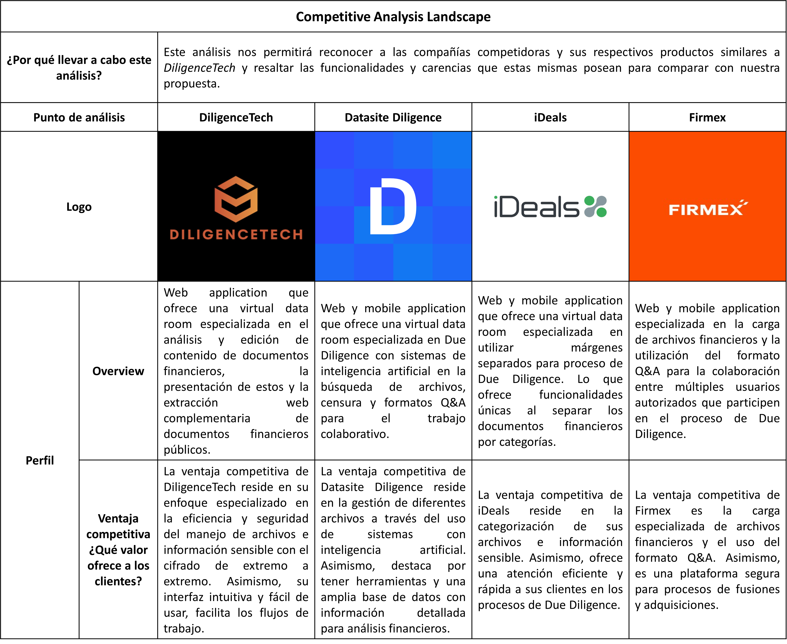
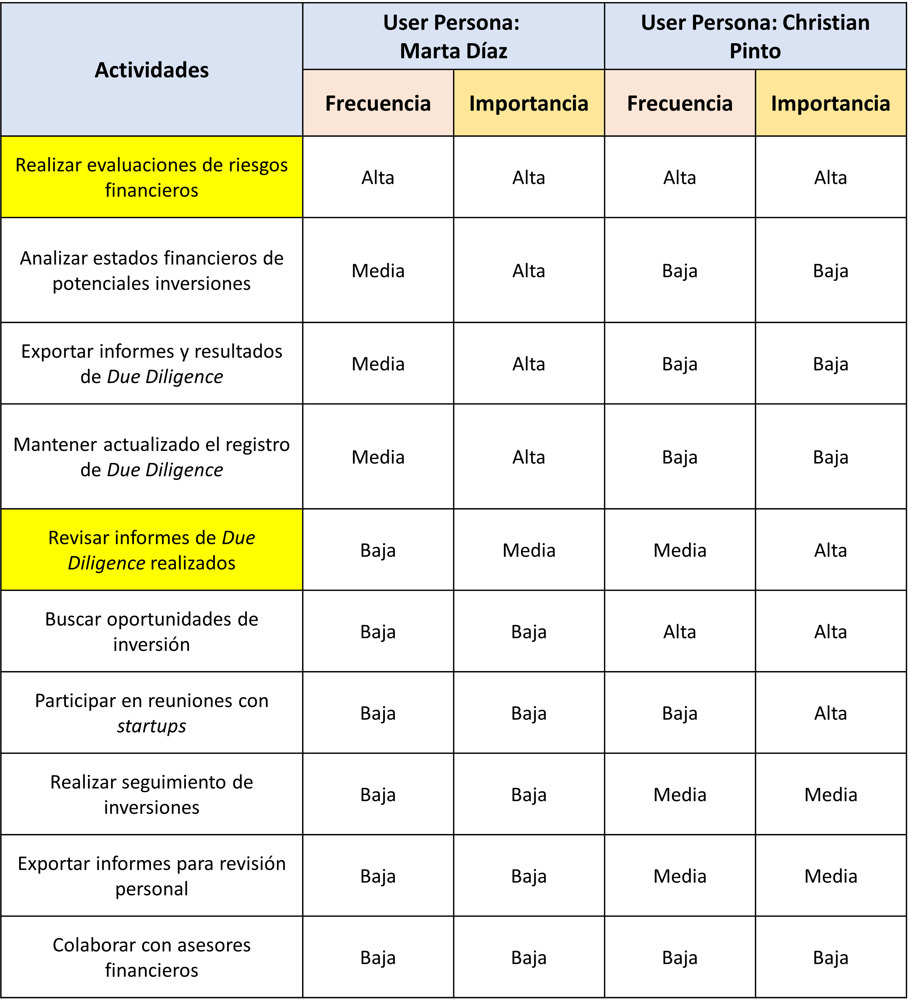

    <strong>Universidad Peruana de Ciencias Aplicadas</strong> 
     </img> 
     
    <strong>Ingeniería de Software - 2024-02</strong> 
     
    <strong>CC238 - Aplicaciones para Dispositivos Móviles - SW63</strong>   
     
    <strong>Profesor: Jorge Luis Mayta Guillermo</strong> 
      <strong>INFORME DE TRABAJO 1 - TB1</strong> 

    <strong>Startup: MobiLoom</strong> 
    <strong>Producto:  DiligenceTech</strong>

<h3 align="center" >Team Members:</h3>

    <table align="center">
        <tr>
            <th style="text-align:center;">Miembro</th>
            <th style="text-align:center;">Código</th>
        </tr>
        <tr>
            <td>Criollo De La Cruz, Diego Anderson</td>
            <td>U202219639</td>
        </tr>
        <tr>
            <td>Herrera González, Luis Eduardo</td>
            <td>U202218227</td>
        </tr>
        <tr>
            <td>Morales Calderón, Hernan Emilio</td>
            <td>U202216263</td>
        </tr>
        <tr>
            <td>Valle Zuta, Abel Andrés</td>
            <td>U202210297</td>
        </tr>
    </table>

 

# Registro de Versiones del Informe

| Versión |   Fecha    | Autor | Descripción de modificación | 
|:-------:|:----------:|:-----:|:----------------------------| 
|TB1| 12/04/2024 |Todos los integrantes del equipo| Capítulo I, Capítulo II, Capítulo III,  Capítulo IV y Capítulo V|

# Contenido
## Tabla de Contenidos
### [Registro de versiones del informe](#registro-de-versiones-del-informe)
### [Contenido](#contenido)
### [Student Outcome](#student-outcome-1)
### [Objetivos SMART](#objetivos-smart)
### [Capítulo I: Presentación](#capítulo-i-presentacion)
- [1.1. Startup Profile](#11-startup-profile)
    - [1.1.1. Descripción de la Startup](#111-description-de-la-startup)
    - [1.1.2. Perfiles de integrantes del equipo](#112-perfiles-de-integrantes-del-equipo)
- [1.2. Solution Profile](#12-solution-profile)
    - [1.2.1. Antecedentes y problemática](#121-antecedentes-y-problemática)
    - [1.2.2. Lean UX Process](#122-lean-ux-process)
        - [1.2.2.1. Lean UX Problem Statements](#1221-lean-ux-problem-statements)
        - [1.2.2.2. Lean UX Assumptions](#1222-lean-ux-assumptions)
        - [1.2.2.3. Lean UX Hypothesis Statements](#1223-lean-ux-hypothesis-statements)
        - [1.2.2.4. Lean UX Canvas](#1224-lean-ux-canvas)
- [1.3. Segmentos objetivo](#13-segmento-objetivo)

### [Capítulo II: Needfinding](#capitulo-ii-needfinding)
- [2.1. Competidores](#21-competidores)
    - [2.1.1. Análisis competitivo](#211-análisis-competitivo)
    - [2.1.2. Estrategias y tácticas frente a competidores](#212-estrategias-y-tácticas-frente-a-competidores)
- [2.2. Entrevistas](#22-entrevistas)
    - [2.2.1. Diseño de entrevistas](#221-diseño-de-entrevistas)
    - [2.2.2. Registro de entrevistas](#222-registro-de-entrevistas)
    - [2.2.3. Análisis de entrevistas](#223-análisis-de-entrevistas)
- [2.3. Needfinding](#23-needfinding)
    - [2.3.1. User Personas](#231-user-personas)
    - [2.3.2. User Task Matrix](#232-user-task-matrix)
    - [2.3.3. User Journey Mapping](#233-user-journey-mapping)
    - [2.3.4. Empathy Mapping](#234-empathy-mapping)
    - [2.3.5. As-is Scenario Mapping](#235-as-is-scenario-mapping)
- [2.4. Requirements specification](#24-requirements-specification)
    - [2.4.1. To-Be Scenario Mapping](#241-to-be-scenario-mapping)
    - [2.4.2. User Stories](#242-user-stories)
    - [2.4.3. Impact Mapping](#243-impact-mapping)
    - [2.4.4. Product Backlog](#244-product-backlog)

### [Capítulo III: Arquitectura](#capitulo-iii-arquitectura)
- [3.1. Product design](#31-product-design)
    - [3.1.1. Style Guidelines](#311-style-guidelines)
        - [3.1.1.1. General Style Guidelines](#3111-general-style-guidelines)
    - [3.1.2. Information Architecture](#312-information-architecture)
        - [3.1.2.1. Organization Systems](#3121-organization-systems)
        - [3.1.2.2. Labelling Systems](#3122-labelling-systems)
        - [3.1.2.3. SEO Tags and Meta Tags](#3123-seo-tags-and-meta-tags)
        - [3.1.2.4. Searching Systems](#3124-searching-systems)
        - [3.1.2.5. Navigation Systems](#3125-navigation-systems)
    - [3.1.3. Landing Page UI Design](#313-landing-page-ui-design)
        - [3.1.3.1. Landing Page Wireframe](#3131-landing-page-wireframe)
        - [3.1.3.2. Landing Page Mock-up](#3132-landing-page-mock-up)
    - [3.1.4. Mobile Applications UX/UI Design](#314-mobile-applications-ux-ui-design)
        - [3.1.4.1. Mobile Applications Wireframes](#3141-mobile-applications-wireframes)
        - [3.1.4.2. Mobile Applications Wireflow Diagrams](#3142-mobile-applications-wireflow-diagrams)
        - [3.1.4.3. Mobile Applications Mock-ups](#3143-mobile-applications-mock-ups)
        - [3.1.4.4. Mobile Applications User Flow Diagrams](#3144-mobile-applications-user-flow-diagrams)
        - [3.1.4.5. Mobile Applications Prototyping](#3145-mobile-applications-prototyping)
- [3.2. Architecture Overview](#32-architecture-overview)
    - [3.2.1. Domain-Driven Software Architecture](#321-domain-driven-software-architecture)
        - [3.2.1.1. Software Architecture Context Level Diagram](#3211-software-architecture-context-level-diagram)
        - [3.2.1.2. Software Architecture Container Level Diagram](#3212-software-architecture-context-level-diagram)
        - [3.2.1.3. Software Architecture Components Diagram](#3213-software-architecture-components-diagram)
    - [3.2.2. Software Object-Oriented Design](#322-software-object-oriented-design)
        - [3.2.2.1. Class Diagrams](#3221-class-diagrams)
        - [3.2.2.2. Class Dictionary](#3222-class-dictionary)
        - [3.2.2.3. Database Design](#3223-database-design)
        - [3.2.2.4. Database Diagram](#3224-database-diagram)

### [Capítulo IV: Backend Product Implementation & Validation](#capitulo-iv-backend-product-implementation-validation)
- [4.1. Software Configuration Management](#41-software-configuration-management)
    - [4.1.1. Software Development Environment Configuration](#411-software-development-environment-configuration)
    - [4.1.2. Source Code Management](#412-source-code-management)

### [Conclusiones](#conclusiones-1)
### [Bibliografía](#bibliografia-1)
### [Anexos](#anexos-1)

# Student Outcome

N/A

# Objetivos SMART

N/A

# Capítulo I: Introducción

## 1.1. Startup Profile
### 1.1.1. Descripción de la Startup

    ReadWell es una empresa emergente innovadora dedicada a fomentar y motivar los hábitos de lectura a través de tecnología de vanguardia. Nuestro enfoque se centra en conectar a autores, editores y lectores 
    para crear una experiencia de lectura excepcionalmente atractiva y conveniente, Además, cuenta con funciones como recomendaciones personalizadas, clubes de lectura virtuales y eventos con autores. Ofrecemos
    una amplia gama de libros electrónicos, audiolibros y contenido exclusivo a través de nuestra suscripción premium y tienda integrada. Con un compromiso inquebrantable con la seguridad y la privacidad de los 
    usuarios, nuestro producto BookFlow podrá redefinir el mundo de la lectura digital. 
    <ul>
        <li>
            <b>Misión:</b>
        </li>
        En ReadWell, nuestra misión es inspirar y enriquecer la vida de las personas a través de la lectura. Buscamos brindar acceso conveniente a una amplia variedad de contenidos literarios mientras apoyamos a 
        autores emergentes y conectamos a los lectores con experiencias que enriquecen su amor por los libros.
        <li>
            <b>Visión:</b>
        </li>
        Aspiramos a ser la plataforma líder en lectura digital, proporcionando acceso a una amplia variedad de contenidos literarios de alta calidad. Queremos ser el destino preferido de los lectores para descubrir, 
        compartir y disfrutar de historias que los transporten a mundos nuevos y emocionantes.
    </ul>

### 1.1.2. Perfiles de integrantes del equipo

### Los integrantes que conforman parte de nuestro startup son:

| Integrante                | Perfil                                | Foto                                                |
|---------------------------|--------------------------------------------------|-------------------------------------|
| Criollo De La Cruz, Diego Anderson (U202219639) | Mi nombre es Diego Anderson Criollo de La Cruz, soy estudiante de 6to ciclo de la carrera de Ingeniería de Software. Me gusta mucho emplear soluciones creativas y que busquen eficiencia para poder aborder de esta forma cualquier desafío de la mejor manera. Como miembro del grupo, pretendo aportar con todos mis conocimientos en el desarrollo web tanto como en el front-end y back-end, además de siempre colaborar con mis ideas y soluciones ante cualquier dificultad que se presente en el desarrollo. Espero poder aprender mucho de mis compañeros y que todos juntos podamos emplear de manera adecuada las tecnologías que iremos aprendiendo a lo largo del desarrollo del proyecto. |              |
| Herrera González, Luis Eduardo (U202218227) | Me llamo Luis Eduardo Herrera González, tengo 20 años y curso el 6to ciclo de la carrera de Ingeniería de Software en la Universidad Peruana de Ciencias Aplicadas (UPC). Como habilidades técnicas conozco los lenguajes de C++, C#, Java, Python y Visual Basic; manejo base de datos SQL y NoSQL (MongoDB); manejo los frameworks de Angular, Vue, Spring Boot y .NET. Por la parte de mis habilidades blandas siento que soy buen comunicador, responsable, empático y buen organizador de grupo. Espero ser de utilidad para el equipo en cumplir todos los requisitos con alta calidad de este proyecto. |                |
| Morales Calderón, Hernan Emilio (U202216263) | Soy Hernan Morales, tengo 19 años y actualmente estoy cursando el 6to ciclo de Ingeniería de Software. Me considero una persona sumamente responsable y organizada, especialmente en trabajos universitarios. Mi objetivo es culminar exitosamente el curso y nuestro proyecto junto a mi equipo, asegurando que cada detalle se ejecute con precisión. Tengo conocimientos sólidos en lenguajes como C++, C#, y JavaScript, así como en frameworks como Angular y Vue, lo que me permite desarrollar interfaces dinámicas y adaptarme rápidamente a diferentes entornos de desarrollo. Además, manejo SQL para la gestión y optimización de bases de datos. Estoy convencido de que, con buena planificación y comunicación, entregaremos un proyecto de alta calidad que supere las expectativas. |               |
| Valle Zuta, Abel Andrés (U202210297) | Soy Abel Andrés Valle Zuta, estudiante de la carrera de Ingeniería de Software en la Universidad Peruana de Ciencias Aplicadas (UPC), tengo 19 años y actualmente estoy cursando el 6to ciclo en la sede de Monterrico. Sé programar y editar videos. Además, sé resolver problemas, trabajar en equipo y lograr unir más al grupo. Mis hobbies son jugar básquet, fútbol, tenis, videojuegos, escuchar música, salir a pasear con mis amigos, ver películas, nadar, hacer ejercicio, pasear a mis mascotas y pasar tiempo con mi familia. Finalmente, siempre estoy dispuesto a trabajar y terminar a tiempo los deberes, esforzándome para aprender y comprender lo máximo posible y finalizar con éxito todos mis objetivos. |                |

## 1.2. Solution Profile

En el cambiante mundo empresarial actual, la debida diligencia financiera se ha convertido en un pilar fundamental para asegurar transacciones comerciales seguras y exitosas. Sin embargo, el proceso tradicional de recolección y análisis de datos financieros de empresas puede ser lento, tedioso y propenso a errores. Esta realidad ha generado una necesidad urgente de encontrar soluciones innovadoras que permitan a los inversores realizar este crucial proceso de manera más eficiente y efectiva.
En este contexto, surge una nueva era de la debida diligencia financiera, donde la tecnología y la inteligencia se unen para ofrecer soluciones ágiles y precisas. La búsqueda de métodos más inteligentes para acceder y analizar datos financieros se ha convertido en una prioridad para los profesionales que buscan tomar decisiones informadas y estratégicas en sus inversiones.

### 1.2.1. Antecedentes y problemática

***What***

* El proceso tradicional de *Due Diligence* se caracteriza por ser laborioso, costoso y propenso a errores.
* Los inversores y profesionales financieros revisan una gran cantidad de documentos financieros, legales y operativos en un tiempo limitado.
* Esto puede resultar en la contratación de servicios adicionales y gastos innecesarios.

***Who***

* Inversores y profesionales financieros se ven afectados por la complejidad y la carga de trabajo del proceso tradicional de *Due Diligence*.
* Propietarios de empresas enfrentan el desafío de compartir información confidencial con inversores potenciales.

***Where***

Esta problemática es común en transacciones comerciales y de inversión, donde la debida diligencia es crucial.

***When***

La problemática surge en cada proceso de adquisición o inversión, donde la toma de decisiones debe realizarse en un tiempo limitado.

***Why***

* La falta de acceso rápido y la preocupación por la seguridad de la información sensible de la empresa dificultan la toma de decisiones.
* Existe el riesgo de que los inversores utilicen los datos sensibles con otros fines, lo que genera incertidumbre y desconfianza.

***How***

* En el estado normal, los contadores e inversores pueden requerir días o semanas para revisar y analizar manualmente los documentos financieros de una empresa. Con "DeltaTech", el proceso se acelerará significativamente, permitiendo la revisión y análisis en cuestión de horas

* El problema sigue un patrón de ineficiencia y lentitud en el proceso de *Due Diligence*. Los contadores y los inversores a menudo se ven abrumados por la cantidad de documentos y la falta de herramientas eficientes para analizarlos de manera rápida y precisa.

***How Much***

* En un día, un inversor puede perder oportunidades de inversión valiosas debido a la demora en la obtención de informes financieros. Con "DeltaTech", estas oportunidades podrían aumentar en un 50%.

* En términos de pérdida de oportunidades de inversión, el retraso actual podría estar implicando el equivalente a 50 000 soles por mes por los participantes de la inversión. Con "DeltaTech", se podrían reducir los retrasos que se pueden presentar en el proceso de **Due Diligence**.

### 1.2.2. *Lean UX Process*

#### 1.2.2.1. *Lean UX Problem Statements*

***Problem Statement***

* El estado actual del Due Diligence para los inversionistas, y contadores que representan a sus empresas, es muy extenuante.

* Los productos actuales no ofrecen una solución completa. Ya sea esto solo el análisis, la búsqueda de empresas, la seguridad para trabajar con archivos. Sin embargo, nunca algo que embarque todo. Debido a esto, todos los involucrados son afectados de manera negativa, perdiendo grandes oportunidades de negocio o la inversión que necesitan para poder crecer en el mercado.

* ¿Cómo podemos mejorar la experiencia del proceso Due Diligence con el fin de agilizar y mejorar la calidad del trabajo?

#### 1.2.2.2. *Lean UX Assumptions*

***Business Assumptions:***

1. **Creo que mis clientes necesitan** una herramienta eficiente y confiable para realizar sus análisis financieros exhaustivos durante el proceso de *Due Diligence*.

2. **Estas necesidades se pueden resolver con** nuestra plataforma inteligente que automatice el análisis financiero y que ofrezca acceso rápido y seguro a información relevante de las empresas objetivo.

3. **Mis clientes iniciales son** inversores y contadores financieros que trabajan en sell-side.

4. **El valor #1 que un cliente quiere de mi servicio es** una manera eficiente y precisa de realizar sus transacciones durante el proceso de *Due Diligence*.

5. **El cliente también puede obtener estos beneficios adicionales** como una mayor confianza en el proceso de *Due Diligence*, una mayor seguridad de los datos financieros y una experiencia de usuario mejorada.
6. **Voy a adquirir la mayoría de mis clientes a través de** campañas de marketing dirigidas a empresas de capital privado, fondos de inversión y otros actores clave en el mercado de transacciones

7. **Haré dinero a través de** la venta de suscripciones a nuestra plataforma "Diligence Tech", ofreciendo diferentes niveles de acceso según las necesidades del cliente.

8. **Mi competencia principal en el mercado serán** otras plataformas de *Due Diligence* en línea, así como servicios tradicionales de consultoría que ofrecen análisis de datos financieros.

9. **Los venceremos debido a** nuestra capacidad para ofrecer una solución tecnológica más rápida, precisa y fácil de usar que nuestras competidoras, así como nuestro enfoque en la seguridad de los datos y la experiencia del usuario..

10. **El mayor riesgo del producto es** que la tecnología pueda no funcionar como se espera, lo que podría resultar en errores en los datos o brechas de seguridad.

11. **Resolveremos esto a través de la** implementación de rigurosas pruebas de calidad y seguridad, así como la rápida corrección de errores a medida que surjan.

12. **¿Qué otras suposiciones tenemos? ¿Eso, si se prueba que es falso, causará que nuestro negocio/proyecto no funcione?** Otras suposiciones que tenemos son si:
    - Existe una demanda significativa.
    - La automatización de datos financieros mejorará el proceso de *Due Diligence*.
    - Garantizar la seguridad y privacidad de los datos financieros de las empresas objetivo a través de cifrado de extremo a extremo generará confianza entre los usuarios

***Business Outcomes:***

- Conseguir los primeros 100 usuarios registrados para la aplicación de ambos segmentos objetivos.

- Retener el 50% de los usuarios
  durante el primer semestre.

- Registrar 20 usuarios activos al mismo tiempo utilizando la aplicación.

- Conseguir el registro de 10 nuevos usuarios referidos a través de links compartidos.

***Users Assumptions:***

1. **¿Quién es el usuario?**

   Los usuarios son los asociados al proceso de Due Diligence, tanto los inversores que están interesados participar con empresas, como estás mismas representadas con sus contadores financieros.

2. **¿Qué problemas tiene nuestro producto? ¿Resolver?**

    * Dificultad para acceder y comparar de manera eficiente la información financiera de múltiples empresas durante el proceso de Due Diligence.
    * Riesgos asociados con la toma de decisiones basadas en datos financieros incompletos o inexactos.
    * Falta de una plataforma centralizada y fácil de usar para analizar y evaluar oportunidades de inversión de manera efectiva.
    * Dificultad para acceder y analizar rápidamente datos financieros de empresas objetivo durante el proceso de debida diligencia.
    * Riesgos asociados con la falta de seguridad y privacidad de los datos financieros sensibles.
    * Falta de eficiencia en el proceso de debida diligencia debido a la dependencia de métodos manuales y lentos.

3. **¿Qué características son importantes?**

* Interfaz de usuario intuitiva y eficiente que permita una navegación fluida y acceso rápido a la información financiera clave.
* Funcionalidades avanzadas de comparación y análisis de datos financieros para facilitar la toma de decisiones informadas.
* Seguridad de datos avanzada para garantizar la confidencialidad y protección de la información financiera sensible.
* Herramientas de visualización y generación de informes que permitan una comprensión clara y rápida de la salud financiera de las empresas objetivo.

4. **¿Dónde encaja nuestro producto en su trabajo o vida?**

   Nuestro producto se incorpora en el proceso de Due Diligence que los usuarios realizan. Estos lo utilizarían para agilizar los procesos que usualmente se realizan de manera manual o menos automatizada.

5. **¿Cuándo y cómo es usado nuestro producto?**

    * Es utilizado por los inversores y contadores desde el inicio del proceso de evaluación de una empresa objetivo hasta la toma final de decisiones de compra o inversión.
    * Los inversores utilizan nuestro producto para analizar los estados financieros, realizar comparaciones entre empresas y   evaluar los riesgos y oportunidades de inversión.
    * Los contadores lo utilizan para poder comunicarse con los inversores interesados y realizar transacciones de información de manera segura.

6. **¿Cómo debe verse nuestro producto y cómo comportarse?**

    * Debe comportarse de manera eficiente y rápida, brindando resultados precisos y actualizados de manera oportuna.
    * La seguridad y confidencialidad de los datos financieros es fundamental, por lo que el producto debe garantizar un cifrado sólido y medidas de protección avanzadas.
    * Nuestro producto debe tener una apariencia profesional y moderna, con una interfaz de usuario clara y organizada que facilite la comparación y análisis de datos.

***User outcomes:***

- Acceso de manera rápida y eficiente a la información financiera relevante de las empresas objetivo.
- Confianza en la seguridad y privacidad de los datos financieros sensibles
- Experiencia de usuario mejorada gracias a la interfaz intuitiva y fácil de usar

***Feature Assumptions***

* Herramientas avanzadas de análisis:
    - Los inversores podrán utilizar herramientas avanzadas para comparar rápidamente los datos financieros de múltiples empresas.
    - Se asume que características como gráficos interactivos, análisis comparativos y tablas dinámicas mejorarán la eficiencia del análisis.
    - Funciones especializadas para analizar estados financieros, ratios financieros, tendencias históricas y comparaciones sectoriales.
* Automatización de Procesos Repetitivos:
    - Capacidad de automatizar tareas como la extracción de datos financieros, el cálculo de ratios y la generación de informes estándar.
* Funcionalidades de Seguridad Avanzada:
    - Los inversores confiarán en la plataforma debido a las medidas de seguridad avanzada, como cifrado de extremo a extremo y autenticación de dos factores.
    - Se asume que la seguridad sólida garantizará la protección de los datos financieros confidenciales.
* Generación de Informes Personalizados:
    - Los inversores podrán crear informes personalizados basados en sus criterios de evaluación y preferencias.
    - Se asume que los informes detallados y personalizados facilitarán la toma de decisiones informadas.
* Visualización de Datos Interactiva:
    - Gráficos interactivos y tablas dinámicas para visualizar los datos financieros de manera clara y comprensible.
* Alertas y Notificaciones Relevantes:
    - Los inversores recibirán alertas sobre cambios significativos en los datos financieros de las empresas en su lista de seguimiento.
    - Se asume que las alertas oportunas y relevantes mejorarán la capacidad de reacción a los cambios en las empresas objetivo.

#### 1.2.2.3. *Lean UX Hypothesis Statements*

* **Creemos que** los usuarios valoran la eficiencia y precisión en el análisis de datos financieros durante el proceso de *Due Diligence*. **Sabremos que** esto es cierto **cuando** observemos una disminución significativa en el tiempo dedicado al análisis manual de datos, medido por una reducción del 30% en el tiempo promedio necesario para completar una debida diligencia.

* **Creemos que** los usuarios encuentran la automatización un elemento esencial para agilizar el proceso de cDue Diligence*. **Sabremos que** esto es cierto **cuando** veamos la disminución en el tiempo que se ocupa por cada proceso, medido por una reducción en 40% en el tiempo de los procesos que tienen la capacidad de ser automatizados.

* **Creemos que** la seguridad y privacidad de los datos financieros sensibles es una preocupación clave para los usuarios durante el proceso de *Due Diligence*. **Sabremos que** esto es cierto **cuando** veamos una mayor confianza en la plataforma “DiligenceTech” por parte de los contadores, medido por una reducción del 20% en las solicitudes de soporte relacionadas con la seguridad de los datos.

* **Creemos que** la generación de informes personalizados será importante para tomar decisiones finales para los usuarios. **Sabremos que** esto es cierto **cuando** veamos un incremento en la cantidad de adquisiciones que se realicen. Medido por un aumento en un 20% de compras después de realizarse el proceso de analisis financiero.

* **Creemos que** los usuarios valoran la visualización de datos interactivos durante el proceso de *Due Diligence*. **Sabremos que** esto es cierto **cuando** observemos un aumento del 30% en la tasa de participación de los usuarios en proyectos de análisis financiero donde se ofrecen visualizaciones de datos interactivos en comparación con sesiones donde no se proporcionan

* **Creemos que** las alertas y notificaciones son una funcionalidad muy importante para todos los usuarios. **Sabremos que** esto es cierto **cuando** veamos una reducción en el tiempo de respuesta entre los usuarios y la entrega de sus partes correspondientes., medido por un 20% en la reducción de quejas por falta de respuestas a tiempo de los usuarios durante el proceso de *Due Diligence*.

#### 1.2.2.4. *Lean UX Canvas*

)](Resources/cap1/Lean-UX-Canvas.png)

## 1.3. Segmentos objetivo

# Capítulo II: Needfinding

## 2.1. Competidores

En el contexto de un mercado peruano en constante cambio y evolución, donde la gestión eficiente en los procesos de *Due Diligence*  se convierten en una necesidad primordial en el rubro de las inversiones. **DiligenceTech** se enfrenta a una urgente tarea: comprender y abordar a sus competidores para lograr una posición sólida y garantizar la satisfacción de sus usuarios.

**Competidores:**

* ***Datasite Diligence:***
  El *virtual data room* más utilizado en el mercado. Proporcionada por la empresa Datasite, esta solución mediante aplicación web brinda un espacio de almacenamiento y edición de archivos, los cuales se esperan que sean documentos financieros para posteriormente ser enviados por correo electrónico a quien sea desee el usuario. Entre las mecánicas más resaltantes en este competidor está la posibilidad de censura mediante IA elementos de los documentos y la modalidad Q&A. Su precio es a base de páginas que contengan los archivos, costando 7 mil dólares por cada 10 mil páginas.

  )](Resources/cap2/datasite.png)

* ***iDeals:***
  *Virtual data room online* para servicios financieros, Biotech, IT y otras especializaciones del sistema que utilizan organizaciones de muchos usuarios dentro de la aplicación, la simplificación del ingreso y uso de archivos, y la seguridad del sistema en cuidarlos. Cuenta actualmente con más de 1 millón de usuarios y destaca en el mercado por su atención al cliente rápida y constante.

  )](Resources/cap2/ideals.png)

* ***Firmex:***
  *Virtual data room* para contadores financieros que permite insertar y guardar archivos al sistema con funcionalidades como Q&A y censura. Reconocido en el mercado por la seguridad que mantiene en los archivos.

  )](Resources/cap2/firmex.png)

### 2.1.1. Análisis competitivo

<table>
<thead>
  <tr>
    <th colspan="6">Competitive Analysis Landscape </th>
  </tr>
</thead>
<tbody>
  <tr>
    <td colspan="2">¿Por qué llevar a cabo este análisis?</td>
    <td colspan="4">Este análisis nos permitirá reconocer a las compañías competidoras y sus respectivos productos similares a DiligenceTech y resaltar las funcionalidades y carencias que estas mismas posean para comparar con nuestra propuesta.</td>
  </tr>
  <tr>
    <td colspan="2">
        
Nombre

    </td>
    <td>
		
DillingenceTech 

	</td>
    <td>
		
Datasite Dilligence

	</td>
    <td>
		
iDeals

	</td>
    <td>
		
Firmex

	</td>
  </tr>
  <tr>
    <td colspan="2">
        
Logo

    </td>
    <td>
		

		</td>
    <td>
		

		</td>
    <td>
		

		</td>
    <td>
		

		</td>
  </tr>
  <tr>
    <td rowspan="2">Perfil</td>
    <td>Overview</td>
    <td>Web application que ofrece una virtual data room especializada en el análisis y edición de contenido de documentos financieros, la presentación de estos y la extracción web complementaria de documentos financieros públicos.
	</td>
    <td>Web y mobile application que ofrece una virtual data room especializada en Due Diligence con sistemas de inteligencia artificial en la búsqueda de archivos, censura y formatos Q&A para el trabajo colaborativo.</td>
    <td>Web y mobile application que ofrece una virtual data room especializada en utilizar márgenes separados para proceso de Due Diligence. Lo que ofrece funcionalidades únicas separar los. documentos financieros por categorías.</td>
    <td>Web y mobile application especializada en la carga de archivos financieros y la utilización del formato Q&A para la colaboración entre múltiples usuarios autorizados que participen en el proceso de Due Diligence.</td>
  </tr>
  <tr>
    <td>Ventaja Competitiva  ¿Qué valor ofrece a los clientes?</td>
    <td>La ventaja competitiva de DiligenceTech reside en su enfoque especializado en la eficiencia y seguridad del manejo de archivos e información sensible con el cifrado de extremo a extremo. Asimismo, su interfaz intuitiva y fácil de usar, facilita los flujos de trabajo.</td>
    <td>La ventaja competitiva de Datasite Diligence reside en la gestión de diferentes archivos a través del uso de sistemas con inteligencia artificial. Asimismo, destaca por tener herramientas y una amplia base de datos con información detallada para análisis financieros.</td>
    <td>La ventaja competitiva de iDeals reside en la categorización de sus archivos e información sensible. Asimismo, ofrece una atención eficiente y rápida a sus clientes en los procesos de Due Diligence.</td>
    <td>La ventaja competitiva de Firmex es la carga especializada de archivos financieros y el uso del formato Q&A. Asimismo, es una plataforma segura para procesos de fusiones y adquisiciones.
</td>
  </tr>
  <tr>
    <td rowspan="2">Perfiles de Marketing </td>
    <td>Mercado Objetivo </td>
    <td>Personas interesadas en  intercambiar o donar sus pertenencias.</td>
    <td>Personas que buscan intercambiar productos y servicios</td>
    <td>Personas interesados en intercambiar servicios y artículos de segunda mano</td>
    <td>Usuarios interesados en darle un nuevo propósito a sus pertenencias mediante intercambios.</td>
  </tr>
  <tr>
    <td>Estrategias de marketing</td>
    <td>Publicidad en Foros y Redes sociales</td>
    <td>Publicidad en redes sociales</td>
    <td>Publicidad en redes sociales</td>
    <td>Publicidad en redes sociales</td>
  </tr>
  <tr>
    <td rowspan="3">Perfil de Producto </td>
    <td>Productos &amp; Servicios</td>
    <td>Intercambiar bienes o servicios, donar a ONGs</td>
    <td>Intercambiar bienes o servicios</td>
    <td>Intercambiar bienes o servicios</td>
    <td>Intercambiar bienes o servicios</td>
  </tr>
  <tr>
    <td>Precios y Costos</td>
    <td>Free y Premium desde $2.99 por mes</td>
    <td>Free</td>
    <td>Free</td>
    <td>Free y Premium $2.99 por mes</td>
  </tr>
  <tr>
    <td>Canales de Distribución (Web y/o Móvil)</td>
    <td>Web y móvil</td>
    <td>Web</td>
    <td>Web</td>
    <td>Móvil</td>
  </tr>
  <tr>
    <td rowspan="4">Análisis SWOT</td>
    <td>Fortalezas</td>
    <td>Conexión intuitiva para intercambiar o donar objetos.  Amplia variedad de opciones para los usuarios.  Posibilidad de personalización en los intercambios.  Incorporación de automatización e innovación en la plataforma.</td>
    <td>Plataforma intuitiva para intercambiar bienes y servicios.  Amplia variedad de opciones disponibles.  Posibilidad de personalizar los intercambios.</td>
    <td>Plataforma confiable y amplia con una gran base de usuarios.  Compromiso con la sostenibilidad y la economía circular.</td>
    <td>Plataforma intuitiva y segura para intercambiar bienes y servicios.  Variedad de opciones disponibles para los usuarios.  Interfaz fácil de usar para una experiencia positiva.</td>
  </tr>
  <tr>
    <td>Debilidades</td>
    <td>Limitaciones en la disponibilidad de objetos y servicios.  Posibles dificultades técnicas en la gestión de transacciones y seguridad de datos.</td>
    <td>Posibles dificultades para garantizar la equidad en los intercambios.  Limitaciones técnicas que puedan afectar la funcionalidad.</td>
    <td>Posibles desafíos relacionados con la competencia de otras plataformas y la seguridad de las transacciones.</td>
    <td>Posibles desafíos con seguridad de transacciones y gestión de reclamos.</td>
  </tr>
  <tr>
    <td>Oportunidades</td>
    <td>Aprovechar la conciencia creciente sobre sostenibilidad y consumo responsable.  Desarrollar alianzas con ONGs para ampliar el impacto social.  Expandir la plataforma a nivel nacional e internacional.</td>
    <td>Expandir la plataforma para incluir nuevas categorías de productos y servicios.  Establecer alianzas con organizaciones benéficas para ampliar el impacto social.</td>
    <td>Expandir la plataforma a nivel nacional e internacional.</td>
    <td>Aprovechar la conciencia creciente sobre economía colaborativa y sostenibilidad.  Expandir la plataforma con más servicios y funciones para mejorar la experiencia.</td>
  </tr>
  <tr>
    <td>Amenazas</td>
    <td>Al ser una aplicación nueva, puede que no tenga la demanda esperada.  Competencia de otras plataformas. Cambios en las preferencias del usuario.</td>
    <td>Mejor organizacion del sitio web  Cambios en las preferencias del usuario.</td>
    <td>Mejor interfaz, mas amigable e intuitiva  Cambios en las preferencias del usuario.</td>
    <td>Mejorar la seguridad de datos y privacidad de usuarios.  Cambios en las preferencias del usuario.</td>
  </tr>
</tbody>
</table>

### 2.1.2. Estrategias y tácticas frente a competidores

Según Michael Porter, la estrategia competitiva implica cómo una empresa compite en su mercado específico. Porter identificó tres estrategias generales que las empresas pueden emplear para competir con éxito: liderazgo en costos, diferenciación y enfoque. La estrategia de liderazgo en costos implica ofrecer productos o servicios a precios más bajos que los de los competidores, mientras que la diferenciación se basa en ofrecer productos y servicios únicos y distintivos. Por otro lado, una estrategia de enfoque se centra en un segmento de mercado específico. Para llevar a cabo eficazmente estas estrategias, las empresas necesitan tener un profundo conocimiento de sus mercados y competidores para desarrollar y mantener una ventaja competitiva sostenible a largo plazo.

Teniendo en cuenta el análisis SWOT previamente presentado para DiligenceTech, proponemos las siguientes estrategias competitivas:

**Estrategias Competitivas para** ***DiligenceTech:***

1. **Liderazgo en Costos:**

**Estrategia:** *DiligenceTech* puede buscar optimizar sus procesos internos para reducir costos operativos y ofrecer sus servicios a precios más competitivos que los de sus competidores.

**Tácticas:**
* Implementar tecnologías eficientes que reduzcan los gastos de infraestructura y operativos.
* Negociar acuerdos favorables con proveedores y socios para obtener mejores precios en servicios y herramientas necesarios.
* Ofrecer modelos de precios flexibles y descuentos opr volumen para atraer a clientes sensibles al costo.

2. **Diferenciación a través de la Innovación:**

**Estrategia:** *DiligenceTech* puede enfocarse en desarrollar características y funcionalidades únicas que destaquen su plataforma como líder en innovación en el proceso de *Due Diligence*.

**Tácticas:**
* Realizar investigaciones de mercado para identificar necesidades no cubiertas y oportunidades de mejora.
* Invertir en I+D para desarrollar herramientas avanzadas de análisis financiero y presentación de informes.
* Promocionar activamente las nuevas características a través de campañas de marketing destacando la vanguardia tecnológica de DiligenceTech.

3. **Enfoque en segmentos específicos del mercado:**

**Estrategia:** *DiligenceTech* puede especializarse en atender a segmentos específicos del mercado donde pueda ofrecer un valor diferenciado y adaptado.

**Tácticas:**
* Identificar sectores de la industria con necesidades únicas de debida diligencia, como startups en crecimiento, empresas de tecnología emergente, o industrias reguladas.
* Desarrollar soluciones personalizadas y paquetes de servicios adaptados a las necesidades específicas de cada segmento.
* Colaborar con asociaciones y grupos de la industria para fortalecer la presencia en estos segmentos y generar confianza.

**Tácticas Específicas para** ***DiligenceTech:***

1. **Monitoreo Competitivo Continuo:**

**Táctica:** Realizar análisis periódicos de las estrategias, precios y ofertas de la competencia para identificar oportunidades y amenazas.

**Acciones:**
* Mantenerse al tanto de los movimientos de los competidores en cuanto a lanzamientos de productos, cambios de precios y campañas de marketing.
* Utilizar herramientas de seguimiento de competidores y análisis de mercado para obtener información valiosa.

2. **Estrategias de Precios y Paquetes Competitivos:**

**Táctica:** Ajustar estratégicamente los precios y paquetes de servicios para competir de manera efectiva en el mercado.

**Acciones:**
* Realizar análisis de precios comparativos y ajustar los precios de acuerdo con el valor percibido por los clientes.
* Ofrecer paquetes personalizados que se ajusten a las necesidades específicas de diferentes tipos de clientes, como empresas grandes, medianas y startups.

3. **Inversión en Marketing Diferenciado:**

**Táctica:** Desarrollar mensajes y campañas de marketing que resalten las fortalezas únicas y la propuesta de valor de DiligenceTech.

**Acciones:**
* Crear contenido educativo y de valor que demuestre cómo DiligenceTech aborda los desafíos específicos de la debida diligencia.
* Utilizar estudios de casos y testimonios de clientes para respaldar los beneficios y resultados de la plataforma.

4) **Alianzas Estratégicas y Colaboraciones:**

**Táctica:** Establecer asociaciones estratégicas con empresas complementarias o instituciones que puedan ampliar el alcance y la oferta de DiligenceTech.

**Acciones:**
* Colaborar con firmas de consultoría reconocidas para ofrecer servicios combinados de asesoramiento y tecnología.
* Formar alianzas con organizaciones financieras o legales para ofrecer paquetes completos de servicios de debida diligencia.

## 2.2. Entrevistas

Para acceder al video de las entrevistas, haga click en la ([URL](https://upcedupe-my.sharepoint.com/:v:/g/personal/u20201b380_upc_edu_pe/Eee1M6-Jg-dImBVzG5oLzDABSq0nZPG4Tgj0we3EL3ufaA?e=65BOJ8))

### 2.2.1. Diseño de entrevistas

Entrevista a personas referentes a nuestro segmentos objetivo, las preguntas varían dependiendo del segmento debido a las diferentes situaciones:

**Segmento 1:** Contadores Financieros

**Preguntas de introducción:**

1. ¿Cuántos años tiene?
2. ¿En qué ciudad del Perú reside?
3. ¿Cuál considera que es su estatus social limitando la descripción a Clase Baja, Clase Media, Clase Media-Alta y Clase Alta?
4. ¿Cúal es su profesión?
5. ¿Cuánto tiempo lleva ejerciendo esta profesión?
6. ¿Está familiarizado con el concepto y proceso de diligencia debida?

**Preguntas principales:**

1. ¿Cómo lleva a cabo usted su trabajo para un proceso de diligencia debida?
2. ¿Podría mencionar su participación en la diligencia debida en base a las etapas que tiene?
3. ¿Cómo son los procesos más comunes de obtener documentos financieros de las empresas investigadas y cuanto tiempo demoran?
4. ¿Cuáles son los documentos de las empresas que dan más problemas en obtener?
5. ¿Qué indicador o análisis financiero considera el más importante para calificar una empresa?
6. ¿Cual ha sido la mayor cantidad de empresas que ha consultado a la vez?
7. ¿Usted mismo realiza el análisis financiero?
8. ¿Qué tipo de problemas se encuentran a la hora de analizar los datos de la empresa?
9. ¿Qué medidas de seguridad se llevan para garantizar la confidencialidad de los datos?
10. ¿Cuáles son los procesos más importantes que usted rinde para la diligencia debida?
11. ¿Cómo se guardan y se comparten los documentos financieros en el proceso de diligencia debida?
12. ¿Usualmente cuánto demora un proceso de *Due Diligence*?
13. ¿Qué herramientas conoce o utiliza durante este proceso?
14. ¿Qué partes le parecen tediosas del proceso de diligencia debida?
15. ¿Cómo colabora con otros participantes en el proceso de diligencia debida?
16. ¿Qué problemas suelen ocurrir mediante el proceso de diligencia debida y cómo los resuelve?
17. ¿Ve factible contener los documentos financieros en un servicio de alojamiento en la web como Google Drive?
    * En caso sí, ¿Qué funcionalidades cree que vendrían útil para complementar el servicio? ¿Algo que tenga que ver con seguridad, análisis automático o edición de los documentos?
    * En caso no, ¿Qué funcionalidades cree que debería tener para que sea posible tenerlo en uno de estos sistemas?
18. En los documentos financieros se suele presentar censura de elementos que no se desea que sean revelados: ¿Le parece que le sería sencillo que en la aplicación misma sea posible hacer este proceso?
19. Para mantener la seguridad del proceso el dueño de la empresa va a agregar a diversos contadores los cuales solo tendrán acceso a subir archivos en cada request que haga el inversor. ¿Piensa que esta limitación es suficiente para mantener la integridad de la empresa a vender?
20. ¿Existen documentos financieros que obtiene, como contador, del internet? ¿Nos podría decir en donde se consiguen normalmente? ¿Me gustaría que nuestro sistema haga automáticamente la recolección de estos documentos al brindar el nombre de la compañía? ¿Tiene alguna opinión complementaria a esta funcionalidad?
21. Debido a la sensibilidad y debida discreción que deben tener los documentos privados de la empresa nuestro modelo ha implementado una vista previa de los mismos que no podrán descargarse ni apropiarse de algún modo. ¿Qué opina sobre esta funcionalidad?
22. Nuestra aplicación web usará el análisis de datos en base a lo que el contador envía y mostrará de manera intuitiva y digerible la proyección a largo plazo de la empresa. ¿Qué opina sobre esta implementación?

**Segmento 2:** Inversores

**Preguntas de introducción:**

1. ¿Cuántos años tiene?
2. ¿En qué ciudad del Perú reside?
3. ¿Cuál es su ocupación principal?
4. ¿Cuál es su nivel de experiencia en inversiones?
5. ¿Con qué frecuencia realiza inversiones?
6. ¿Cuál es su principal objetivo al invertir? (por ejemplo, crecimiento de capital, ingresos pasivos, diversificación, impacto social, etc.)
7. ¿En qué sectores o industrias prefiere invertir?
8. ¿Prefiere invertir en empresas nuevas y emergentes o en empresas establecidas?
9. ¿Ha participado anteriormente en procesos de *Due Diligence* antes de invertir en una empresa?
10. ¿Qué información financiera y empresarial considera más importante al evaluar una oportunidad de inversión?

**Preguntas principales:**

1. ¿Qué experiencia tiene en procesos de *Due Diligence* al evaluar una empresa?
2. ¿Cuáles son los aspectos clave que busca en un informe de *Due Diligence* antes de tomar una decisión de inversión?
3. ¿Qué indicadores financieros o métricas considera cruciales al evaluar la salud financiera de una empresa?
4. ¿Qué tipo de riesgos financieros le preocupan más al considerar una inversión?
5. ¿Qué papel juega la reputación y el historial de la empresa en su decisión de inversión?
6. ¿Cuál es su enfoque para diversificar su cartera de inversiones?
7. ¿Qué herramientas o plataformas utiliza para realizar análisis financiero y seguimiento de inversiones?
8. ¿Cómo es el proceso de una diligencia debida desde su experiencia? ¿Cómo participa en ella?
9. ¿En algún momento durante el proceso la empresa le ha hecho una serie de preguntas o detalles para poder llevar a cabo el proceso?
10. ¿En qué formato es el que recibe los resultados de la diligencia debida? ¿Le parece eficiente? ¿Desearía tenerlo en formato virtual?
11. ¿Ve factible contener los resultados de los documentos financieros en un servicio de alojamiento en la web como Google Drive donde se le comparte?
    * En caso sí, ¿Qué funcionalidades cree que vendrían útil para complementar el servicio? ¿Algo que tenga que ver con seguridad, análisis automático o edición de los documentos?
    * En caso no, ¿Qué funcionalidades cree que debería tener para que sea posible tenerlo en uno de estos sistemas?

**Preferencias y comportamientos de inversión:**

1. ¿Prefiere invertir en empresas locales o internacionales?
2. ¿Qué tamaño de empresa prefiere para sus inversiones? (por ejemplo, startups, PYMES, grandes corporaciones)
3. ¿Cuál es su horizonte de tiempo típico para una inversión? (corto plazo, mediano plazo, largo plazo)
4. ¿Qué factores externos (económicos, políticos, sociales) considera al tomar decisiones de inversión?
5. ¿Qué grado de involucramiento espera tener esn las empresas en las que invierte? (por ejemplo, pasivo, activo, asesoramiento)
6. ¿Cómo valora la transparencia y la comunicación de una empresa con sus inversores?
7. ¿Ha tenido experiencias previas de éxito o fracaso en inversiones que le gustaría compartir?

**Tecnología y preferencias de información:**

1. ¿Qué tipo de información financiera y empresarial prefiere recibir durante un proceso de diligencia debida?
2. ¿Cómo prefiere acceder a esta información? (documentos físicos, plataformas en línea, informes interactivos, etc.)
3. ¿Qué funcionalidades o herramientas tecnológicas le gustaría ver en una plataforma de *Due Diligence* para facilitar sus decisiones de inversión?
4. ¿Está familiarizado con el uso de análisis de datos y tecnologías de inteligencia artificial en procesos de inversión o diligencia debida?
5. ¿Qué medidas de seguridad considera esenciales al compartir información financiera y empresarial durante un proceso de inversión?

**Objetivos y desafíos:**

1. ¿Cuáles son sus principales objetivos financieros a corto, mediano y largo plazo?
2. ¿Cuáles son los desafíos más grandes que enfrenta al tomar decisiones de inversión?
3. ¿Qué información le gustaría tener disponible para tomar decisiones de inversión más informadas?
4. ¿Cómo evalúa el éxito de una inversión?

**Preferencias y comportamientos:**

1. ¿Qué factores le llevan a confiar en una empresa para invertir?
2. ¿Cuáles son sus preferencias de comunicación y cómo le gusta recibir actualizaciones sobre sus inversiones?
3. ¿Cuál es su nivel de tolerancia al riesgo en sus inversiones?
4. ¿Qué actividades o intereses adicionales tiene fuera de sus inversiones financieras?

**Tecnología y preferencias digitales:**

1. ¿Cuáles son sus hábitos de uso de tecnología y medios digitales?
2. ¿Utiliza aplicaciones o plataformas financieras para realizar transacciones o seguimiento de inversiones?
3. ¿Qué funcionalidades considera esenciales en una plataforma de inversión en línea?

### 2.2.2. Registro de entrevistas

Para el registro de entrevistas se realizará una entrevista por segmento, dando un total de 6 entrevistas. Además, el formato de las entrevistas es mp4, cada entrevista es independiente debido a las diferentes preguntas y respuestas dadas por los entrevistados de cada segmento.

**Segmento 1: Contadores financieros trabajando en sell-side en empresas financieras con la necesidad de agilizar el proceso de análisis de debida diligencia**

<table>
<colgroup>
</colgroup>
<thead>
  <tr>
    <th colspan="2">Entrevista #1 </th>
  </tr>
</thead>
<tbody>
  <tr>
    <td>Nombre</td>
    <td>Guisella</td>
  </tr>
  <tr>
    <td>Apellidos</td>
    <td>Díaz</td>
  </tr>
  <tr>
    <td>Edad</td>
    <td>51 años</td>
  </tr>
  <tr>
    <td>Distrito</td>
    <td>La Molina</td>
  </tr>
  <tr>
    <td>Aplicaciones Usadas</td>
    <td>Google Chrome, Zoom</td>
  </tr>
  <tr>
    <td>Motivación</td>
    <td>Asegurar que el proceso de Due Diligence sea eficiente, seguro y práctico, especialmente en la entrega y manejo de documentos confidenciales.</td>
  </tr>
  <tr>
    <td>Frustración</td>
    <td>La posibilidad de seleccionar una empresa con intenciones maliciosas en el proceso de Due Diligence, lo que puede llevar a la creación de competidores indeseados.</td>
  </tr>
  <tr>
    <td>Tecnologías</td>
    <td>Laptop Windows, Smartphone Android</td>
  </tr>
	<tr>
    <td>Browsers</td>
    <td>Google Chrome</td>
  </tr>
  <tr>
    <td>Entrevistador</td>
    <td>Luis Eduardo Herrera González</td>
  </tr>
  <tr>
    <td>Evidencia</td>
    <td>

</td>
  </tr>
  <tr>
    <td>Link</td>
    <td>
<a target="_blank"  href="https://upcedupe-my.sharepoint.com/:v:/g/personal/u202214059_upc_edu_pe/EdBNnIWOvIhJn69S71tMAa8B-kF0ma-SPyhrqtHHSOk0eQ?nav=eyJyZWZlcnJhbEluZm8iOnsicmVmZXJyYWxBcHAiOiJTdHJlYW1XZWJBcHAiLCJyZWZlcnJhbFZpZXciOiJTaGFyZURpYWxvZy1MaW5rIiwicmVmZXJyYWxBcHBQbGF0Zm9ybSI6IldlYiIsInJlZmVycmFsTW9kZSI6InZpZXcifX0%3D&e=NSnEGe" title="Title">Microsoft Stream
</td>
  </tr>
  <tr>
    <td>Duración </td>
    <td>00:00 min - 4:59 min </td>
  </tr>
  <tr>
    <td>Resumen</td>
    <td style="text-align: justify;">Guisella Bravo, contadora pública con más de 25 años de experiencia, ha participado en procesos de Due Diligence en roles de Sell-side y Buy-side, utilizando herramientas como Dropbox y Excel. Aunque su conocimiento tecnológico es limitado a estas herramientas y al correo electrónico, considera que la solución propuesta es “muy buena” debido a la falta de alternativas especializadas en la interacción entre empresas compradoras y vendedoras en el Perú. Explica que el proceso de Due Diligence se divide en tres etapas: Entrega de Requerimientos de Información, Due Diligence, y el Informe Final, destacando la importancia de un sistema de Q&A. Señala que la funcionalidad de evitar la descarga de archivos es innecesaria, pero considera útil un análisis financiero dentro del sistema. También destaca la importancia de la seguridad en la gestión de documentos y menciona que seleccionar una empresa con intenciones maliciosas es un riesgo que ha enfrentado, lo que llevó a la creación de un competidor. Finalmente, Guisella se mostró como una persona práctica y lógica, con interés en la eficiencia y seguridad de los procesos. Utiliza un celular Android, Chrome como navegador y Windows en su ambiente laboral.
</td>
  </tr>
</tbody>
</table>

<table>
<colgroup>
</colgroup>
<thead>
  <tr>
    <th colspan="2">Entrevista #2 </th>
  </tr>
</thead>
<tbody>
  <tr>
    <td>Nombre</td>
    <td>Patricia</td>
  </tr>
  <tr>
    <td>Apellidos</td>
    <td>González</td>
  </tr>
  <tr>
    <td>Edad</td>
    <td>58 años</td>
  </tr>
  <tr>
    <td>Distrito</td>
    <td>Lima, La Molina</td>
  </tr>
  <tr>
    <td>Aplicaciones Usadas</td>
    <td>Google Chrome, Zoom</td>
  </tr>
  <tr>
    <td>Motivación</td>
    <td>Mejorar la eficiencia y precisión del proceso de Due Diligence, especialmente en la organización y análisis de documentos financieros.</td>
  </tr>
  <tr>
    <td>Frustración</td>
    <td>La necesidad de utilizar múltiples herramientas para completar informes y gestionar documentos, lo que puede fragmentar el proceso.</td>
  </tr>
  <tr>
    <td>Tecnologías</td>
    <td>Laptop Windows, Smartphone Apple</td>
  </tr>
	<tr>
    <td>Browsers</td>
    <td>Google Chrome</td>
  </tr>
  <tr>
    <td>Entrevistador</td>
    <td>Luis Eduardo Herrera González</td>
  </tr>
  <tr>
    <td>Evidencia</td>
    <td>

</td>
  </tr>
  <tr>
    <td>Link</td>
    <td>
<a target="_blank"  href="https://upcedupe-my.sharepoint.com/:v:/g/personal/u202214059_upc_edu_pe/EdBNnIWOvIhJn69S71tMAa8B-kF0ma-SPyhrqtHHSOk0eQ?nav=eyJyZWZlcnJhbEluZm8iOnsicmVmZXJyYWxBcHAiOiJTdHJlYW1XZWJBcHAiLCJyZWZlcnJhbFZpZXciOiJTaGFyZURpYWxvZy1MaW5rIiwicmVmZXJyYWxBcHBQbGF0Zm9ybSI6IldlYiIsInJlZmVycmFsTW9kZSI6InZpZXcifX0%3D&e=NSnEGe" title="Title">Microsoft Stream
</td>
  </tr>
  <tr>
    <td>Duración </td>
    <td>00:00 min - 4:59 min </td>
  </tr>
  <tr>
    <td>Resumen</td>
    <td style="text-align: justify;">Patricia González es contadora pública colegiada, lo cual significa que se dedica a ámbitos financieros de, en su caso, una empresa, que ejerce esta profesión por más de 27 años. Tiene experiencia con el proceso de *Due Diligence* como participante Sell-side en labores pasadas para una empresa trujillana. En su opinión, la propuesta de solución tiene mucho mercado interesado y mucho alcance también. Para ella el proceso de *Due Diligence* se divide en 3 etapas: Obtención de Información de Requerimientos, *Due Diligence* e Informe Final. El *Due Diligence* son Ítems de Información divido en áreas de especialización que suele restringirse a Laboral, Legal, Financiera y Tributaria. Cada Ítem es un contenedor de documentos y se reconocen por número. Cada ítem tiene como atributo el requerimiento completa y formalmente escrito. El proceso de *Due Diligence* no le parece tedioso. Opina que una herramienta para censura es una buena idea para segmentos como el RUC y razones sociales en documentos financieros. Por otro lado, no descarta el uso de herramientas que utiliza en su laptop Windows como Excel, Word hasta PowerPoint para ciertos informes que realiza habitualmente durante la *Due Diligence*. O el uso poco habitual de Drive, una herramienta de fácil acceso a través de Chrome.  Cree que el análisis financiero puede ser apoyado por la misma solución yayudaría mucho. Es favorable su opinión en cuanto a la agregación de la funcionalidad de recolección de documentos en páginas públicas específicas y acreditadas. Por último, nos mencionó que usa un iPhone.
</td>
  </tr>
</tbody>
</table>

<table>
<colgroup>
</colgroup>
<thead>
  <tr>
    <th colspan="2">Entrevista #3 </th>
  </tr>
</thead>
<tbody>
  <tr>
    <td>Nombre</td>
    <td>Jorge Andres</td>
  </tr>
  <tr>
    <td>Apellidos</td>
    <td>Valdivia Moche</td>
  </tr>
  <tr>
    <td>Edad</td>
    <td>21 años</td>
  </tr>
  <tr>
    <td>Distrito</td>
    <td>Lima, Santiago de Surco</td>
  </tr>
  <tr>
    <td>Aplicaciones Usadas</td>
    <td>Google Chrome, Zoom</td>
  </tr>
  <tr>
    <td>Motivación</td>
    <td>Está motivado por seguir creciendo de manera profesional en la compañía donde se encuentra realizando sus prácticas profesionales.</td>
  </tr>
  <tr>
    <td>Frustración</td>
    <td>Disconformidad con los procesos y trámites actuales del proceso de Diligencia Debida, y desea encontrar una manera de automatizar o mejorar estos procesos para hacerlos más sencillos.</td>
  </tr>
  <tr>
    <td>Tecnologías</td>
    <td>Laptop Windows, Smartphone Android</td>
  </tr>
	<tr>
    <td>Browsers</td>
    <td>Google Chrome</td>
  </tr>
  <tr>
    <td>Entrevistador</td>
    <td>Diego Anderson Criollo De La Cruz</td>
  </tr>
  <tr>
    <td>Evidencia</td>
    <td>

</td>
  </tr>
  <tr>
    <td>Link</td>
    <td>
<a target="_blank"  href="https://upcedupe-my.sharepoint.com/:v:/g/personal/u202214059_upc_edu_pe/EdBNnIWOvIhJn69S71tMAa8B-kF0ma-SPyhrqtHHSOk0eQ?nav=eyJyZWZlcnJhbEluZm8iOnsicmVmZXJyYWxBcHAiOiJTdHJlYW1XZWJBcHAiLCJyZWZlcnJhbFZpZXciOiJTaGFyZURpYWxvZy1MaW5rIiwicmVmZXJyYWxBcHBQbGF0Zm9ybSI6IldlYiIsInJlZmVycmFsTW9kZSI6InZpZXcifX0%3D&e=NSnEGe" title="Title">Microsoft Stream
</td>
  </tr>
  <tr>
    <td>Duración </td>
    <td>00:00 min - 4:59 min </td>
  </tr>
  <tr>
    <td>Resumen</td>
    <td style="text-align: justify;">Jorge Valdivia Moche es un estudiante de 9no ciclo de la carrera de Contabilidad en la Universidad Peruana de Ciencias Aplicadas. Actualmente se encuentra realizando practicas profesionales en EY y está trabajando de manera continua en el proceso de Diligencia Debida. Participa activamente en todos los procesos respectivos junto con su equipo de trabajo, sin embargo ha hecho saber su disconformidad con los procesos y tramites que se realizan, haciendonos conocer que le gustaría que hubiera una forma de poder automatizar o mejorar ciertos procesos para hacerlo mucho más sencillos. Nos comentó también que le gustaría una plataforma que permita gestionar de manera óptima todo el proceso de diligenica debida, desde la concepción del proyecto hasta la finalización de este mismo. La motivación más grande que tiene Jorge es poder seguir creciendo de manera profesional en la compañía que se encuentra y a su vez facilitarse las labores que corresponden todo el trabajo que tiene que hacer día a día.
</td>
  </tr>
</tbody>
</table>

**Segmento 2: Inversores trabajando en el Buy-side de empresas que busquen agilizar sus procesos de** ***Due Diligence***

<table>
<colgroup>
</colgroup>
<thead>
  <tr>
    <th colspan="2">Entrevista #1 </th>
  </tr>
</thead>
<tbody>
  <tr>
    <td>Nombre</td>
    <td>Yasmin Susana</td>
  </tr>
  <tr>
    <td>Apellidos</td>
    <td>Calderón Céspedes</td>
  </tr>
  <tr>
    <td>Edad</td>
    <td>45 años</td>
  </tr>
  <tr>
    <td>Distrito</td>
    <td>Lima, San Juan de Lurigancho</td>
  </tr>
  <tr>
    <td>Aplicaciones Usadas</td>
    <td>Google Chrome, Google Meet</td>
  </tr>
  <tr>
    <td>Motivación</td>
    <td>Mejorar la eficiencia y precisión del proceso de Due Diligence, especialmente en la organización y análisis de documentos financieros.</td>
  </tr>
  <tr>
    <td>Frustración</td>
    <td>La necesidad de utilizar múltiples herramientas para completar informes y gestionar documentos, lo que puede fragmentar el proceso.</td>
  </tr>
  <tr>
    <td>Tecnologías</td>
    <td>Laptop Windows, Smartphone Apple</td>
  </tr>
	<tr>
    <td>Browsers</td>
    <td>Google Chrome</td>
  </tr>
  <tr>
    <td>Entrevistador</td>
    <td>Hernan Emilio Morales Calderón</td>
  </tr>
  <tr>
    <td>Evidencia</td>
    <td>

</td>
  </tr>
  <tr>
    <td>Link</td>
    <td>
<a target="_blank"  href="https://drive.google.com/file/d/1WD1bV_y37QT1CHmZeH9QBvgFRJQEnxkL/view?usp=sharing" title="Title">Microsoft Stream
</td>
  </tr>
  <tr>
    <td>Duración </td>
    <td>00:00 min - 14:12 min </td>
  </tr>
  <tr>
    <td>Resumen</td>
    <td style="text-align: justify;">Yasmin Calderón es una inversionista de 42 años, residente en Lima, Perú, con más de 15 años de experiencia en el mundo financiero. Como asesora especializada en mercados emergentes y tecnologías disruptivas, realiza inversiones regularmente, enfocándose en el crecimiento de capital, diversificación e impacto social. Su cartera se centra en sectores como tecnología, energías renovables y el sector financiero, equilibrando entre startups con alto potencial y empresas establecidas con un historial sólido. Con una vasta experiencia en procesos de Due Diligence, ha liderado y participado en más de 50 evaluaciones exhaustivas, donde analiza la viabilidad financiera, la estructura de deuda, proyecciones de crecimiento y posibles contingencias legales. Los indicadores financieros que considera cruciales incluyen el EBITDA, la razón de deuda sobre capital, el ROI y la liquidez de la empresa. Valora enormemente la reputación y el historial de la empresa, así como la transparencia y la comunicación constante con los inversores. Prefiere recibir información detallada a través de plataformas en línea y utiliza herramientas como Bloomberg y Reuters para realizar análisis en tiempo real y seguir sus inversiones. Además de su vida profesional, es una apasionada del montañismo y la fotografía de naturaleza, disfrutando de explorar los paisajes peruanos. También participa activamente en iniciativas de conservación ambiental y es una ávida lectora de temas de historia y filosofía. Su enfoque en la tecnología la lleva a utilizar aplicaciones y plataformas digitales diariamente para gestionar tanto su vida personal como profesional, considerando esenciales las funcionalidades de análisis en tiempo real, herramientas de simulación de escenarios y medidas de seguridad robustas en cualquier plataforma de inversión en línea que utilice.
</td>
  </tr>
</tbody>
</table>

<table>
<colgroup>
</colgroup>
<thead>
  <tr>
    <th colspan="2">Entrevista #2 </th>
  </tr>
</thead>
<tbody>
  <tr>
    <td>Nombre</td>
    <td>Beth</td>
  </tr>
  <tr>
    <td>Apellidos</td>
    <td>Oneglio</td>
  </tr>
  <tr>
    <td>Edad</td>
    <td>28 años</td>
  </tr>
  <tr>
    <td>Distrito</td>
    <td>Lima, San Borja</td>
  </tr>
  <tr>
    <td>Aplicaciones Usadas</td>
    <td>Google Chrome, Zoom</td>
  </tr>
  <tr>
    <td>Motivación</td>
    <td>Optimizar la efectividad y exactitud del procedimiento de Due Diligence, particularmente en la estructuración y revisión de registros financieros.</td>
  </tr>
  <tr>
    <td>Frustración</td>
    <td>La incertidumbre del mercado y la falta de información verdadera y completa para elaborar reportes e investigaciones le dificulta tomar mejores decisiones al momento de invertir.</td>
  </tr>
  <tr>
    <td>Tecnologías</td>
    <td>Computadora Windows</td>
  </tr>
	<tr>
    <td>Browsers</td>
    <td>Google Chrome</td>
  </tr>
  <tr>
    <td>Entrevistador</td>
    <td>Abel Andrés Valle Zuta</td>
  </tr>
  <tr>
    <td>Evidencia</td>
    <td>

</td>
  </tr>
  <tr>
    <td>Link</td>
    <td>
<a target="_blank"  href="https://upcedupe-my.sharepoint.com/:v:/g/personal/u202214059_upc_edu_pe/EdBNnIWOvIhJn69S71tMAa8B-kF0ma-SPyhrqtHHSOk0eQ?nav=eyJyZWZlcnJhbEluZm8iOnsicmVmZXJyYWxBcHAiOiJTdHJlYW1XZWJBcHAiLCJyZWZlcnJhbFZpZXciOiJTaGFyZURpYWxvZy1MaW5rIiwicmVmZXJyYWxBcHBQbGF0Zm9ybSI6IldlYiIsInJlZmVycmFsTW9kZSI6InZpZXcifX0%3D&e=NSnEGe" title="Title">Microsoft Stream
</td>
  </tr>
  <tr>
    <td>Duración </td>
    <td>14:12 min - 25:34 min </td>
  </tr>
  <tr>
    <td>Resumen</td>
    <td style="text-align: justify;">Beth Oneglio es una empresaria e inversora peruana de 28 años con experiencia moderada en inversiones. Su principal objetivo al invertir es el crecimiento de capital, y se enfoca en invertir en tecnología y energías renovables, prefiriendo empresas emergentes y startups. Beth tiene experiencia en procesos de Due Diligence, valorando la claridad en la información financiera, la viabilidad del modelo de negocio y la solidez del equipo gestor. Considera cruciales los indicadores financieros como EBITDA y los márgenes de utilidad, y se preocupa por los riesgos de liquidez y la volatilidad del mercado. La reputación de la empresa y la diversificación de su cartera son aspectos clave en sus decisiones de inversión. Además, mencionó que utiliza plataformas como Bloomberg para análisis financiero, y prefiere informes interactivos en línea. Valora la transparencia y comunicación regular, y se involucra activamente en sus inversiones. Su horizonte de inversión es a mediano y largo plazo, considerando el entorno económico y la estabilidad política. Se enfrenta a desafíos como la incertidumbre del mercado y la falta de información clara, y busca herramientas de análisis automático y simulaciones para tomar decisiones más informadas. Por último, Beth comentó que prefiere recibir actualizaciones mensuales por correo electrónico, y tiene una tolerancia moderada al riesgo. Fuera de las inversiones, le interesan la sostenibilidad, la tecnología y el deporte. Además, añadió que utiliza aplicaciones financieras diariamente y que considera de gran valor las funcionalidades como análisis en tiempo real y alertas personalizadas.
</td>
  </tr>
</tbody>
</table>

<table>
<colgroup>
</colgroup>
<thead>
  <tr>
    <th colspan="2">Entrevista #3 </th>
  </tr>
</thead>
<tbody>
  <tr>
    <td>Nombre</td>
    <td>Rodrigo</td>
  </tr>
  <tr>
    <td>Apellidos</td>
    <td>Carrascal</td>
  </tr>
  <tr>
    <td>Edad</td>
    <td>29 años</td>
  </tr>
  <tr>
    <td>Distrito</td>
    <td>Lima, La Molina</td>
  </tr>
  <tr>
    <td>Aplicaciones Usadas</td>
    <td>Microsoft Edge, Zoom</td>
  </tr>
  <tr>
    <td>Motivación</td>
    <td>Optimizar la efectividad y exactitud del procedimiento de Due Diligence, particularmente en la estructuración y revisión de registros financieros.</td>
  </tr>
  <tr>
    <td>Frustración</td>
    <td>El requerimiento de usar varias herramientas para generar informes y administrar archivos puede dificultar y desorganizar el flujo de trabajo.</td>
  </tr>
  <tr>
    <td>Tecnologías</td>
    <td>Laptop Windows, Computadora Windows</td>
  </tr>
	<tr>
    <td>Browsers</td>
    <td>Microsoft Edge</td>
  </tr>
  <tr>
    <td>Entrevistador</td>
    <td>Abel Andrés Valle Zuta</td>
  </tr>
  <tr>
    <td>Evidencia</td>
    <td>

</td>
  </tr>
  <tr>
    <td>Link</td>
    <td>
<a target="_blank"  href="https://upcedupe-my.sharepoint.com/:v:/g/personal/u202214059_upc_edu_pe/EdBNnIWOvIhJn69S71tMAa8B-kF0ma-SPyhrqtHHSOk0eQ?nav=eyJyZWZlcnJhbEluZm8iOnsicmVmZXJyYWxBcHAiOiJTdHJlYW1XZWJBcHAiLCJyZWZlcnJhbFZpZXciOiJTaGFyZURpYWxvZy1MaW5rIiwicmVmZXJyYWxBcHBQbGF0Zm9ybSI6IldlYiIsInJlZmVycmFsTW9kZSI6InZpZXcifX0%3D&e=NSnEGe" title="Title">Microsoft Stream
</td>
  </tr>
  <tr>
    <td>Duración </td>
    <td>25:34 min - 40:56 min </td>
  </tr>
  <tr>
    <td>Resumen</td>
    <td style="text-align: justify;">En la entrevista logramos conocer a Rodrigo Carrascal, quien es un administrador peruano de 29 años que se dedica a las inversiones. Tiene experiencia con el uso de Due Diligence en inversiones que ha realizado en gran frecuencia a lo largo de su carrera profesional. Su objetivo es poder generar ingresos pasivos, y suele invertir en empresas grandes y consolidadas ya que le brindan mayor seguridad. Rodrigo considera que la propuesta planteada tiene muchas opciones que le facilitaría realizar mejores inversiones y a estar más seguro y tranquilo al invertir. Opina que le gustaría poder acceder a documentos financieros fundamentales y a información sobre la seguridad de las empresas al realizar inversiones y le gustaría poder tener un apartado donde vea las gráficas de cómo se va moviendo el mercado. También indicó que le gustaría que fuera intuitivo para que varias personas puedan usarlo sin la necesidad de ser expertos. También considera que la implementación de una aplicación móvil facilitaría y mejoraría sus experiencias al momento de realizar inversiones, por lo que estaría dispuesto a utilizarlo y recomendarlo.
</td>
  </tr>
</tbody>
</table>

### 2.2.3. Análisis de entrevistas

**Segmento de Contadores:**

**Perfil Demográfico**

* Edades: Promedio de 44 años.
* Ubicación Geográfica: Principalmente Lima, Perú.
* Profesión: Contadores Públicos Colegiados.
* Experiencia Laboral: Más de 25 años en promedio.

**Experiencia y Conocimientos en** ***Due Diligence***

* Todos los contadores públicos entrevistados tienen una experiencia considerable en el proceso de *Due Diligence*, con más de 25 años de experiencia en promedio.
* Algunos tienen experiencia en ambos lados de la transacción (sell-side y buy-side).

**Herramientas y Tecnologías utilizadas**

* Todos tienen experiencia con herramientas virtuales como Dropbox y Excel para Due Diligence.
* Valoran las plataformas en la nube que ofrecen seguridad y facilidad de uso para almacenar y analizar documentos financieros.

**Intereses y Necesidades en Plataformas de** ***Due Diligence***

* Consideran importante la automatización del análisis de datos financieros para agilizar el proceso.
* Valorizan la seguridad de los datos financieros sensibles, buscando cifrado de extremo a extremo y medidas de seguridad robustas.
* Prefieren una interfaz intuitiva y fácil de usar para facilitar la navegación y el acceso a la información relevante.
* Algunos encuentran útil la posibilidad de realizar análisis financieros dentro de la plataforma, especialmente al tratar con una gran cantidad de documentos.
* Opinan que la herramienta de recolección de información de la internet sería valiosa para complementar los documentos recibidos.

**Preferencias y Comportamientos**

* Tienen un enfoque meticuloso y analítico en el proceso de Due Diligence.
* Valorizan la eficiencia y la precisión en el análisis de datos financieros.
* Algunos contadores consideran que evitar la descarga de archivos durante el proceso no es necesario, ya que la confidencialidad es clave.
* Prefieren la seguridad en las plataformas de Due Diligence sobre otras funcionalidades menos relevantes.
* Reconocen la importancia de sesiones presenciales en algunos aspectos de su trabajo, aunque la tecnología como realidad virtual es vista como una herramienta complementaria.

**Estadísticas y Porcentajes**

* El 100% de los contadores considera que nuestra propuesta de una plataforma en la nube especializada en Due Diligence es muy favorable y tiene un mercado interesante.
* El 100% valora la seguridad de los datos financieros sensibles como una prioridad.
* El proceso de Due Diligence, según el 100% de los contadores entrevistados, se divide en tres etapas: Entrega de Requerimientos de la Información, Due Diligence y el Informe Final.
* El 100% de los contadores menciona que el Due Diligence se centra en áreas específicas como laboral, legal, financiera y tributaria, dividiendo la información en ítems numerados con requerimientos formales.
* El 100% de los contadores opina que una herramienta de censura para documentos financieros sería beneficiosa, especialmente para información sensible como el RUC y razones sociales.
  Todos los contadores entrevistados consideran que la inclusión de un análisis financiero dentro de la plataforma sería una herramienta útil y novedosa.
* El 100% de los contadores está a favor de la funcionalidad de recolección de documentos desde páginas públicas específicas y acreditadas como una característica valiosa para agilizar el proceso de obtención de información clave.
  Todos los contadores destacan la importancia de la seguridad y confidencialidad de los datos financieros en el proceso de Due Diligence, enfatizando la necesidad de medidas robustas.
* El 100% de los contadores menciona que la plataforma debe ser intuitiva y fácil de usar, considerando la diversidad de usuarios que podrían interactuar con ella.
* En cuanto a los problemas más comunes atendidos durante el Due Diligence, el 100% de los contadores menciona áreas como laboral, legal, financiera y tributaria.
* El 100% los contadores consideran que la eficiencia y efectividad del proceso de Due Diligence son clave para garantizar resultados precisos y completos en las transacciones empresariales.
* El 100% mostraron ser personas racionales a lo largo de la entrevista.

Con base en estas entrevistas, se puede concluir que los contadores públicos entrevistados tienen una vasta experiencia en *Due Diligence*, valoran la eficiencia, la seguridad y la facilidad de uso en una plataforma especializada, y consideran que herramientas como el análisis financiero integrado y la recolección de documentos desde fuentes públicas serían de gran utilidad. Además, se resalta la importancia de la seguridad de los datos, la segmentación por áreas específicas en el *Due Diligence*, y la necesidad de una interfaz intuitiva para facilitar la navegación y el uso de la plataforma.

**Segmento de Inversores:**

**Perfil Demográfico**

* Edades: Promedio de 25 años.
* Ubicación Geográfica: Principalmente Lima, Perú.
* Profesión: Inversores con formación en áreas como Economía, Ingeniería de Sistemas, entre otros.
* Experiencia Laboral: Alrededor de 3 a 8 años en el campo de las finanzas e inversiones.

**Objetivos e Intereses en Inversiones**

* Todos buscan principalmente el crecimiento de capital en sus inversiones.
* Algunos tienen interés en la diversificación de sus carteras y el impacto social de sus inversiones.
* Prefieren empresas nuevas y emergentes, especialmente en sectores tecnológicos y de energía renovable.

**Conocimientos y Participación en** ***Due Diligence***

* Todos tienen experiencia en el proceso de *Due Diligence*, enfocándose en la información financiera y empresarial.
* Participan activamente en el proceso para comprender los riesgos y oportunidades.

**Uso de Herramientas y Plataformas**

* Utilizan herramientas avanzadas de análisis financiero y plataformas en línea para monitorear sus inversiones.
* Valoran la seguridad de los datos financieros y aprecian funcionalidades como el análisis predictivo y simulaciones de escenarios.
* Buscan plataformas con interfaces interactivas y generación de informes eficiente.
* Mencionan el uso de herramientas más cotidianas como Google Drive y DropBox.

**Preferencias y Estrategias de Inversión**

* Prefieren un enfoque activo en la inversión, buscando empresas con modelos de negocio claros y equipos directivos sólidos.
* Su tolerancia al riesgo varía, pero buscan oportunidades con un equilibrio entre riesgo y retorno.
* Valoran la transparencia y la comunicación de las empresas en las que invierten.

**Estadísticas y Porcentajes**

* El 100% tiene experiencia en el proceso de Due Diligence.
* El 66% ha participado en consultoría sell-side para empresas financieras.
* El 100% busca principalmente el crecimiento de capital en sus inversiones.
* El 66% tiene interés en la diversificación de sus carteras.
* El 66% valora el impacto social de sus inversiones.
* El 100% utiliza herramientas avanzadas de análisis financiero y plataformas en línea.
* El 100% valora la seguridad de los datos financieros en las plataformas de Due Diligence.
* El 100% busca interfaces interactivas y generación de informes eficiente.
* El 100% prefiere un enfoque activo en la inversión.
* El 100% busca empresas con modelos de negocio claros y equipos directivos sólidos.
* El 66% tiene una tolerancia moderada al riesgo
* El 100% de los entrevistados mostraron ser personas racionales.

Con base en estas entrevistas, se puede concluir que los inversores tienen un enfoque estratégico en sus inversiones, buscando el crecimiento de capital en empresas con potencial de crecimiento y un impacto social positivo. Valorando la seguridad y las herramientas tecnológicas en el proceso de Due Diligence, buscan plataformas que les proporcionen información clara, análisis efectivo y una gestión eficiente de sus inversiones. También, se destaca su interés en modelos de negocio sólidos y equipos directivos confiables en las empresas en las que invierten.

## 2.3. *Needfinding*

En el cambiante mundo de las transacciones empresariales y la diligencia debida, DiligenceTech se ha comprometido con la excelencia en el servicio a través de un enfoque dedicado para comprender las necesidades específicas de sus usuarios. Esta sección, denominada Needfinding, representa nuestra firme convicción en la importancia de escuchar y comprender a fondo las demandas de nuestros usuarios y clientes.

En DiligenceTech, creemos que el éxito de nuestra plataforma radicará en nuestra capacidad de responder de manera efectiva a las necesidades del mercado. A través de investigaciones detalladas y la recopilación de valiosas entrevistas, hemos desarrollado una profunda comprensión de las necesidades y deseos de los profesionales involucrados en el proceso de *Due Diligence*. Este conocimiento nos impulsa a ofrecer características y funcionalidades que se alinean perfectamente con las expectativas de nuestros usuarios, asegurando que DiligenceTech, se desarrolle con el objetivo de ser una herramienta esencial en la simplificación y mejora del proceso de evaluación empresarial.

En la siguiente sección de Needfinding, profundizaremos en cómo DiligenceTech se compromete a entender y abordar de manera proactiva las cambiantes necesidades de nuestros usuarios, permitiéndoles realizar el proceso de  *Due Diligence* más eficiente y preciso que nunca.

### 2.3.1. *User Personas*

Presentaremos los User Persona por cada segmento objetivo, en los cuales nos basamos en los usuarios ideales de cada segmento. A continuación, los presentamos:

User Persona 1 - Segmento de Contadores: Marta Díaz

Gráfico sobre la sistema operativo mas usado:

Gráfico sobre dispositivo móvil mas usado:

Gráfico sobre browser mas usado:

User Persona 2 - Segmento de Inversores: Christian Pinto

Gráfico sobre la sistema operativo mas usado:

Gráfico sobre dispositivo móvil mas usado:

Gráfico sobre browser mas usado:

### 2.3.2. *User Task Matrix*

User Task Matrix: Marta Díaz y Christian Pinto

### 2.3.3. *User Journey Mapping*

User Journey Mapping: Marta Díaz

User Journey Mapping: Christian Pinto

### 2.3.4. *Empathy Mapping*

Empathy Mapping: Marta Díaz

Empathy Mapping: Christian Pinto

### 2.3.5. *As-is Scenario Mapping*

El As-Is Scenario Mapping es una herramienta para identificar los pensamientos que tendrán los usuarios a la hora de utilizar la aplicación actual.

***As-Is Scenario Map:*** **Contador Financiero**

***As-Is Scenario Map:*** **Inversor**

