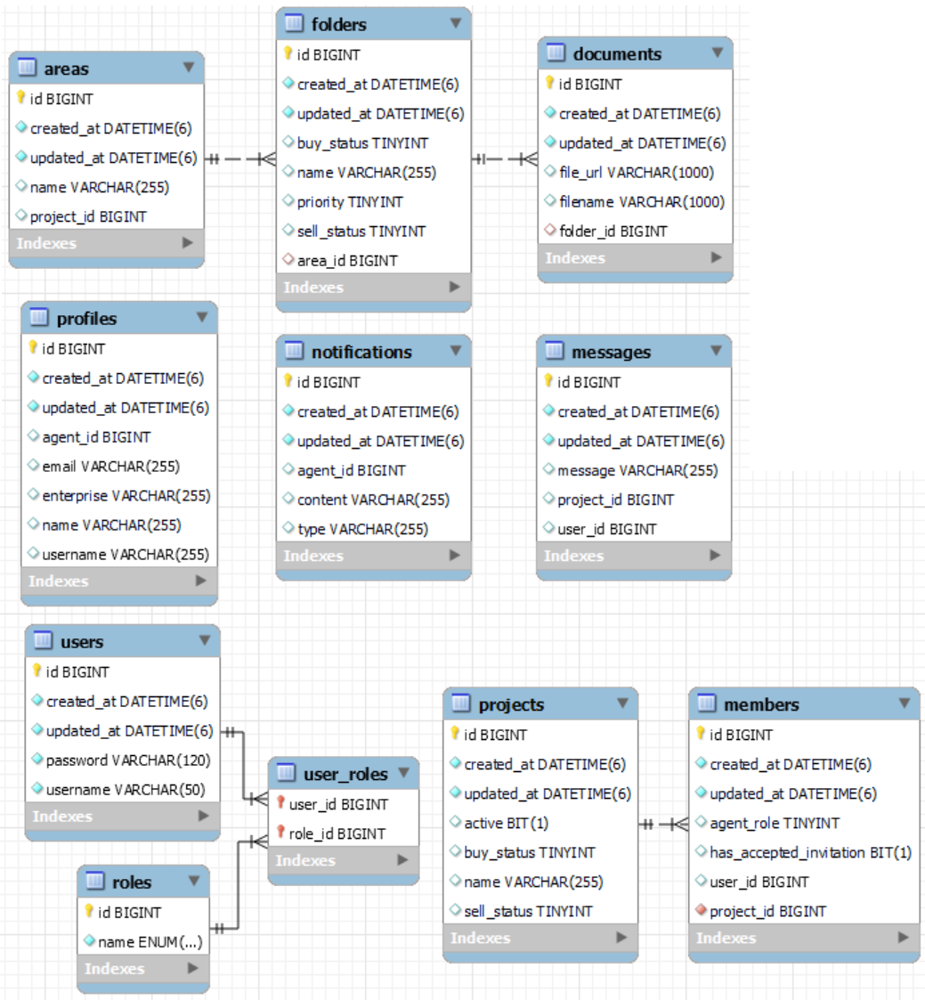
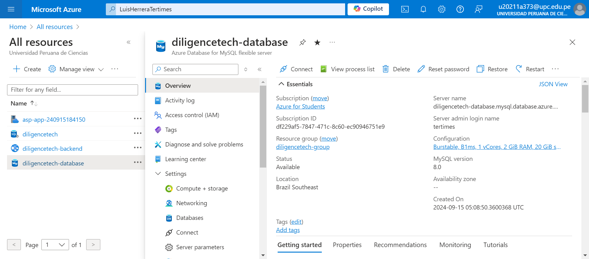
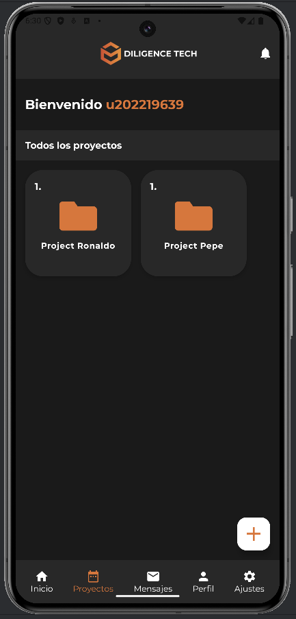

<p align="center">
    <strong>Universidad Peruana de Ciencias Aplicadas</strong><br>
    <br></img><br>
    <br>
    <strong>Ingeniería de Software - 2024-02</strong><br>
    <br>
    <strong>CC238 - Aplicaciones para Dispositivos Móviles - SW63</strong><br>  
    <br>
    <strong>Profesor: Jorge Luis Mayta Guillermo</strong><br>
    <br> <strong>INFORME DE TRABAJO PARCIAL - TP1</strong> 
</p>
<p align="center">
    <strong>Startup: MobiLoom</strong><br>
    <strong>Producto:  DiligenceTech</strong>
</p>

<h3 align="center" >Team Members:</h3>
<div>
    <table align="center">
        <tr>
            <th style="text-align:center;">Miembro</th>
            <th style="text-align:center;">Código</th>
        </tr>
        <tr>
            <td>Criollo De La Cruz, Diego Anderson</td>
            <td>U202219639</td>
        </tr>
        <tr>
            <td>Herrera González, Luis Eduardo</td>
            <td>U202218227</td>
        </tr>
        <tr>
            <td>Morales Calderón, Hernan Emilio</td>
            <td>U202216263</td>
        </tr>
        <tr>
            <td>Valle Zuta, Abel Andrés</td>
            <td>U202210297</td>
        </tr>
    </table>
</div>
<br>

---

<div style="page-break-after: always;"></div>

# Registro de Versiones del Informe

<div align="center">

| Versión |   Fecha    | Autor | Descripción de modificación | 
|:-------:|:----------:|:-----:|:----------------------------| 
|TB1| 20/08/2024 |Criollo De La Cruz, Diego Anderson| Realicé el capítulo II y mis entrevistas|
|TB1| 20/08/2024 |Herrera González, Luis Eduardo| Completé el capítulo I y mis entrevistas|
|TB1| 20/08/2024 |Morales Calderón, Hernan Emilio| Llevé a cabo el capítulo I y mis entrevistas|
|TB1| 20/08/2024 |Valle Zuta, Abel Andrés| Desarrollé a cabo el capítulo II y mis entrevistas|
|TB2| 10/09/2024 |Criollo De La Cruz, Diego Anderson| Realicé la Landing Page y aporté con el Backend|
|TB2| 10/09/2024 |Herrera González, Luis Eduardo| Realicé el Backend|
|TB2| 10/09/2024 |Morales Calderón, Hernan Emilio| Completé el capítulo III y ayudé con el Backend|
|TB2| 10/09/2024 |Valle Zuta, Abel Andrés| Hice el capítulo IV y colaboré con el desarrollo del Backend|
|TP1| 23/09/2024 |Criollo De La Cruz, Diego Anderson| Contribuí en la implementación de la aplicación móvil |
|TP1| 23/09/2024 |Herrera González, Luis Eduardo| Participé en la creación de la aplicación móvil |
|TP1| 23/09/2024 |Morales Calderón, Hernan Emilio| Desarrollé el contenido del capítulo V|
|TP1| 23/09/2024 |Valle Zuta, Abel Andrés| Llevé a cabo el desarrollo del capitulo V|

</div>

---

<div style="page-break-after: always;"></div>

# Contenido
## Tabla de Contenidos
### [Registro de versiones del informe](#registro-de-versiones-del-informe)
### [Contenido](#contenido)
### [Student Outcome](#student-outcome)
### [Objetivos SMART](#objetivos-smart)
### [Capítulo I: Presentación](#capítulo-i-presentación)
- [1.1. Startup Profile](#11-startup-profile)
    - [1.1.1. Descripción de la Startup](#111-descripción-de-la-startup)
    - [1.1.2. Perfiles de integrantes del equipo](#112-perfiles-de-integrantes-del-equipo)
- [1.2. Solution Profile](#12-solution-profile)
    - [1.2.1. Antecedentes y problemática](#121-antecedentes-y-problemática)
    - [1.2.2. Lean UX Process](#122-lean-ux-process)
        - [1.2.2.1. Lean UX Problem Statements](#1221-lean-ux-problem-statements)
        - [1.2.2.2. Lean UX Assumptions](#1222-lean-ux-assumptions)
        - [1.2.2.3. Lean UX Hypothesis Statements](#1223-lean-ux-hypothesis-statements)
        - [1.2.2.4. Lean UX Canvas](#1224-lean-ux-canvas)
- [1.3. Segmentos objetivo](#13-segmentos-objetivo)

### [Capítulo II: Needfinding](#capítulo-ii-needfinding)
- [2.1. Competidores](#21-competidores)
    - [2.1.1. Análisis competitivo](#211-análisis-competitivo)
    - [2.1.2. Estrategias y tácticas frente a competidores](#212-estrategias-y-tácticas-frente-a-competidores)
- [2.2. Entrevistas](#22-entrevistas)
    - [2.2.1. Diseño de entrevistas](#221-diseño-de-entrevistas)
    - [2.2.2. Registro de entrevistas](#222-registro-de-entrevistas)
    - [2.2.3. Análisis de entrevistas](#223-análisis-de-entrevistas)
- [2.3. Needfinding](#23-needfinding)
    - [2.3.1. User Personas](#231-user-personas)
    - [2.3.2. User Task Matrix](#232-user-task-matrix)
    - [2.3.3. User Journey Mapping](#233-user-journey-mapping)
    - [2.3.4. Empathy Mapping](#234-empathy-mapping)
    - [2.3.5. As-is Scenario Mapping](#235-as-is-scenario-mapping)
- [2.4. Requirements specification](#24-requirements-specification)
    - [2.4.1. To-Be Scenario Mapping](#241-to-be-scenario-mapping)
    - [2.4.2. User Stories](#242-user-stories)
    - [2.4.3. Impact Mapping](#243-impact-mapping)
    - [2.4.4. Product Backlog](#244-product-backlog)

### [Capítulo III: Arquitectura](#capítulo-iii-arquitectura)
- [3.1. Product Design](#31-product-design)
    - [3.1.1. Style Guidelines](#311-style-guidelines)
        - [3.1.1.1. General Style Guidelines](#3111-general-style-guidelines)
    - [3.1.2. Information Architecture](#312-information-architecture)
        - [3.1.2.1. Organization Systems](#3121-organization-systems)
        - [3.1.2.2. Labelling Systems](#3122-labelling-systems)
        - [3.1.2.3. SEO Tags and Meta Tags](#3123-seo-tags-and-meta-tags)
        - [3.1.2.4. Searching Systems](#3124-searching-systems)
        - [3.1.2.5. Navigation Systems](#3125-navigation-systems)
    - [3.1.3. Landing Page UI Design](#313-landing-page-ui-design)
        - [3.1.3.1. Landing Page Wireframe](#3131-landing-page-wireframe)
        - [3.1.3.2. Landing Page Mock-up](#3132-landing-page-mock-up)
    - [3.1.4. Mobile Applications UX/UI Design](#314-mobile-applications-uxui-design)
        - [3.1.4.1. Mobile Applications Wireframes](#3141-mobile-applications-wireframes)
        - [3.1.4.2. Mobile Applications Wireflow Diagrams](#3142-mobile-applications-wireflow-diagrams)
        - [3.1.4.3. Mobile Applications Mock-ups](#3143-mobile-applications-mock-ups)
        - [3.1.4.4. Mobile Applications User Flow Diagrams](#3144-mobile-applications-user-flow-diagrams)
        - [3.1.4.5. Mobile Applications Prototyping](#3145-mobile-applications-prototyping)
- [3.2. Architecture Overview](#32-architecture-overview)
    - [3.2.1. Domain-Driven Software Architecture](#321-domain-driven-software-architecture)
        - [3.2.1.1. Software Architecture Context Level Diagram](#3211-software-architecture-context-level-diagram)
        - [3.2.1.2. Software Architecture Container Level Diagram](#3212-software-architecture-container-level-diagram)
        - [3.2.1.3. Software Architecture Components Diagram](#3213-software-architecture-components-diagram)
    - [3.2.2. Software Object-Oriented Design](#322-software-object-oriented-design)
        - [3.2.2.1. Class Diagrams](#3221-class-diagrams)
        - [3.2.2.2. Class Dictionary](#3222-class-dictionary)
        - [3.2.2.3. Database Design](#3223-database-design)
        - [3.2.2.4. Database Diagram](#3224-database-diagram)

### [Capítulo IV: Backend Product Implementation & Validation](#capítulo-iv-backend-product-implementation-validation)
- [4.1. Software Configuration Management](#41-software-configuration-management)
    - [4.1.1. Software Development Environment Configuration](#411-software-development-environment-configuration)
    - [4.1.2. Source Code Management](#412-source-code-management)
    - [4.1.3. Source Code Style Guide & Conventions](#413-source-code-style-guide-conventions)
    - [4.1.4. Software Deployment Configuration](#414-software-deployment-configuration)
- [4.2. Software Development & Implementation](#42-software-development-implementation)
    - [4.2.1. Sprint 1](#421-sprint-1)
        - [4.2.1.1. Sprint Planning 1](#4211-sprint-planning-1)
        - [4.2.1.2. Sprint Backlog 1](#4212-sprint-backlog-1)
        - [4.2.1.3. Development Evidence for Sprint Review](#4213-development-evidence-for-sprint-review)
        - [4.2.1.4. Testing Suite Evidence for Sprint Review](#4214-testing-suite-evidence-for-sprint-review)
        - [4.2.1.5. Execution Evidence for Sprint Review](#4215-execution-evidence-for-sprint-review)
        - [4.2.1.6. Services Documentation Evidence for Sprint Review](#4216-services-documentation-evidence-for-sprint-review)
        - [4.2.1.7. Software Deployment Evidence for Sprint Review](#4217-software-deployment-evidence-for-sprint-review)
        - [4.2.1.8. Team Collaboration Insights during Sprint](#4218-team-collaboration-insights-during-sprint)

### [Capítulo V: Product Implementation & Validation](#capítulo-v-product-implementation-validation)
- [5.1. Software Configuration Management](#51-software-configuration-management)
    - [5.1.1. Software Development Environment Configuration](#511-software-development-environment-configuration)
    - [5.1.2. Source Code Management](#512-source-code-management)
    - [5.1.3. Source Code Style Guide & Conventions](#513-source-code-style-guide-conventions)
    - [5.1.4. Software Deployment Configuration](#514-software-deployment-configuration)
- [5.2. Landing Page & Mobile Application Implementation](#52-landing-page-mobile-application-implementation)
    - [5.2.1. Sprint 2](#521-sprint-2)
        - [5.2.1.1. Sprint Planning 2](#5211-sprint-planning-2)
        - [5.2.1.2. Sprint Backlog 2](#5212-sprint-backlog-2)
        - [5.2.1.3. Development Evidence for Sprint Review](#5213-development-evidence-for-sprint-review)
        - [5.2.1.4. Testing Suite Evidence for Sprint Review](#5214-testing-suite-evidence-for-sprint-review)
        - [5.2.1.5. Execution Evidence for Sprint Review](#5215-execution-evidence-for-sprint-review)
        - [5.2.1.6. Services Documentation Evidence for Sprint Review](#5216-services-documentation-evidence-for-sprint-review)
        - [5.2.1.7. Software Deployment Evidence for Sprint Review](#5217-software-deployment-evidence-for-sprint-review)
        - [5.2.1.8. Team Collaboration Insights during Sprint](#5218-team-collaboration-insights-during-sprint)

### [Conclusiones](#conclusiones)
### [Bibliografía](#bibliografía)
### [Anexos](#anexos)
---
<div style="page-break-after: always;"></div>

# Student Outcome

<div align="justify">

| Criterio Específico | Acciones Realizadas                                                                                                                                                                                                                                                                                                                                                                                                                                                                                                                                                                                                                                                                                                                                                                                                                                                                                                                                                                                                                                                                                                                                                                                                                                                                                                                                                                                                                                                                                                                                                                                                                                                                                                                                                                                                                                                                                                                                                                                                                                               | Conclusiones |
|---------------------|-------------------------------------------------------------------------------------------------------------------------------------------------------------------------------------------------------------------------------------------------------------------------------------------------------------------------------------------------------------------------------------------------------------------------------------------------------------------------------------------------------------------------------------------------------------------------------------------------------------------------------------------------------------------------------------------------------------------------------------------------------------------------------------------------------------------------------------------------------------------------------------------------------------------------------------------------------------------------------------------------------------------------------------------------------------------------------------------------------------------------------------------------------------------------------------------------------------------------------------------------------------------------------------------------------------------------------------------------------------------------------------------------------------------------------------------------------------------------------------------------------------------------------------------------------------------------------------------------------------------------------------------------------------------------------------------------------------------------------------------------------------------------------------------------------------------------------------------------------------------------------------------------------------------------------------------------------------------------------------------------------------------------------------------------------------------|--------------|
| Actualiza conceptos <br> y conocimientos <br> necesarios para su <br> desarrollo profesional <br> y en especial para su <br> proyecto en soluciones <br> de software. | **TB1:**<br><br>Criollo De La Cruz, Diego Anderson<br><br>En este entregable colaboré con la realización de la comparación del producto con los competidores del mercado, además de ello, brindé apoyo con la documentación general. Esto contribuye con este criterio del Student Outcome de tal manera que contribuye con el desarrollo de la capacidad de brindar soluciones de software.<br><br>Herrera González, Luis Eduardo<br><br>Produje los Lean UX Statements y apoyé en el Lean UX Process en general para brindar la base del producto de DiligenceTech. Realicé el diseño de entrevistas con el fin de conocer que es Due Diligence a mayor grado y obtener preferencias de soluciones para nuestros segmentos objetivos, tal como estaba descrito en el libro de Domain-Driven Design de Eric Evans. Apoyé en los User Stories para realizar la solución en las siguientes entregas.<br><br>Morales Calderón, Hernan Emilio<br><br>En esta entrega, participé activamente en la definición de los Objetivos SMART, la realización de entrevistas y su análisis, así como en la revisión y corrección de diversos aspectos del proyecto. Además, aporté en varios puntos clave del desarrollo. Estas actividades han sido fundamentales para actualizar mis conocimientos y habilidades, lo que me permite continuar mejorando en la creación de soluciones de software efectivas y alineadas con las necesidades del mercado.<br><br>Valle Zuta, Abel Andrés<br><br>Para esta primera entrega, estuve investigando nueva información sobre las necesidades que hay actualmente para poder plantear una propuesta de solución atractiva y de gran utilidad para los usuarios, además ayudé a identificar las necesidades que tendrían los usuarios, comprendiendo su punto de vista al realizar el needfinding y posteriormente a definir las historias de usuario y colocarlas en el product backlog con su dificultad de cada una. Esto me ha ayudado a desarrollarme como un mejor profesional y a poder plantear mejores soluciones de software. <br><br>**TB2:** <br><br> Criollo De La Cruz, Diego Anderson<br><br> En este segundo entregable, colaboré principalmente en el desarrollo del diseño y el prototipo de la aplicación móvil, asegurando que las interfaces fueran intuitivas y centradas en el usuario. Mi participación en esta fase me ayudó a mejorar mis habilidades en diseño de interfaces y a comprender mejor la importancia de la usabilidad en soluciones de software. Estas actividades me permitieron actualizar mis conocimientos en UX/UI, contribuyendo significativamente a mi desarrollo profesional. <br><br>Herrera González, Luis Eduardo<br><br> En esta entrega, lideré el desarrollo del backend, implementando la lógica principal de la aplicación y garantizando una integración eficiente con la base de datos y la API. Me encargué de diseñar la estructura del sistema y asegurar que todas las funcionalidades críticas estuvieran alineadas con los requerimientos del proyecto. Esta experiencia me permitió actualizar y fortalecer mis habilidades en desarrollo de backend, consolidando mi capacidad para crear soluciones escalables y eficaces en entornos complejos. <br><br>Morales Calderón, Hernan Emilio<br><br> Mi principal contribución en este entregable fue el desarrollo del diseño y el prototipo de la aplicación móvil, donde participé activamente en la creación de interfaces atractivas y funcionales. Esta tarea me ayudó a mejorar mi comprensión del diseño centrado en el usuario y a actualizar mis conocimientos en herramientas de prototipado, lo cual ha sido fundamental para mi desarrollo profesional en la creación de soluciones de software orientadas al usuario. <br><br> Valle Zuta, Abel Andrés<br><br> En esta fase del proyecto, colaboré principalmente en el desarrollo del diseño y prototipo de la aplicación móvil, asegurando que la experiencia de usuario fuera clara y eficiente. Además, participé en la conceptualización del flujo de la aplicación para asegurar su coherencia. Estas tareas me ayudaron a actualizar mis conocimientos en diseño de interfaces y en la creación de prototipos funcionales, mejorando mis capacidades en la creación de soluciones de software que satisfagan las necesidades del usuario final.<br><br> **TP:** <br><br> Criollo De La Cruz, Diego Anderson <br><br> Me encargué de la configuración del entorno de desarrollo y la gestión del código fuente, asegurando la correcta integración de los cambios mediante el uso de control de versiones. Implementé las guías de estilo definidas para el proyecto, contribuyendo a la consistencia y calidad del código. Además, participé en la configuración del despliegue del software, fortaleciendo mis habilidades en la gestión de entornos de desarrollo y control de versiones.<br><br>Herrera González, Luis Eduardo<br><br>Lideré la implementación y despliegue del backend, configurando la infraestructura de la aplicación y asegurando una integración eficiente con la base de datos y la API. Documenté los servicios desarrollados y creé la suite de pruebas y evidencias para el Sprint Review, asegurando la funcionalidad y robustez del sistema. Estas actividades me permitieron actualizar mis conocimientos en desarrollo backend y gestión de infraestructura, mejorando mi capacidad para crear soluciones escalables.<br><br>Morales Calderón, Hernan Emilio<br><br>Participé activamente en el desarrollo de la landing page y la implementación de la aplicación móvil. Colaboré en la planificación del Sprint 2, elaborando el Sprint Backlog y organizando el desarrollo de tareas. Además, me encargué de generar las evidencias de desarrollo, pruebas y ejecución para el Sprint Review. Esta experiencia me permitió profundizar mis conocimientos en desarrollo frontend y metodologías ágiles, asegurando la entrega eficiente de productos de alta calidad.<br><br>Valle Zuta, Abel Andrés<br><br>Establecí y apliqué las guías de estilo y convenciones del código, garantizando la uniformidad y legibilidad en todo el proyecto. Configuré el entorno de despliegue del software y documenté el proceso de implementación, facilitando la colaboración del equipo. También configuré pruebas automatizadas para asegurar la calidad del producto. Estas actividades me ayudaron a fortalecer mis conocimientos en DevOps y buenas prácticas de desarrollo, optimizando la calidad y estabilidad del proyecto.| **TB1:** <br><br>En base a las contribuciones individuales y el objetivo del Student Outcome, podemos concluir que este primer entregable ha sido fundamental para el desarrollo profesional del equipo. A través de la comparación con los competidores, el desarrollo del Lean UX Process y del Needfinding, todos los miembros del equipo hemos adquirido un entendimiento profundo del mercado y las necesidades de los usuarios. La participación en la definición de objetivos SMART, entrevistas, y su respectivo análisis, así como la investigación de necesidades actuales y la creación de user stories, nos ha permitido actualizar y expandir nuestros conocimientos y habilidades en soluciones de software. Este proceso ha fortalecido nuestra capacidad para desarrollar productos efectivos y alineados con las demandas del mercado, mostrando un avance significativo en nuestra formación como profesionales competentes en el ámbito de desarrollo de software. <br><br> **TB2:** <br><br>En este segundo entregable, el equipo se centró en el desarrollo del backend y la creación del diseño y prototipo de la aplicación móvil, lo cual ha sido clave para nuestro crecimiento profesional. A través de la implementación del backend, liderado por el desarrollo de la lógica principal de la aplicación y la integración con la base de datos, hemos reforzado nuestras habilidades técnicas en la construcción de soluciones robustas. Al mismo tiempo, el enfoque en el diseño y prototipado de interfaces centradas en el usuario nos permitió perfeccionar nuestra capacidad para crear experiencias intuitivas y funcionales. Este proceso no solo nos ha ayudado a actualizar y expandir nuestros conocimientos, sino también a fortalecer nuestra capacidad para desarrollar soluciones de software completas y efectivas, alineadas con las expectativas del mercado y las mejores prácticas de la industria. <br><br> **TP:** <br><br> En este tercer entregable, el equipo se ha centrado en la implementación y validación del producto. A través de la configuración del entorno de desarrollo, la gestión del código fuente y la aplicación de guías de estilo, hemos asegurado un proceso de desarrollo eficiente. La implementación de la landing page y la aplicación móvil durante el Sprint 2 ha permitido afianzar nuestras habilidades técnicas y de colaboración. Este proceso nos ha ayudado a fortalecer nuestras competencias para entregar productos de alta calidad, alineados con las necesidades del mercado y las mejores prácticas de la industria.|
| Reconoce la <br> necesidad del <br> aprendizaje permanente <br> para el desempeño <br> profesional y el desarrollo <br> de proyectos en <br> soluciones de software. | <br>**TB1:**<br><br>Criollo De La Cruz, Diego Anderson<br><br>Reconocí la necesidad del por qué se implementó la solución planteada para el rubro elegido, esto fue de la mano con la documentación realizada y las entrevistas que se hicieron para conocer más a fondo a nuestros segmentos objetivos.<br><br>Herrera González, Luis Eduardo<br><br>Tal como es necesario, obtuve información online necesaria para apoyar a la construcción del Needfinding. Utilicé las entrevistas para conocer Due Diligence y tratar de modelarlo en Diagrama de Clases para simplificarlo posteriormente para la solución.<br><br>Morales Calderón, Hernan Emilio<br><br>Reconocí la importancia del aprendizaje continuo al definir los Objetivos SMART, realizar entrevistas, y hacer correcciones en el proyecto. Mantenerme en constante actualización es esencial para enfrentar los desafíos y adaptar soluciones de software a las necesidades del mercado.<br><br>Valle Zuta, Abel Andrés <br><br> Confirmé que es de vital importancia seguir aprendiendo y a nunca conformarnos con solo lo que ya sabemos, sino a siempre buscar aprender algo nuevo, ya que esto nos ayuda a tener un mejor desempeño y una visión más amplia al realizar proyectos, y de este modo poder solucionar con tecnología los diferentes problemas que pueden tener las personas actualmente. <br><br>**TB2:**<br><br>                                   Criollo De La Cruz, Diego Anderson<br><br> Durante esta fase del proyecto, mi implicación en el desarrollo del diseño y prototipo de la aplicación móvil me permitió actualizar mis conceptos sobre diseño de interfaces y experiencia de usuario. Al trabajar en la creación de prototipos interactivos y en la documentación técnica, profundicé en las mejores prácticas de diseño y en la integración visual del software. Este proceso me ha permitido actualizar mis conocimientos y habilidades, asegurando que mi enfoque en la creación de soluciones de software sea más efectivo y alineado con las necesidades de los usuarios. <br><br>Herrera González, Luis Eduardo <br><br> En esta etapa, me centré en el desarrollo del backend, lo que me brindó la oportunidad de actualizar y expandir mis conocimientos en arquitectura de sistemas y lógica de programación. La implementación y optimización de la infraestructura backend me permitió aplicar conceptos avanzados de desarrollo de software, mejorando mi capacidad para construir sistemas robustos y eficientes. Este trabajo ha sido crucial para actualizar mis habilidades técnicas y asegurar que el backend de la aplicación sea sólido y funcional.<br><br>Morales Calderón, Hernan Emilio<br><br>Participé activamente en el diseño y prototipo de la aplicación móvil, lo que me permitió actualizar mis habilidades en diseño de interfaces y en la creación de experiencias de usuario efectivas. Trabajar en la elaboración de prototipos funcionales y en la integración de componentes visuales me ayudó a actualizar y reforzar mis conocimientos sobre usabilidad y diseño interactivo. Este proceso ha sido fundamental para mejorar mi capacidad de desarrollar soluciones de software que sean tanto funcionales como atractivas para los usuarios.<br><br>Valle Zuta, Abel Andrés<br><br>En esta fase del proyecto, mi trabajo en el desarrollo del diseño y prototipo de la aplicación móvil destacó la importancia de mantenerse actualizado con las últimas tendencias y técnicas en diseño de software. La creación de prototipos me permitió aplicar nuevos enfoques y metodologías, actualizando mis conocimientos en el campo del diseño de interfaces y experiencia de usuario. Este aprendizaje continuo ha sido clave para mejorar mi capacidad de diseñar soluciones tecnológicas que respondan eficazmente a las necesidades y expectativas de los usuarios. <br><br> **TP:**<br><br> Criollo De La Cruz, Diego Anderson<br><br>  En esta entrega, colaboré principalmente en la configuración del entorno de desarrollo y la gestión del código fuente, asegurando un flujo de trabajo eficiente y organizado para el equipo. Mi participación me permitió actualizar mis conocimientos en control de versiones y en la correcta configuración del entorno, mejorando mi capacidad para gestionar proyectos de software y optimizar el proceso de desarrollo.<br><br> Herrera González, Luis Eduardo <br><br> Durante este entregable, me enfoqué en la implementación y despliegue del backend, asegurando una integración eficiente con la base de datos y la API. Lideré la configuración de la infraestructura y la documentación de los servicios para el Sprint 2, lo que me ayudó a mejorar mis habilidades en la creación de soluciones backend robustas y escalables, y a fortalecer mi capacidad para gestionar la infraestructura de proyectos de software complejos.<br><br> Morales Calderón, Hernan Emilio<br><br>Mi principal contribución en esta entrega fue el desarrollo de la landing page y la implementación de la aplicación móvil. Participé activamente en la planificación y ejecución del Sprint 2, asegurando que las funcionalidades desarrolladas estuvieran alineadas con los objetivos del proyecto. Esta experiencia me permitió profundizar mis conocimientos en desarrollo frontend y en la gestión ágil de proyectos, mejorando mi capacidad para entregar productos de alta calidad de manera eficiente.<br><br>Valle Zuta, Abel Andrés<br><br>En este entregable, me encargué de establecer y aplicar las guías de estilo y convenciones del código, así como de colaborar en la configuración del entorno de desarrollo y despliegue. Estas actividades me ayudaron a reforzar mis conocimientos en buenas prácticas de desarrollo y a mejorar mi capacidad para asegurar la consistencia y calidad del código en todo el proyecto, contribuyendo a un proceso de desarrollo más eficiente y organizado.                                                                                                                                                                                                                                                                                                                                                                                                                                                                                                                                                                 | **TB1:** <br><br>En esta primera entrega, todos hemos reafirmado la importancia del aprendizaje permanente como un pilar esencial para el desempeño profesional y el desarrollo de soluciones de software efectivas. A través de realizar la documentación, entrevistas, y la recolección de información clave, hemos reconocido la necesidad de mantenernos actualizados y en constante aprendizaje. Este enfoque nos ha permitido comprender mejor las necesidades del mercado y de nuestros segmentos objetivos, facilitando la construcción de una solución más precisa y adaptada a sus necesidades. La identificación de la importancia del aprendizaje continuo ha reforzado la idea de que, para enfrentar los desafíos del sector tecnológico y proponer soluciones innovadoras, es crucial no conformarse con el conocimiento existente, sino buscar siempre expandirlo y actualizarlo. Por lo que consideramos que esta mentalidad es fundamental para el éxito a largo plazo en el campo de desarrollo de software.<br><br> **TB2:** <br><br>En esta fase del proyecto, hemos subrayado la importancia de actualizar constantemente nuestros conocimientos y habilidades en el desarrollo de soluciones de software. La colaboración en el diseño y prototipado de la aplicación móvil nos ha permitido aplicar y expandir nuestros conocimientos sobre diseño de interfaces y desarrollo de backend. Este proceso ha reforzado la necesidad de estar al día con las últimas técnicas y mejores prácticas, lo cual es crucial para crear soluciones tecnológicas efectivas y adaptadas a las necesidades de los usuarios. La actualización continua en estas áreas ha sido fundamental para mejorar nuestras capacidades profesionales y asegurar que el software que desarrollamos sea robusto, eficiente y relevante.<br><br> **TP:** <br><br> En este tercer entregable, hemos reafirmado la importancia del aprendizaje permanente como base para el desarrollo profesional y la ejecución exitosa de proyectos en soluciones de software. La implementación del entorno de desarrollo, la gestión del código y la aplicación de guías de estilo han destacado la necesidad de adaptarse a nuevas herramientas y metodologías para asegurar la calidad y eficiencia del producto final. La constante actualización de nuestras habilidades ha sido crucial para enfrentar los retos técnicos y colaborar efectivamente en la creación de una aplicación móvil robusta y funcional. Este enfoque en el aprendizaje continuo nos ha permitido no solo mejorar nuestras competencias actuales, sino también prepararnos para los futuros desafíos del sector tecnológico, reafirmando que el conocimiento es un recurso dinámico que debe nutrirse constantemente para el éxito en el desarrollo de software.
|

</div>

<div style="page-break-after: always;"></div>

# Objetivos SMART

<div align="justify">

En esta sección, se detallan los objetivos específicos asignados a cada estudiante, aplicando la metodología SMART. Este enfoque asegura que los objetivos sean Específicos, Medibles, Ambiciosos, Relevantes y estén limitados en el Tiempo. La definición precisa de estos objetivos no solo orienta el trabajo de cada estudiante hacia resultados claros y alcanzables, sino que también garantiza que cada paso contribuya de manera significativa al éxito del proyecto MobiLoom, alineándose con su misión de transformar el proceso de Due Diligence en línea. A continuación, se presenta un desglose de los objetivos SMART asignados, junto con sus respectivas métricas y plazos.

<br><br>


| Nombre                               | Criollo De La Cruz, Diego Anderson                                                                                   |
|--------------------------------------|---------------------------------------------------------------------------------------------------------------------|
| **Descripción del objetivo**         | Mejorar habilidades en la identificación y formulación de problemáticas y suposiciones en el contexto de proyectos tecnológicos. |
| **Fecha de inicio**                  | 12 / 08 / 2024                                                                                                      |
| **Fecha de cumplimiento esperada**   | 19 / 08 / 2024                                                  |
| **S - Specific**                     | Evaluar la precisión y aceptación de las hipótesis por parte del equipo de trabajo, utilizando el Lean UX Canvas como herramienta de validación. |
| **M - Measurable**                   | Completar al menos tres entrevistas detalladas con usuarios y presentar un informe que incluya el mapeo de empatía y escenarios actuales (As-is Scenario Mapping), además de identificar al menos dos oportunidades clave para mejorar el producto. |
| **A - Ambitious**                    | Retar la habilidad de Diego para identificar problemas complejos y diseñar soluciones innovadoras dentro del proceso de Lean UX. |
| **R - Relevant**                     | Este objetivo es clave para roles de gestión de proyectos y diseño estratégico en entornos tecnológicos, específicamente en el manejo del Lean UX Process. |
| **T - Time-bound**                   | Completar este objetivo dentro de la primera semana para asegurar un comienzo sólido en el proyecto. |

<br><br>

| Nombre                               | Herrera González, Luis Eduardo                                                                                       |
|--------------------------------------|----------------------------------------------------------------------------------------------------------------------|
| **Descripción del objetivo**         | Desarrollar habilidades de análisis competitivo y diseño de estrategias, aplicables en la evaluación de mercado y propuestas de valor. |
| **Fecha de inicio**                  | 12 / 08 / 2024                                                                                                      |
| **Fecha de cumplimiento esperada**   | 26 / 08 / 2024                                                                                                      |
| **S - Specific**                     | Identificar competidores clave utilizando el Competitive Analysis y formular estrategias basadas en evidencia para mejorar la propuesta de valor en relación con los Segmentos objetivo. |
| **M - Measurable**                   | Medir la cantidad de competidores analizados y la calidad de la evidencia recopilada para sustentar decisiones estratégicas en el contexto del Análisis competitivo. |
| **A - Ambitious**                    | Desafiar la capacidad de Luis para investigar y entender mercados competitivos y formular estrategias frente a competidores. |
| **R - Relevant**                     | El análisis competitivo es fundamental para roles de planificación y gestión en entornos tecnológicos, alineado con la mejora continua en la evaluación de Estrategias y tácticas frente a competidores. |
| **T - Time-bound**                   | Completar este análisis dentro de las dos primeras semanas para asegurar una estrategia competitiva adecuada. |

<br><br>

| Nombre                               | Morales Calderón, Hernan Emilio                                                                                       |
|--------------------------------------|----------------------------------------------------------------------------------------------------------------------|
| **Descripción del objetivo**         | Adquirir habilidades en análisis de mercado y planificación estratégica, aplicables al liderazgo de proyectos tecnológicos. |
| **Fecha de inicio**                  | 12 / 08 / 2024                                                                                                      |
| **Fecha de cumplimiento esperada**   | 26 / 08 / 2024                                                                                                      |
| **S - Specific**                     | Desarrollar capacidades para analizar entrevistas y proponer soluciones estratégicas alineadas con las tendencias del mercado, utilizando el Análisis de entrevistas. |
| **M - Measurable**                   | Medir la precisión de los análisis y la alineación de las soluciones propuestas con las necesidades del mercado, basándose en los resultados del Análisis de entrevistas. |
| **A - Ambitious**                    | Fomentar la habilidad de Hernán para liderar proyectos y desarrollar estrategias de mercado innovadoras basadas en los insights obtenidos de User Personas y Empathy Mapping. |
| **R - Relevant**                     | La planificación estratégica es esencial para roles de liderazgo en proyectos tecnológicos, asegurando que las decisiones estén alineadas con los resultados del Needfinding. |
| **T - Time-bound**                   | Completar este análisis dentro de las dos primeras semanas para asegurar una dirección clara en el proyecto. |

<br><br>

| Nombre                               | Valle Zuta, Abel Andrés                                                                                              |
|--------------------------------------|----------------------------------------------------------------------------------------------------------------------|
| **Descripción del objetivo**         | Fortalecer las habilidades en la identificación y definición de necesidades del usuario, aplicables en roles de gestión de producto. |
| **Fecha de inicio**                  | 12 / 08 / 2024                                                                                                      |
| **Fecha de cumplimiento esperada**   | 27 / 08 / 2024                                                                                                      |
| **S - Specific**                     | Desarrollar la capacidad para identificar y definir User Stories que reflejen las necesidades del usuario en proyectos tecnológicos, basándose en los resultados de User Journey Mapping y Empathy Mapping. |
| **M - Measurable**                   | Medir el éxito mediante la alineación de User Stories con las expectativas del usuario final y los objetivos del proyecto, documentando los resultados en el Product Backlog. |
| **A - Ambitious**                    | Ampliar las competencias de Abel en la gestión de productos y en la creación de soluciones centradas en el usuario, mejorando la claridad de los requerimientos de Requirements specification. |
| **R - Relevant**                     | Las User Stories son fundamentales para garantizar que el desarrollo de productos siga las necesidades reales del usuario, asegurando que el To-Be Scenario Mapping defina con claridad el futuro del producto. |
| **T - Time-bound**                   | Cumplir este objetivo dentro de las primeras tres semanas para asegurar claridad en el roadmap del producto. |


<div style="page-break-after: always;"></div>

# Capítulo I: Presentación

## 1.1. Startup Profile
### 1.1.1. Descripción de la Startup
<div align="justify">
    MobiLoom es una startup centrada en la producción de soluciones móviles en el ámbito de finanzas corporativas teniendo como enfoque central la seguridad de los archivos y el User Experience con el objetivo de hacer nuestros productos los más intuitivos y rápidos de utilizar. Nuestras plataformas tecnológicas están diseñadas para proporcionar una manera eficiente y precisa de llevar a cabo los procesos más importantes de este rubro, como el proceso de Debida Diligencia exhaustiva durante transacciones comerciales, como la venta de empresas. En MobiLoom, nos comprometemos a simplificar y agilizar el proceso de evaluación tan importante en finanzas, permitiendo a nuestros clientes tomar decisiones informadas con confianza. Cada solución que desarrollamos está impulsada por la búsqueda constante de la excelencia en la eficiencia operativa y la precisión en el análisis de datos. En MobiLoom, estamos transformando la forma en que se aborda la recolección de datos en línea, llevando la automatización al centro de las transacciones comerciales del siglo XXI.
    <br>
    
  <div align="center">

  <div align="center">

  

  </div>

  </div>

</div>
<div align="justify">
    <ul>
        <li>
            <b>Misión:</b>
        </li> 
        Nuestra misión en MobiLoom es proporcionar soluciones innovadoras y eficientes para el mundo de finanzas corporativas, permitiendo a nuestros clientes realizar evaluaciones exhaustivas de manera rápida y precisa durante transacciones comerciales críticas, como la venta de empresas en Due Diligence.
        <li>
            <b>Visión:</b>
        </li>
        En MobiLoom, nuestra visión es ser la plataforma líder en soluciones móviles para finanzas corporativas al ser la opción más eficiente en tiempo-dinero y por su innovación en seguridad de archivos y experiencia de usuario. Aspiramos a liderar el cambio hacia la automatización inteligente en la recolección y análisis de datos, impulsando un nuevo estándar en la eficiencia y precisión de las transacciones comerciales del siglo XXI.
    </ul>
</div>

<div style="page-break-after: always;"></div>

### 1.1.2. Perfiles de integrantes del equipo

### Los integrantes que conforman parte de nuestro startup son:
<div align="justify">

| Integrante                | Perfil                                                                                                                                                                                                                                                                                                                                                                                                                                                                                                                                                                                                                                                                                                                                                                                              | Foto                                                |
|---------------------------|-----------------------------------------------------------------------------------------------------------------------------------------------------------------------------------------------------------------------------------------------------------------------------------------------------------------------------------------------------------------------------------------------------------------------------------------------------------------------------------------------------------------------------------------------------------------------------------------------------------------------------------------------------------------------------------------------------------------------------------------------------------------------------------------------------|-------------------------------------|
| Criollo De La Cruz, Diego Anderson (U202219639) | Mi nombre es Diego Anderson Criollo de La Cruz, soy estudiante de 6to ciclo de la carrera de Ingeniería de Software. Me gusta mucho emplear soluciones creativas y que busquen eficiencia para poder abordar de esta forma cualquier desafío de la mejor manera. Como miembro del grupo, pretendo aportar con todos mis conocimientos en el desarrollo web tanto como en el front-end y back-end, además de siempre colaborar con mis ideas y soluciones ante cualquier dificultad que se presente en el desarrollo. Espero poder aprender mucho de mis compañeros y que todos juntos podamos emplear de manera adecuada las tecnologías que iremos aprendiendo a lo largo del desarrollo del proyecto.                                                                                             |              |
| Herrera González, Luis Eduardo (U202218227) | Me llamo Luis Eduardo Herrera González, tengo 20 años y curso el 6to ciclo de la carrera de Ingeniería de Software en la Universidad Peruana de Ciencias Aplicadas (UPC). Como habilidades técnicas conozco los lenguajes de C++, C#, Java, Python y Visual Basic; manejo base de datos SQL y NoSQL (MongoDB); manejo los frameworks de Angular, Vue, Spring Boot y .NET. Por la parte de mis habilidades blandas siento que soy buen comunicador, responsable, empático y buen organizador de grupo. Espero ser de utilidad para el equipo en cumplir todos los requisitos con alta calidad de este proyecto.                                                                                                                                                                                      |                |
| Morales Calderón, Hernan Emilio (U202216263) | Soy Hernan Morales, tengo 19 años y actualmente estoy cursando el 6to ciclo de Ingeniería de Software. Me considero una persona sumamente responsable y organizada, especialmente en trabajos universitarios. Mi objetivo es culminar exitosamente el curso y nuestro proyecto junto a mi equipo, asegurando que cada detalle se ejecute con precisión. Tengo conocimientos sólidos en lenguajes como C++, C#, y JavaScript, así como en frameworks como Angular y Vue, lo que me permite desarrollar interfaces dinámicas y adaptarme rápidamente a diferentes entornos de desarrollo. Además, manejo SQL para la gestión y optimización de bases de datos. Estoy convencido de que, con buena planificación y comunicación, entregaremos un proyecto de alta calidad que supere las expectativas. |               |
| Valle Zuta, Abel Andrés (U202210297) | Soy Abel Andrés Valle Zuta, estudiante de la carrera de Ingeniería de Software en la Universidad Peruana de Ciencias Aplicadas (UPC), tengo 19 años y actualmente estoy cursando el 6to ciclo en la sede de Monterrico. Sé programar y editar videos. Además, sé resolver problemas, trabajar en equipo y lograr unir más al grupo. Mis hobbies son jugar básquet, fútbol, tenis, videojuegos, escuchar música, salir a pasear con mis amigos, ver películas, nadar, hacer ejercicio, pasear a mis mascotas y pasar tiempo con mi familia. Finalmente, siempre estoy dispuesto a trabajar y terminar a tiempo los deberes, esforzándome para aprender y comprender lo máximo posible y finalizar con éxito todos mis objetivos.                                                                     |                |

</div>

<div style="page-break-after: always;"></div>

## 1.2. Solution Profile

<div align="justify">

En el cambiante mundo empresarial actual, la debida diligencia financiera se ha convertido en un pilar fundamental para asegurar transacciones comerciales seguras y exitosas. Sin embargo, el proceso tradicional de recolección y análisis de datos financieros de empresas puede ser lento, tedioso y propenso a errores. Esta realidad ha generado una necesidad urgente de encontrar soluciones innovadoras que permitan a los inversores realizar este crucial proceso de manera más eficiente y efectiva.
En este contexto, surge una nueva era de la debida diligencia financiera, donde la tecnología y la inteligencia se unen para ofrecer soluciones ágiles y precisas. La búsqueda de métodos más inteligentes para acceder y analizar datos financieros se ha convertido en una prioridad para los profesionales que buscan tomar decisiones informadas y estratégicas en sus inversiones.

</div>


### 1.2.1. Antecedentes y problemática

<div align="justify">

***What***

* El proceso tradicional de *Due Diligence* se caracteriza por ser laborioso, costoso y propenso a errores.
* Los inversores y profesionales financieros revisan una gran cantidad de documentos financieros, legales y operativos en un tiempo limitado.
* Esto puede resultar en la contratación de servicios adicionales y gastos innecesarios.


***Who***

* Inversores y profesionales financieros se ven afectados por la complejidad y la carga de trabajo del proceso tradicional de *Due Diligence*.
* Propietarios de empresas enfrentan el desafío de compartir información confidencial con inversores potenciales.


***Where***

Esta problemática es común durante el proceso de Diligencia Debida online, usualmente en empresas de alto valor.


***When***

La problemática surge opcionalmente al inicio de un proceso de adquisición o inversión, donde las dos empresas participantes están de acuerdo con brindarse toda la información necesaria para llevar a cabo la transacción pronto y donde la toma de decisiones debe realizarse en un tiempo limitado.


***Why***

* La falta de acceso rápido y la preocupación por la seguridad de la información sensible de la empresa dificultan la toma de decisiones.
* Existe el riesgo de que los inversores utilicen los datos sensibles con otros fines, lo que genera incertidumbre y desconfianza.


***How***

* En el estado normal, los contadores e inversores pueden requerir días o semanas para revisar y analizar manualmente los documentos financieros de una empresa. Con "MobiLoom", el proceso se acelerará significativamente, permitiendo la revisión y análisis en cuestión de horas

* El problema sigue un patrón de ineficiencia y lentitud en el proceso de *Due Diligence*. Los contadores y los inversores a menudo se ven abrumados por la cantidad de documentos y la falta de herramientas eficientes para analizarlos de manera rápida y precisa.


***How Much***

* En un día, un inversor puede perder oportunidades de inversión valiosas debido a la demora en la obtención de informes financieros. Con "MobiLoom", estas oportunidades podrían aumentar en un 50%.

* En términos de pérdida de oportunidades de inversión, el retraso actual podría estar implicando el equivalente a 50 000 soles por mes por los participantes de la inversión. Con "MobiLoom", se podrían reducir los retrasos que se pueden presentar en el proceso de **Due Diligence**.

</div>

### 1.2.2. *Lean UX Process*


#### 1.2.2.1. *Lean UX Problem Statements*

<div align="justify">

***Problem Statement***

* El estado actual del Due Diligence para los inversionistas, y contadores que representan a sus empresas, es muy extenuante.

* Los productos actuales no ofrecen una solución completa. Ya sea esto solo el análisis, la búsqueda de empresas, la seguridad para trabajar con archivos. Sin embargo, nunca algo que embarque todo. Debido a esto, todos los involucrados son afectados de manera negativa, perdiendo grandes oportunidades de negocio o la inversión que necesitan para poder crecer en el mercado.

* ¿Cómo podemos mejorar la experiencia del proceso Due Diligence con el fin de agilizar y mejorar la calidad del trabajo?

</div>

#### 1.2.2.2. *Lean UX Assumptions*

***Business Assumptions:***

<div align="justify">

1. **Creo que mis clientes necesitan** una herramienta eficiente y confiable para realizar sus análisis financieros exhaustivos durante el proceso de *Due Diligence*.

2. **Estas necesidades se pueden resolver con** nuestra plataforma inteligente que automatice el análisis financiero y que ofrezca acceso rápido y seguro a información relevante de las empresas objetivo.

3. **Mis clientes iniciales son** inversores y contadores financieros que trabajan en sell-side.

4. **El valor #1 que un cliente quiere de mi servicio es** una manera eficiente y precisa de realizar sus transacciones durante el proceso de *Due Diligence*.

5. **El cliente también puede obtener estos beneficios adicionales** como una mayor confianza en el proceso de *Due Diligence*, una mayor seguridad de los datos financieros y una experiencia de usuario mejorada.
6. **Voy a adquirir la mayoría de mis clientes a través de** campañas de marketing dirigidas a empresas de capital privado, fondos de inversión y otros actores clave en el mercado de transacciones

7. **Haré dinero a través de** la venta de suscripciones a nuestra plataforma "Diligence Tech", ofreciendo diferentes niveles de acceso según las necesidades del cliente.

8. **Mi competencia principal en el mercado serán** otras plataformas de *Due Diligence* en línea, así como servicios tradicionales de consultoría que ofrecen análisis de datos financieros.

9. **Los venceremos debido a** nuestra capacidad para ofrecer una solución tecnológica más rápida, precisa y fácil de usar que nuestras competidoras, así como nuestro enfoque en la seguridad de los datos y la experiencia del usuario..

10. **El mayor riesgo del producto es** que la tecnología pueda no funcionar como se espera, lo que podría resultar en errores en los datos o brechas de seguridad.

11. **Resolveremos esto a través de la** implementación de rigurosas pruebas de calidad y seguridad, así como la rápida corrección de errores a medida que surjan.

12. **¿Qué otras suposiciones tenemos? ¿Eso, si se prueba que es falso, causará que nuestro negocio/proyecto no funcione?** Otras suposiciones que tenemos son si:
    - Existe una demanda significativa.
    - La automatización de datos financieros mejorará el proceso de *Due Diligence*.
    - Garantizar la seguridad y privacidad de los datos financieros de las empresas objetivo a través de cifrado de extremo a extremo generará confianza entre los usuarios

</div>

***Business Outcomes:***

<div align="justify">

- Conseguir los primeros 100 usuarios registrados para la aplicación de ambos segmentos objetivos.

- Retener el 50% de los usuarios
  durante el primer semestre.

- Registrar 20 usuarios activos al mismo tiempo utilizando la aplicación.

- Conseguir el registro de 10 nuevos usuarios referidos a través de links compartidos.

</div>

***Users Assumptions:***

<div align="justify">

1. **¿Quién es el usuario?**

   Los usuarios son los asociados al proceso de Due Diligence, tanto los inversores que están interesados participar con empresas, como estás mismas representadas con sus contadores financieros.

2. **¿Qué problemas tiene nuestro producto? ¿Resolver?**

    * Dificultad para acceder y comparar de manera eficiente la información financiera de múltiples empresas durante el proceso de Due Diligence.
    * Riesgos asociados con la toma de decisiones basadas en datos financieros incompletos o inexactos.
    * Falta de una plataforma centralizada y fácil de usar para analizar y evaluar oportunidades de inversión de manera efectiva.
    * Dificultad para acceder y analizar rápidamente datos financieros de empresas objetivo durante el proceso de debida diligencia.
    * Riesgos asociados con la falta de seguridad y privacidad de los datos financieros sensibles.
    * Falta de eficiencia en el proceso de debida diligencia debido a la dependencia de métodos manuales y lentos.

3. **¿Qué características son importantes?**

* Interfaz de usuario intuitiva y eficiente que permita una navegación fluida y acceso rápido a la información financiera clave.
* Funcionalidades avanzadas de comparación y análisis de datos financieros para facilitar la toma de decisiones informadas.
* Seguridad de datos avanzada para garantizar la confidencialidad y protección de la información financiera sensible.
* Herramientas de visualización y generación de informes que permitan una comprensión clara y rápida de la salud financiera de las empresas objetivo.

4. **¿Dónde encaja nuestro producto en su trabajo o vida?**

   Nuestro producto se incorpora en el proceso de Due Diligence que los usuarios realizan. Estos lo utilizarían para agilizar los procesos que usualmente se realizan de manera manual o menos automatizada.

5. **¿Cuándo y cómo es usado nuestro producto?**

    * Es utilizado por los inversores y contadores desde el inicio del proceso de evaluación de una empresa objetivo hasta la toma final de decisiones de compra o inversión.
    * Los inversores utilizan nuestro producto para analizar los estados financieros, realizar comparaciones entre empresas y   evaluar los riesgos y oportunidades de inversión.
    * Los contadores lo utilizan para poder comunicarse con los inversores interesados y realizar transacciones de información de manera segura.

6. **¿Cómo debe verse nuestro producto y cómo comportarse?**

    * Debe comportarse de manera eficiente y rápida, brindando resultados precisos y actualizados de manera oportuna.
    * La seguridad y confidencialidad de los datos financieros es fundamental, por lo que el producto debe garantizar un cifrado sólido y medidas de protección avanzadas.
    * Nuestro producto debe tener una apariencia profesional y moderna, con una interfaz de usuario clara y organizada que facilite la comparación y análisis de datos.

</div>

***User outcomes:***

<div align="justify">

- Acceso de manera rápida y eficiente a la información financiera relevante de las empresas objetivo.
- Confianza en la seguridad y privacidad de los datos financieros sensibles
- Experiencia de usuario mejorada gracias a la interfaz intuitiva y fácil de usar

</div>

***Feature Assumptions***

<div align="justify">

* Herramientas avanzadas de análisis:
    - Los inversores podrán utilizar herramientas avanzadas para comparar rápidamente los datos financieros de múltiples empresas.
    - Se asume que características como gráficos interactivos, análisis comparativos y tablas dinámicas mejorarán la eficiencia del análisis.
    - Funciones especializadas para analizar estados financieros, ratios financieros, tendencias históricas y comparaciones sectoriales.
* Automatización de Procesos Repetitivos:
    - Capacidad de automatizar tareas como la extracción de datos financieros, el cálculo de ratios y la generación de informes estándar.
* Funcionalidades de Seguridad Avanzada:
    - Los inversores confiarán en la plataforma debido a las medidas de seguridad avanzada, como cifrado de extremo a extremo y autenticación de dos factores.
    - Se asume que la seguridad sólida garantizará la protección de los datos financieros confidenciales.
* Generación de Informes Personalizados:
    - Los inversores podrán crear informes personalizados basados en sus criterios de evaluación y preferencias.
    - Se asume que los informes detallados y personalizados facilitarán la toma de decisiones informadas.
* Visualización de Datos Interactiva:
    - Gráficos interactivos y tablas dinámicas para visualizar los datos financieros de manera clara y comprensible.
* Alertas y Notificaciones Relevantes:
    - Los inversores recibirán alertas sobre cambios significativos en los datos financieros de las empresas en su lista de seguimiento.
    - Se asume que las alertas oportunas y relevantes mejorarán la capacidad de reacción a los cambios en las empresas objetivo.

</div>

#### 1.2.2.3. *Lean UX Hypothesis Statements*

<div align="justify">

* **Creemos que** los usuarios valoran la eficiencia y precisión en el análisis de datos financieros durante el proceso de *Due Diligence*. **Sabremos que** esto es cierto **cuando** observemos una disminución significativa en el tiempo dedicado al análisis manual de datos, medido por una reducción del 30% en el tiempo promedio necesario para completar una debida diligencia.

* **Creemos que** los usuarios encuentran la automatización un elemento esencial para agilizar el proceso de cDue Diligence*. **Sabremos que** esto es cierto **cuando** veamos la disminución en el tiempo que se ocupa por cada proceso, medido por una reducción en 40% en el tiempo de los procesos que tienen la capacidad de ser automatizados.

* **Creemos que** la seguridad y privacidad de los datos financieros sensibles es una preocupación clave para los usuarios durante el proceso de *Due Diligence*. **Sabremos que** esto es cierto **cuando** veamos una mayor confianza en la plataforma “DiligenceTech” por parte de los contadores, medido por una reducción del 20% en las solicitudes de soporte relacionadas con la seguridad de los datos.

* **Creemos que** la generación de informes personalizados será importante para tomar decisiones finales para los usuarios. **Sabremos que** esto es cierto **cuando** veamos un incremento en la cantidad de adquisiciones que se realicen. Medido por un aumento en un 20% de compras después de realizarse el proceso de analisis financiero.

* **Creemos que** los usuarios valoran la visualización de datos interactivos durante el proceso de *Due Diligence*. **Sabremos que** esto es cierto **cuando** observemos un aumento del 30% en la tasa de participación de los usuarios en proyectos de análisis financiero donde se ofrecen visualizaciones de datos interactivos en comparación con sesiones donde no se proporcionan

* **Creemos que** las alertas y notificaciones son una funcionalidad muy importante para todos los usuarios. **Sabremos que** esto es cierto **cuando** veamos una reducción en el tiempo de respuesta entre los usuarios y la entrega de sus partes correspondientes., medido por un 20% en la reducción de quejas por falta de respuestas a tiempo de los usuarios durante el proceso de *Due Diligence*.

</div>

#### 1.2.2.4. *Lean UX Canvas*

)](Resources/cap1/Lean-UX-Canvas.png)

## 1.3. Segmentos objetivo


<div style="page-break-after: always;"></div>

# Capítulo II: Needfinding

## 2.1. Competidores


<div align="justify">

En el contexto de un mercado peruano en constante cambio y evolución, donde la gestión eficiente en los procesos de *Due Diligence*  se convierten en una necesidad primordial en el rubro de las inversiones. **DiligenceTech** se enfrenta a una urgente tarea: comprender y abordar a sus competidores para lograr una posición sólida y garantizar la satisfacción de sus usuarios.

</div>

**Competidores:**

<div align="justify">

* ***Datasite Diligence:***
  El *virtual data room* más utilizado en el mercado. Proporcionada por la empresa Datasite, esta solución mediante aplicación web brinda un espacio de almacenamiento y edición de archivos, los cuales se esperan que sean documentos financieros para posteriormente ser enviados por correo electrónico a quien sea desee el usuario. Entre las mecánicas más resaltantes en este competidor está la posibilidad de censura mediante IA elementos de los documentos y la modalidad Q&A. Su precio es a base de páginas que contengan los archivos, costando 7 mil dólares por cada 10 mil páginas.

</div>

  )](Resources/cap2/datasite.png)

<div align="justify">

* ***iDeals:***
  *Virtual data room online* para servicios financieros, Biotech, IT y otras especializaciones del sistema que utilizan organizaciones de muchos usuarios dentro de la aplicación, la simplificación del ingreso y uso de archivos, y la seguridad del sistema en cuidarlos. Cuenta actualmente con más de 1 millón de usuarios y destaca en el mercado por su atención al cliente rápida y constante.

</div>

  )](Resources/cap2/ideals.png)

<div align="justify">

* ***Firmex:***
  *Virtual data room* para contadores financieros que permite insertar y guardar archivos al sistema con funcionalidades como Q&A y censura. Reconocido en el mercado por la seguridad que mantiene en los archivos.

</div>

  )](Resources/cap2/firmex.png)

### 2.1.1. Análisis competitivo

<table><tr><th colspan="16" valign="top"><b>Competitive Analysis Landscape</b></th></tr>
<tr><td colspan="9" valign="top">¿Por qué llevar a cabo este análisis?  </td><td colspan="7" valign="top">Este análisis nos permitirá reconocer a las compañías competidoras y sus respectivos productos similares a DiligenceTech y resaltar las funcionalidades y carencias que estas mismas posean para comparar con nuestra propuesta.</td></tr>
<tr><td colspan="6" valign="top"><p><b>Nombre</b></p><p></p></td><td colspan="3" valign="top"><b>DillingenceTech</b></td><td colspan="3" valign="top"><b>Datasite Dilligence</b></td><td colspan="3" valign="top"><b>iDeals</b></td><td valign="top"><b>Firmex</b></td></tr>
<tr><td colspan="6" valign="top"><b>Logo</b> </td><td colspan="3" valign="top"><div align="center"></div></td><td colspan="3" valign="top"><div align="center"></div></td><td colspan="3" valign="top"><div align="center"></div></td><td valign="top"><div align="center"></div></td></tr>
<tr><td colspan="3" rowspan="4" valign="top"><b>Perfil</b></td><td colspan="3" rowspan="2" valign="top"><b>Overview</b></td><td colspan="3" rowspan="2" valign="top">Web application que ofrece una virtual data room especializada en el análisis y edición de contenido de documentos financieros, la presentación de estos y la extracción web complementaria de documentos financieros públicos.</td><td colspan="3" rowspan="2" valign="top">Web y mobile application que ofrece una virtual data room especializada en Due Diligence con sistemas de inteligencia artificial en la búsqueda de archivos, censura y formatos Q&A para el trabajo colaborativo.</td><td colspan="3" rowspan="2" valign="top">Web y mobile application que ofrece una virtual data room especializada en utilizar márgenes separados para proceso de Due Diligence. Lo que ofrece funcionalidades únicas separar los. documentos financieros por categorías.</td><td rowspan="2" valign="top">Web y mobile application especializada en la carga de archivos financieros y la utilización del formato Q&A para la colaboración entre múltiples usuarios autorizados que participen en el proceso de Due Diligence.</td></tr>
<tr></tr>
<tr><td colspan="3" rowspan="2" valign="top"><b>Ventaja competitiva ¿Qué valor ofrece a los clientes?</b></td><td colspan="3" rowspan="2" valign="top">La ventaja competitiva de DiligenceTech reside en su enfoque especializado en la eficiencia y seguridad del manejo de archivos e información sensible con el cifrado de extremo a extremo. Asimismo, su interfaz intuitiva y fácil de usar, facilita los flujos de trabajo.</td><td colspan="3" rowspan="2" valign="top">La ventaja competitiva de Datasite Diligence reside en la gestión de diferentes archivos a través del uso de sistemas con inteligencia artificial. Asimismo, destaca por tener herramientas y una amplia base de datos con información detallada para análisis financieros.</td><td colspan="3" rowspan="2" valign="top">La ventaja competitiva de iDeals reside en la categorización de sus archivos e información sensible. Asimismo, ofrece una atención eficiente y rápida a sus clientes en los procesos de Due Diligence.</td><td rowspan="2" valign="top">La ventaja competitiva de Firmex es la carga especializada de archivos financieros y el uso del formato Q&A. Asimismo, es una plataforma segura para procesos de fusiones y adquisiciones.</td></tr>
<tr></tr>
<tr><td colspan="3" rowspan="2" valign="top"><b>Perfil de Marketing</b></td><td colspan="3" valign="top"><b>Mercado objetivo</b></td><td colspan="3" valign="top"><p>- Contadores financieros. </p><p>- Inversores. </p><p>- Firmas de capital privado. </p><p>- Empresas en procesos de fusiones y adquisiciones.</p></td><td colspan="3" valign="top"><p>- Empresas en procesos de fusiones y adquisiciones. </p><p>- Empresas financieras que trabajan realizando Due Diligence.</p></td><td colspan="3" valign="top"><p>- Empresas en busca de realizar un Due Diligence para su beneficio. </p><p>- Empresas financieras que trabajan realizando Due Diligence.</p></td><td valign="top"><p>- Empresas en busca de realizar un Due Diligence para su beneficio. </p><p>- Empresas financieras que trabajan realizando Due Diligence.</p></td></tr>
<tr><td colspan="3" valign="top"><b>Estrategias de Marketing</b></td><td colspan="3" valign="top"><p>- Social Ads. </p><p>- Email marketing. </p><p>- Marketing en redes sociales. </p><p>- Marketing de contenidos.</p></td><td colspan="3" valign="top"><p>- Estrategia de up-selling. </p><p>- Marketing de contenidos. </p><p>- Email marketing. </p><p>- Marketing en redes sociales. </p><p>- SEM (Search Engine Marketing).</p></td><td colspan="3" valign="top"><p>- Marketing de contenidos. </p><p>- Email marketing. </p><p>- SEM (Search </p><p>&emsp;Engine Marketing).</p></td><td valign="top"><p>- Marketing en redes sociales. </p><p>- Marketing de contenidos. </p><p>- Social Ads.</p></td></tr>
<tr><td colspan="3" rowspan="3" valign="top"><b>Perfil de producto</b></td><td colspan="3" valign="top"><b>Productos y Servicios</b></td><td colspan="3" valign="top"><p>- Plataforma de gestión de datos financieros y revisión segura de información sensible. </p><p>- Herramientas de análisis y comparación.</p></td><td colspan="3" valign="top"><p>- Base de datos con extensa información detallada. </p><p>- Herramientas avanzadas de análisis financiero y comparativo.</p></td><td colspan="3" valign="top"><p>- Plataforma segura para compartir documentos con información sensible. </p><p>- Herramientas de colaboración y seguimiento de transacciones.</p></td><td valign="top"><p>- Virtual data room con un soporte para una cantidad ilimitada de usuarios en cualquier tipo de Due Diligence (M&A, Buy Side, Sell Side, etc). </p><p>- Atención especializada a los clientes las 24 horas del día.</p></td></tr>
<tr><td colspan="3" valign="top"><b>Precios y Costos</b></td><td colspan="3" valign="top">DiligenceTech tendrá dos planes de suscripción. Un plan básico de 500 soles anuales y un plan avanzado de 800 soles anuales. El plan básico ofrece las funciones principales de la web application, mientras que el plan avanzado, ofrece herramientas avanzadas de recolección de datos financieros de empresas publicas.</td><td colspan="3" valign="top">Datasite Diligence ofrece sus precios en base a la cantidad de datos y tiempo utilizados en su plataforma. Sin embargo, un uso basico de sus funciones puede costar aproximadamente 1000 délares mensuales. Es importante resaltar que sus precios no son compartidos públicamente, la cotización se hace de forma personalizada.</td><td colspan="3" valign="top">iDeals ofrece tres planes de suscripción para sus servicios de salas de datos: el plan Pro, diseñado para proyectos pequeños y medianos; el plan Business, adecuado para proyectos de tamaño mediano a grande; y el plan Enterprise, que es una solución de nivel empresarial pensada para diversos objetivos comerciales.</td><td valign="top"><p>Firmex ofrece planes de precios personalizados que dependen de dos factores: si se requiere la plataforma para un solo proyecto o múltiples proyectos, y la cantidad de memoria requerida. Por ejemplo, para empresas financieras que necesitan 5 GB de memoria y soporte para múltiples proyectos, el precio es de 1000 dólares anuales.</p><p></p></td></tr>
<tr><td colspan="3" valign="top"><b>Canales de distribución</b></td><td colspan="3" valign="top">DiligenceTech contara con un website en donde se mostraran y detallaran sus planes de suscripción.</td><td colspan="3" valign="top"><p>Datasite Diligence cuenta con un formulario de contacto para la cotización y venta de las aplicaciones de su web application. (Web)</p><p></p></td><td colspan="3" valign="top">iDeals cuenta con un formulario de contacto para obtener el precio de cada uno de sus planes de suscripción. (Web)</td><td valign="top">Firmex cuenta con un formulario de contacto para la cotización de sus precios. (Web)</td></tr>
<tr><td colspan="3" rowspan="4" valign="top"><b>Análisis FODA</b></td><td colspan="3" valign="top"><b>Fortalezas</b></td><td colspan="3" valign="top"><p>- Interfaz intuitiva y fácil de usar. </p><p>- Cifrado de extremo a extremo para seguridad de datos. </p><p>- Perfecto para inversores y contadores financieros, debido a que ofrecemos opciones de personalización para adaptarse a las necesidades específicas de cada cliente. </p><p>- Informes detallados y análisis profundo de datos financieros.</p></td><td colspan="3" valign="top"><p>- Competidor líder en el mercado. </p><p>- Presencia global y local, en especial en empresas grandes del país. </p><p>- Aplicación móvil como contraparte. </p><p>- Experiencia en el campo de Due Diligence.</p></td><td colspan="3" valign="top"><p>- Atención al cliente las 24 horas del día y con respuesta rápida. </p><p>- Experiencia en el campo de Due Diligence. </p><p>- Seguridad en el Data Room. </p><p>- Aplicación móvil como contraparte. </p><p>- Enfocado para todo tipo de Due </p><p>- Diligence junto a todo tipo de documentos requeridos.</p></td><td valign="top"><p>- Atención al cliente las 24 horas del día y con respuesta rápida. </p><p>- Precio más asequible en comparación con otras ofertas. </p><p>- Experiencia en el campo de Due Diligence. </p><p>- Seguridad en el Data Room.</p></td></tr>
<tr><td colspan="3" valign="top"><b>Debilidades</b></td><td colspan="3" valign="top"><p>- Proyecto aún en desarollo. </p><p>- Necesidad de establecer una reputación en el mercado.</p></td><td colspan="3" valign="top"><p>- Competencia en el sector de seguridad privada. </p><p>- Riesgos asociados con la ciberseguridad. </p><p>- Dependencia de la economía y la seguridad del país en el que opera.</p></td><td colspan="3" valign="top"><p>- Diferencias de experiencias de uso entre sus plataformas. </p><p>- El costo de adquirir y mantener una plataforma pueden ser una barrera para ciertas empresas.</p></td><td valign="top">- Limitaciones de cobertura.</td></tr>
<tr><td colspan="3" valign="top"><b>Oportunidades</b></td><td colspan="3" valign="top"><p>- Crecimiento del mercado de seguridad residencial y protección personal. </p><p>- Posibilidad de expansión a nivel internacional.</p></td><td colspan="3" valign="top"><p>- La marca y popularidad le permite crecer fácilmente en Perú. </p><p>- Aumento de la demanda. </p><p>- Expansión de mercados emergentes. </p><p>- Mayor conciencia sobre la seguridad en el mundo empresarial.</p></td><td colspan="3" valign="top"><p>- El crecimiento de su popularidad habilita su posibilidad de crecer. </p><p>- Expandirse a nuevos mercados. </p><p>- Continuar con el desarrollo de nuevas funcionalidades y herramientas para mejorar la experiencia del usuario.</p></td><td valign="top"><p>- La demora de cotización de la competencia. </p><p>- Diversificación de productos y servicios. </p><p>- Innovación en la tecnología de seguridad. </p><p>- Expansión geográfica y alianzas estratégicas.</p></td></tr>
<tr><td colspan="3" valign="top"><b>Amenazas</b></td><td colspan="3" valign="top"><p>- Competencia de nuevas plataformas emergentes. </p><p>- Cambios en la regulación gubernamental. </p><p>- Desafíos en la adopción de tecnología. </p><p>- Problema de seguridad de datos.</p></td><td colspan="3" valign="top"><p>- Cambios en la regulación gubernamental. </p><p>- Riesgos cibernéticos en constante evolución. </p><p>- Competencia de nuevas plataformas emergentes.</p></td><td colspan="3" valign="top"><p>- Cambios en preferencias del consumidor. </p><p>- Ataques de la seguridad de los datos en la plataforma. </p><p>- Cambios en la regulación gubernamental.</p></td><td valign="top"><p>- Competencia creciente en el mercado de servicios integrales. </p><p>- Impacto económico adverso en el entorno empresarial peruano. </p><p>- Cambios en la regulación gubernamental.</p></td></tr>
</table>


### 2.1.2. Estrategias y tácticas frente a competidores

<div align="justify">

Según Michael Porter, la estrategia competitiva implica cómo una empresa compite en su mercado específico. Porter identificó tres estrategias generales que las empresas pueden emplear para competir con éxito: liderazgo en costos, diferenciación y enfoque. La estrategia de liderazgo en costos implica ofrecer productos o servicios a precios más bajos que los de los competidores, mientras que la diferenciación se basa en ofrecer productos y servicios únicos y distintivos. Por otro lado, una estrategia de enfoque se centra en un segmento de mercado específico. Para llevar a cabo eficazmente estas estrategias, las empresas necesitan tener un profundo conocimiento de sus mercados y competidores para desarrollar y mantener una ventaja competitiva sostenible a largo plazo.

Teniendo en cuenta el análisis SWOT previamente presentado para DiligenceTech, proponemos las siguientes estrategias competitivas:

**Estrategias Competitivas para** ***DiligenceTech:***

1. **Liderazgo en Costos:**

**Estrategia:** *DiligenceTech* puede buscar optimizar sus procesos internos para reducir costos operativos y ofrecer sus servicios a precios más competitivos que los de sus competidores.

**Tácticas:**
* Implementar tecnologías eficientes que reduzcan los gastos de infraestructura y operativos.
* Negociar acuerdos favorables con proveedores y socios para obtener mejores precios en servicios y herramientas necesarios.
* Ofrecer modelos de precios flexibles y descuentos opr volumen para atraer a clientes sensibles al costo.

2. **Diferenciación a través de la Innovación:**

**Estrategia:** *DiligenceTech* puede enfocarse en desarrollar características y funcionalidades únicas que destaquen su plataforma como líder en innovación en el proceso de *Due Diligence*.

**Tácticas:**
* Realizar investigaciones de mercado para identificar necesidades no cubiertas y oportunidades de mejora.
* Invertir en I+D para desarrollar herramientas avanzadas de análisis financiero y presentación de informes.
* Promocionar activamente las nuevas características a través de campañas de marketing destacando la vanguardia tecnológica de DiligenceTech.


3. **Enfoque en segmentos específicos del mercado:**

**Estrategia:** *DiligenceTech* puede especializarse en atender a segmentos específicos del mercado donde pueda ofrecer un valor diferenciado y adaptado.

**Tácticas:**
* Identificar sectores de la industria con necesidades únicas de debida diligencia, como startups en crecimiento, empresas de tecnología emergente, o industrias reguladas.
* Desarrollar soluciones personalizadas y paquetes de servicios adaptados a las necesidades específicas de cada segmento.
* Colaborar con asociaciones y grupos de la industria para fortalecer la presencia en estos segmentos y generar confianza.

**Tácticas Específicas para** ***DiligenceTech:***

1. **Monitoreo Competitivo Continuo:**

**Táctica:** Realizar análisis periódicos de las estrategias, precios y ofertas de la competencia para identificar oportunidades y amenazas.

**Acciones:**
* Mantenerse al tanto de los movimientos de los competidores en cuanto a lanzamientos de productos, cambios de precios y campañas de marketing.
* Utilizar herramientas de seguimiento de competidores y análisis de mercado para obtener información valiosa.

2. **Estrategias de Precios y Paquetes Competitivos:**

**Táctica:** Ajustar estratégicamente los precios y paquetes de servicios para competir de manera efectiva en el mercado.

**Acciones:**
* Realizar análisis de precios comparativos y ajustar los precios de acuerdo con el valor percibido por los clientes.
* Ofrecer paquetes personalizados que se ajusten a las necesidades específicas de diferentes tipos de clientes, como empresas grandes, medianas y startups.

3. **Inversión en Marketing Diferenciado:**

**Táctica:** Desarrollar mensajes y campañas de marketing que resalten las fortalezas únicas y la propuesta de valor de DiligenceTech.

**Acciones:**
* Crear contenido educativo y de valor que demuestre cómo DiligenceTech aborda los desafíos específicos de la debida diligencia.
* Utilizar estudios de casos y testimonios de clientes para respaldar los beneficios y resultados de la plataforma.

4) **Alianzas Estratégicas y Colaboraciones:**

**Táctica:** Establecer asociaciones estratégicas con empresas complementarias o instituciones que puedan ampliar el alcance y la oferta de DiligenceTech.

**Acciones:**
* Colaborar con firmas de consultoría reconocidas para ofrecer servicios combinados de asesoramiento y tecnología.
* Formar alianzas con organizaciones financieras o legales para ofrecer paquetes completos de servicios de debida diligencia.

</div>

## 2.2. Entrevistas

<div align="justify">

Para acceder al video de las entrevistas, haga click en la ([URL](https://upcedupe-my.sharepoint.com/:v:/g/personal/u202218227_upc_edu_pe/ETDvbGNsfTtPu3SprXtTpj8BxgjAb-tCNDGqu5BaRT13qg?e=YZdpP5&nav=eyJyZWZlcnJhbEluZm8iOnsicmVmZXJyYWxBcHAiOiJTdHJlYW1XZWJBcHAiLCJyZWZlcnJhbFZpZXciOiJTaGFyZURpYWxvZy1MaW5rIiwicmVmZXJyYWxBcHBQbGF0Zm9ybSI6IldlYiIsInJlZmVycmFsTW9kZSI6InZpZXcifX0%3D))

### 2.2.1. Diseño de entrevistas

Entrevista a personas referentes a nuestro segmentos objetivo, las preguntas varían dependiendo del segmento debido a las diferentes situaciones:

**Segmento 1:** Contadores Financieros

**Preguntas de introducción:**

1. ¿Cuántos años tiene?
2. ¿En qué ciudad del Perú reside?
3. ¿Cuál considera que es su estatus social limitando la descripción a Clase Baja, Clase Media, Clase Media-Alta y Clase Alta?
4. ¿Cúal es su profesión?
5. ¿Cuánto tiempo lleva ejerciendo esta profesión?
6. ¿Está familiarizado con el concepto y proceso de diligencia debida?

**Preguntas principales:**

1. ¿Cómo lleva a cabo usted su trabajo para un proceso de diligencia debida?
2. ¿Podría mencionar su participación en la diligencia debida en base a las etapas que tiene?
3. ¿Cómo son los procesos más comunes de obtener documentos financieros de las empresas investigadas y cuanto tiempo demoran?
4. ¿Cuáles son los documentos de las empresas que dan más problemas en obtener?
5. ¿Qué indicador o análisis financiero considera el más importante para calificar una empresa?
6. ¿Cual ha sido la mayor cantidad de empresas que ha consultado a la vez?
7. ¿Usted mismo realiza el análisis financiero?
8. ¿Qué tipo de problemas se encuentran a la hora de analizar los datos de la empresa?
9. ¿Qué medidas de seguridad se llevan para garantizar la confidencialidad de los datos?
10. ¿Cuáles son los procesos más importantes que usted rinde para la diligencia debida?
11. ¿Cómo se guardan y se comparten los documentos financieros en el proceso de diligencia debida?
12. ¿Usualmente cuánto demora un proceso de *Due Diligence*?
13. ¿Qué herramientas conoce o utiliza durante este proceso?
14. ¿Qué partes le parecen tediosas del proceso de diligencia debida?
15. ¿Cómo colabora con otros participantes en el proceso de diligencia debida?
16. ¿Qué problemas suelen ocurrir mediante el proceso de diligencia debida y cómo los resuelve?
17. ¿Ve factible contener los documentos financieros en un servicio de alojamiento en la web como Google Drive?
    * En caso sí, ¿Qué funcionalidades cree que vendrían útil para complementar el servicio? ¿Algo que tenga que ver con seguridad, análisis automático o edición de los documentos?
    * En caso no, ¿Qué funcionalidades cree que debería tener para que sea posible tenerlo en uno de estos sistemas?
18. En los documentos financieros se suele presentar censura de elementos que no se desea que sean revelados: ¿Le parece que le sería sencillo que en la aplicación misma sea posible hacer este proceso?
19. Para mantener la seguridad del proceso el dueño de la empresa va a agregar a diversos contadores los cuales solo tendrán acceso a subir archivos en cada request que haga el inversor. ¿Piensa que esta limitación es suficiente para mantener la integridad de la empresa a vender?
20. ¿Existen documentos financieros que obtiene, como contador, del internet? ¿Nos podría decir en donde se consiguen normalmente? ¿Me gustaría que nuestro sistema haga automáticamente la recolección de estos documentos al brindar el nombre de la compañía? ¿Tiene alguna opinión complementaria a esta funcionalidad?
21. Debido a la sensibilidad y debida discreción que deben tener los documentos privados de la empresa nuestro modelo ha implementado una vista previa de los mismos que no podrán descargarse ni apropiarse de algún modo. ¿Qué opina sobre esta funcionalidad?
22. Nuestra aplicación web usará el análisis de datos en base a lo que el contador envía y mostrará de manera intuitiva y digerible la proyección a largo plazo de la empresa. ¿Qué opina sobre esta implementación?

**Segmento 2:** Inversores

**Preguntas de introducción:**

1. ¿Cuántos años tiene?
2. ¿En qué ciudad del Perú reside?
3. ¿Cuál es su ocupación principal?
4. ¿Cuál es su nivel de experiencia en inversiones?
5. ¿Con qué frecuencia realiza inversiones?
6. ¿Cuál es su principal objetivo al invertir? (por ejemplo, crecimiento de capital, ingresos pasivos, diversificación, impacto social, etc.)
7. ¿En qué sectores o industrias prefiere invertir?
8. ¿Prefiere invertir en empresas nuevas y emergentes o en empresas establecidas?
9. ¿Ha participado anteriormente en procesos de *Due Diligence* antes de invertir en una empresa?
10. ¿Qué información financiera y empresarial considera más importante al evaluar una oportunidad de inversión?

**Preguntas principales:**

1. ¿Qué experiencia tiene en procesos de *Due Diligence* al evaluar una empresa?
2. ¿Cuáles son los aspectos clave que busca en un informe de *Due Diligence* antes de tomar una decisión de inversión?
3. ¿Qué indicadores financieros o métricas considera cruciales al evaluar la salud financiera de una empresa?
4. ¿Qué tipo de riesgos financieros le preocupan más al considerar una inversión?
5. ¿Qué papel juega la reputación y el historial de la empresa en su decisión de inversión?
6. ¿Cuál es su enfoque para diversificar su cartera de inversiones?
7. ¿Qué herramientas o plataformas utiliza para realizar análisis financiero y seguimiento de inversiones?
8. ¿Cómo es el proceso de una diligencia debida desde su experiencia? ¿Cómo participa en ella?
9. ¿En algún momento durante el proceso la empresa le ha hecho una serie de preguntas o detalles para poder llevar a cabo el proceso?
10. ¿En qué formato es el que recibe los resultados de la diligencia debida? ¿Le parece eficiente? ¿Desearía tenerlo en formato virtual?
11. ¿Ve factible contener los resultados de los documentos financieros en un servicio de alojamiento en la web como Google Drive donde se le comparte?
    * En caso sí, ¿Qué funcionalidades cree que vendrían útil para complementar el servicio? ¿Algo que tenga que ver con seguridad, análisis automático o edición de los documentos?
    * En caso no, ¿Qué funcionalidades cree que debería tener para que sea posible tenerlo en uno de estos sistemas?

**Preferencias y comportamientos de inversión:**

1. ¿Prefiere invertir en empresas locales o internacionales?
2. ¿Qué tamaño de empresa prefiere para sus inversiones? (por ejemplo, startups, PYMES, grandes corporaciones)
3. ¿Cuál es su horizonte de tiempo típico para una inversión? (corto plazo, mediano plazo, largo plazo)
4. ¿Qué factores externos (económicos, políticos, sociales) considera al tomar decisiones de inversión?
5. ¿Qué grado de involucramiento espera tener esn las empresas en las que invierte? (por ejemplo, pasivo, activo, asesoramiento)
6. ¿Cómo valora la transparencia y la comunicación de una empresa con sus inversores?
7. ¿Ha tenido experiencias previas de éxito o fracaso en inversiones que le gustaría compartir?

**Tecnología y preferencias de información:**

1. ¿Qué tipo de información financiera y empresarial prefiere recibir durante un proceso de diligencia debida?
2. ¿Cómo prefiere acceder a esta información? (documentos físicos, plataformas en línea, informes interactivos, etc.)
3. ¿Qué funcionalidades o herramientas tecnológicas le gustaría ver en una plataforma de *Due Diligence* para facilitar sus decisiones de inversión?
4. ¿Está familiarizado con el uso de análisis de datos y tecnologías de inteligencia artificial en procesos de inversión o diligencia debida?
5. ¿Qué medidas de seguridad considera esenciales al compartir información financiera y empresarial durante un proceso de inversión?

**Objetivos y desafíos:**

1. ¿Cuáles son sus principales objetivos financieros a corto, mediano y largo plazo?
2. ¿Cuáles son los desafíos más grandes que enfrenta al tomar decisiones de inversión?
3. ¿Qué información le gustaría tener disponible para tomar decisiones de inversión más informadas?
4. ¿Cómo evalúa el éxito de una inversión?

**Preferencias y comportamientos:**

1. ¿Qué factores le llevan a confiar en una empresa para invertir?
2. ¿Cuáles son sus preferencias de comunicación y cómo le gusta recibir actualizaciones sobre sus inversiones?
3. ¿Cuál es su nivel de tolerancia al riesgo en sus inversiones?
4. ¿Qué actividades o intereses adicionales tiene fuera de sus inversiones financieras?

**Tecnología y preferencias digitales:**

1. ¿Cuáles son sus hábitos de uso de tecnología y medios digitales?
2. ¿Utiliza aplicaciones o plataformas financieras para realizar transacciones o seguimiento de inversiones?
3. ¿Qué funcionalidades considera esenciales en una plataforma de inversión en línea?

</div>

### 2.2.2. Registro de entrevistas

<div align="justify">

Para el registro de entrevistas se realizará una entrevista por segmento, dando un total de 6 entrevistas. Además, el formato de las entrevistas es mp4, cada entrevista es independiente debido a las diferentes preguntas y respuestas dadas por los entrevistados de cada segmento.

**Segmento 1: Contadores financieros trabajando en sell-side en empresas financieras con la necesidad de agilizar el proceso de análisis de debida diligencia**

<table>
<colgroup>
</colgroup>
<thead>
  <tr>
    <th colspan="2"> <div align="center">Entrevista #1<br></div></th>
  </tr>
</thead>
<tbody>
  <tr>
    <td>Nombre</td>
    <td>Guisella</td>
  </tr>
  <tr>
    <td>Apellidos</td>
    <td>Díaz</td>
  </tr>
  <tr>
    <td>Edad</td>
    <td>51 años</td>
  </tr>
  <tr>
    <td>Distrito</td>
    <td>La Molina</td>
  </tr>
  <tr>
    <td>Aplicaciones Usadas</td>
    <td>Google Chrome, Zoom</td>
  </tr>
  <tr>
    <td>Motivación</td>
    <td>Asegurar que el proceso de Due Diligence sea eficiente, seguro y práctico, especialmente en la entrega y manejo de documentos confidenciales.</td>
  </tr>
  <tr>
    <td>Frustración</td>
    <td>La posibilidad de seleccionar una empresa con intenciones maliciosas en el proceso de Due Diligence, lo que puede llevar a la creación de competidores indeseados.</td>
  </tr>
  <tr>
    <td>Tecnologías</td>
    <td>Laptop Windows, Smartphone Android</td>
  </tr>
	<tr>
    <td>Browsers</td>
    <td>Google Chrome</td>
  </tr>
  <tr>
    <td>Entrevistador</td>
    <td>Luis Eduardo Herrera González</td>
  </tr>
  <tr>
    <td>Evidencia</td>
    <td><div align="center"></div></td>
  </tr>
  <tr>
    <td>Link</td>
    <td><p><a target="_blank"  href="https://upcedupe-my.sharepoint.com/:v:/g/personal/u202218227_upc_edu_pe/ETDvbGNsfTtPu3SprXtTpj8BxgjAb-tCNDGqu5BaRT13qg?e=YZdpP5&nav=eyJyZWZlcnJhbEluZm8iOnsicmVmZXJyYWxBcHAiOiJTdHJlYW1XZWJBcHAiLCJyZWZlcnJhbFZpZXciOiJTaGFyZURpYWxvZy1MaW5rIiwicmVmZXJyYWxBcHBQbGF0Zm9ybSI6IldlYiIsInJlZmVycmFsTW9kZSI6InZpZXcifX0%3D" title="Title">Microsoft Stream</a></p></td>
  </tr>
  <tr>
    <td>Duración<br></td>
    <td>00:00 min - 30:28 min </td>
  </tr>
  <tr>
    <td>Resumen</td>
    <td style="text-align: justify;">Guisella Bravo, contadora pública con más de 25 años de experiencia, ha participado en procesos de Due Diligence en roles de Sell-side y Buy-side, utilizando herramientas como Dropbox y Excel. Aunque su conocimiento tecnológico es limitado a estas herramientas y al correo electrónico, considera que la solución propuesta es “muy buena” debido a la falta de alternativas especializadas en la interacción entre empresas compradoras y vendedoras en el Perú. Explica que el proceso de Due Diligence se divide en tres etapas: Entrega de Requerimientos de Información, Due Diligence, y el Informe Final, destacando la importancia de un sistema de Q&A. Señala que la funcionalidad de evitar la descarga de archivos es innecesaria, pero considera útil un análisis financiero dentro del sistema. También destaca la importancia de la seguridad en la gestión de documentos y menciona que seleccionar una empresa con intenciones maliciosas es un riesgo que ha enfrentado, lo que llevó a la creación de un competidor. Finalmente, Guisella se mostró como una persona práctica y lógica, con interés en la eficiencia y seguridad de los procesos. Utiliza un celular Android, Chrome como navegador y Windows en su ambiente laboral.
</td>
  </tr>
</tbody>
</table>

<table>
<colgroup>
</colgroup>
<thead>
  <tr>
    <th colspan="2"><div align="center">Entrevista #2<br></div></th>
  </tr>
</thead>
<tbody>
  <tr>
    <td>Nombre</td>
    <td>Jorge Andres</td>
  </tr>
  <tr>
    <td>Apellidos</td>
    <td>Valdivia Moche</td>
  </tr>
  <tr>
    <td>Edad</td>
    <td>21 años</td>
  </tr>
  <tr>
    <td>Distrito</td>
    <td>Lima, Santiago de Surco</td>
  </tr>
  <tr>
    <td>Aplicaciones Usadas</td>
    <td>Google Chrome, Zoom</td>
  </tr>
  <tr>
    <td>Motivación</td>
    <td>Está motivado por seguir creciendo de manera profesional en la compañía donde se encuentra realizando sus prácticas profesionales.</td>
  </tr>
  <tr>
    <td>Frustración</td>
    <td>Disconformidad con los procesos y trámites actuales del proceso de Diligencia Debida, y desea encontrar una manera de automatizar o mejorar estos procesos para hacerlos más sencillos.</td>
  </tr>
  <tr>
    <td>Tecnologías</td>
    <td>Laptop Windows, Smartphone iOS</td>
  </tr>
	<tr>
    <td>Browsers</td>
    <td>Safari</td>
  </tr>
  <tr>
    <td>Entrevistador</td>
    <td>Diego Anderson Criollo De La Cruz</td>
  </tr>
  <tr>
    <td>Evidencia</td>
    <td><div align="center"></div></td>
  </tr>
  <tr>
    <td>Link</td>
    <td><p><a target="_blank"  href="https://upcedupe-my.sharepoint.com/:v:/g/personal/u202218227_upc_edu_pe/ETDvbGNsfTtPu3SprXtTpj8BxgjAb-tCNDGqu5BaRT13qg?e=YZdpP5&nav=eyJyZWZlcnJhbEluZm8iOnsicmVmZXJyYWxBcHAiOiJTdHJlYW1XZWJBcHAiLCJyZWZlcnJhbFZpZXciOiJTaGFyZURpYWxvZy1MaW5rIiwicmVmZXJyYWxBcHBQbGF0Zm9ybSI6IldlYiIsInJlZmVycmFsTW9kZSI6InZpZXcifX0%3D" title="Title">Microsoft Stream</a></p></td>
  </tr>
  <tr>
    <td>Duración<br></td>
    <td>30:28 min - 42:10 min </td>
  </tr>
  <tr>
    <td>Resumen</td>
    <td style="text-align: justify;">Jorge Valdivia Moche es un estudiante de 9no ciclo de la carrera de Contabilidad en la Universidad Peruana de Ciencias Aplicadas. Actualmente se encuentra realizando practicas profesionales en EY y está trabajando de manera continua en el proceso de Diligencia Debida. Participa activamente en todos los procesos respectivos junto con su equipo de trabajo, sin embargo ha hecho saber su disconformidad con los procesos y tramites que se realizan, haciendonos conocer que le gustaría que hubiera una forma de poder automatizar o mejorar ciertos procesos para hacerlo mucho más sencillos. Nos comentó también que le gustaría una plataforma que permita gestionar de manera óptima todo el proceso de diligenica debida, desde la concepción del proyecto hasta la finalización de este mismo. La motivación más grande que tiene Jorge es poder seguir creciendo de manera profesional en la compañía que se encuentra y a su vez facilitarse las labores que corresponden todo el trabajo que tiene que hacer día a día.
</td>
  </tr>
</tbody>
</table>


<table>
<colgroup>
</colgroup>
<thead>
  <tr>
    <th colspan="2"><div align="center">Entrevista #3<br></div></th>
  </tr>
</thead>
<tbody>
  <tr>
    <td>Nombre</td>
    <td>Patricia</td>
  </tr>
  <tr>
    <td>Apellidos</td>
    <td>González</td>
  </tr>
  <tr>
    <td>Edad</td>
    <td>58 años</td>
  </tr>
  <tr>
    <td>Distrito</td>
    <td>Lima, La Molina</td>
  </tr>
  <tr>
    <td>Aplicaciones Usadas</td>
    <td>Google Chrome, Zoom</td>
  </tr>
  <tr>
    <td>Motivación</td>
    <td>Mejorar la eficiencia y precisión del proceso de Due Diligence, especialmente en la organización y análisis de documentos financieros.</td>
  </tr>
  <tr>
    <td>Frustración</td>
    <td>La necesidad de utilizar múltiples herramientas para completar informes y gestionar documentos, lo que puede fragmentar el proceso.</td>
  </tr>
  <tr>
    <td>Tecnologías</td>
    <td>Laptop Windows, Smartphone iOS</td>
  </tr>
	<tr>
    <td>Browsers</td>
    <td>Safari</td>
  </tr>
  <tr>
    <td>Entrevistador</td>
    <td>Luis Eduardo Herrera González</td>
  </tr>
  <tr>
    <td>Evidencia</td>
    <td><div align="center"></div></td>
  </tr>
  <tr>
    <td>Link</td>
    <td><p><a target="_blank"  href="https://upcedupe-my.sharepoint.com/:v:/g/personal/u202218227_upc_edu_pe/ETDvbGNsfTtPu3SprXtTpj8BxgjAb-tCNDGqu5BaRT13qg?e=YZdpP5&nav=eyJyZWZlcnJhbEluZm8iOnsicmVmZXJyYWxBcHAiOiJTdHJlYW1XZWJBcHAiLCJyZWZlcnJhbFZpZXciOiJTaGFyZURpYWxvZy1MaW5rIiwicmVmZXJyYWxBcHBQbGF0Zm9ybSI6IldlYiIsInJlZmVycmFsTW9kZSI6InZpZXcifX0%3D" title="Title">Microsoft Stream</a></p></td>
  </tr>
  <tr>
    <td>Duración<br></td>
    <td>42:10 min - 1:07:43 min </td>
  </tr>
  <tr>
    <td>Resumen</td>
    <td style="text-align: justify;">Patricia González es contadora pública colegiada, lo cual significa que se dedica a ámbitos financieros de, en su caso, una empresa, que ejerce esta profesión por más de 27 años. Tiene experiencia con el proceso de *Due Diligence* como participante Sell-side en labores pasadas para una empresa trujillana. En su opinión, la propuesta de solución tiene mucho mercado interesado y mucho alcance también. Para ella el proceso de *Due Diligence* se divide en 3 etapas: Obtención de Información de Requerimientos, *Due Diligence* e Informe Final. El *Due Diligence* son Ítems de Información divido en áreas de especialización que suele restringirse a Laboral, Legal, Financiera y Tributaria. Cada Ítem es un contenedor de documentos y se reconocen por número. Cada ítem tiene como atributo el requerimiento completa y formalmente escrito. El proceso de *Due Diligence* no le parece tedioso. Opina que una herramienta para censura es una buena idea para segmentos como el RUC y razones sociales en documentos financieros. Por otro lado, no descarta el uso de herramientas que utiliza en su laptop Windows como Excel, Word hasta PowerPoint para ciertos informes que realiza habitualmente durante la *Due Diligence*. O el uso poco habitual de Drive, una herramienta de fácil acceso a través de Chrome.  Cree que el análisis financiero puede ser apoyado por la misma solución yayudaría mucho. Es favorable su opinión en cuanto a la agregación de la funcionalidad de recolección de documentos en páginas públicas específicas y acreditadas. Por último, nos mencionó que usa un iPhone.
</td>
  </tr>
</tbody>
</table>


**Segmento 2: Inversores trabajando en el Buy-side de empresas que busquen agilizar sus procesos de** ***Due Diligence***

<table>
<colgroup>
</colgroup>
<thead>
  <tr>
    <th colspan="2"><div align="center">Entrevista #1<br></div></th>
  </tr>
</thead>
<tbody>
  <tr>
    <td>Nombre</td>
    <td>Beth</td>
  </tr>
  <tr>
    <td>Apellidos</td>
    <td>Oneglio</td>
  </tr>
  <tr>
    <td>Edad</td>
    <td>28 años</td>
  </tr>
  <tr>
    <td>Distrito</td>
    <td>Lima, San Borja</td>
  </tr>
  <tr>
    <td>Aplicaciones Usadas</td>
    <td>Google Chrome, Zoom</td>
  </tr>
  <tr>
    <td>Motivación</td>
    <td>Optimizar la efectividad y exactitud del procedimiento de Due Diligence, particularmente en la estructuración y revisión de registros financieros.</td>
  </tr>
  <tr>
    <td>Frustración</td>
    <td>La incertidumbre del mercado y la falta de información verdadera y completa para elaborar reportes e investigaciones le dificulta tomar mejores decisiones al momento de invertir.</td>
  </tr>
  <tr>
    <td>Tecnologías</td>
    <td>Computadora Windows</td>
  </tr>
	<tr>
    <td>Browsers</td>
    <td>Google Chrome</td>
  </tr>
  <tr>
    <td>Entrevistador</td>
    <td>Abel Andrés Valle Zuta</td>
  </tr>
  <tr>
    <td>Evidencia</td>
    <td><div align="center"></div></td>
  </tr>
  <tr>
    <td>Link</td>
    <td><p><a target="_blank"  href="https://upcedupe-my.sharepoint.com/:v:/g/personal/u202218227_upc_edu_pe/ETDvbGNsfTtPu3SprXtTpj8BxgjAb-tCNDGqu5BaRT13qg?e=YZdpP5&nav=eyJyZWZlcnJhbEluZm8iOnsicmVmZXJyYWxBcHAiOiJTdHJlYW1XZWJBcHAiLCJyZWZlcnJhbFZpZXciOiJTaGFyZURpYWxvZy1MaW5rIiwicmVmZXJyYWxBcHBQbGF0Zm9ybSI6IldlYiIsInJlZmVycmFsTW9kZSI6InZpZXcifX0%3D" title="Title">Microsoft Stream</a></p></td>
  </tr>
  <tr>
    <td>Duración<br></td>
    <td>1:07:43 min - 1:19:01 min </td>
  </tr>
  <tr>
    <td>Resumen</td>
    <td style="text-align: justify;">Beth Oneglio es una empresaria e inversora peruana de 28 años con experiencia moderada en inversiones. Su principal objetivo al invertir es el crecimiento de capital, y se enfoca en invertir en tecnología y energías renovables, prefiriendo empresas emergentes y startups. Beth tiene experiencia en procesos de Due Diligence, valorando la claridad en la información financiera, la viabilidad del modelo de negocio y la solidez del equipo gestor. Considera cruciales los indicadores financieros como EBITDA y los márgenes de utilidad, y se preocupa por los riesgos de liquidez y la volatilidad del mercado. La reputación de la empresa y la diversificación de su cartera son aspectos clave en sus decisiones de inversión. Además, mencionó que utiliza plataformas como Bloomberg para análisis financiero, y prefiere informes interactivos en línea. Valora la transparencia y comunicación regular, y se involucra activamente en sus inversiones. Su horizonte de inversión es a mediano y largo plazo, considerando el entorno económico y la estabilidad política. Se enfrenta a desafíos como la incertidumbre del mercado y la falta de información clara, y busca herramientas de análisis automático y simulaciones para tomar decisiones más informadas. Por último, Beth comentó que prefiere recibir actualizaciones mensuales por correo electrónico, y tiene una tolerancia moderada al riesgo. Fuera de las inversiones, le interesan la sostenibilidad, la tecnología y el deporte. Además, añadió que utiliza aplicaciones financieras diariamente y que considera de gran valor las funcionalidades como análisis en tiempo real y alertas personalizadas.
</td>
  </tr>
</tbody>
</table>

<table>
<colgroup>
</colgroup>
<thead>
  <tr>
    <th colspan="2"><div align="center">Entrevista #2<br></div></th>
  </tr>
</thead>
<tbody>
  <tr>
    <td>Nombre</td>
    <td>Rodrigo</td>
  </tr>
  <tr>
    <td>Apellidos</td>
    <td>Carrascal</td>
  </tr>
  <tr>
    <td>Edad</td>
    <td>29 años</td>
  </tr>
  <tr>
    <td>Distrito</td>
    <td>Lima, La Molina</td>
  </tr>
  <tr>
    <td>Aplicaciones Usadas</td>
    <td>Microsoft Edge, Zoom</td>
  </tr>
  <tr>
    <td>Motivación</td>
    <td>Optimizar la efectividad y exactitud del procedimiento de Due Diligence, particularmente en la estructuración y revisión de registros financieros.</td>
  </tr>
  <tr>
    <td>Frustración</td>
    <td>El requerimiento de usar varias herramientas para generar informes y administrar archivos puede dificultar y desorganizar el flujo de trabajo.</td>
  </tr>
  <tr>
    <td>Tecnologías</td>
    <td>Laptop Windows, Computadora Windows</td>
  </tr>
	<tr>
    <td>Browsers</td>
    <td>Microsoft Edge</td>
  </tr>
  <tr>
    <td>Entrevistador</td>
    <td>Abel Andrés Valle Zuta</td>
  </tr>
  <tr>
    <td>Evidencia</td>
    <td><div align="center"></div></td>
  </tr>
  <tr>
    <td>Link</td>
    <td><p><a target="_blank"  href="https://upcedupe-my.sharepoint.com/:v:/g/personal/u202218227_upc_edu_pe/ETDvbGNsfTtPu3SprXtTpj8BxgjAb-tCNDGqu5BaRT13qg?e=YZdpP5&nav=eyJyZWZlcnJhbEluZm8iOnsicmVmZXJyYWxBcHAiOiJTdHJlYW1XZWJBcHAiLCJyZWZlcnJhbFZpZXciOiJTaGFyZURpYWxvZy1MaW5rIiwicmVmZXJyYWxBcHBQbGF0Zm9ybSI6IldlYiIsInJlZmVycmFsTW9kZSI6InZpZXcifX0%3D" title="Title">Microsoft Stream</a></p></td>
  </tr>
  <tr>
    <td>Duración<br></td>
    <td>1:19:01 min - 1:34:35 min </td>
  </tr>
  <tr>
    <td>Resumen</td>
    <td style="text-align: justify;">En la entrevista logramos conocer a Rodrigo Carrascal, quien es un administrador peruano de 29 años que se dedica a las inversiones. Tiene experiencia con el uso de Due Diligence en inversiones que ha realizado en gran frecuencia a lo largo de su carrera profesional. Su objetivo es poder generar ingresos pasivos, y suele invertir en empresas grandes y consolidadas ya que le brindan mayor seguridad. Rodrigo considera que la propuesta planteada tiene muchas opciones que le facilitaría realizar mejores inversiones y a estar más seguro y tranquilo al invertir. Opina que le gustaría poder acceder a documentos financieros fundamentales y a información sobre la seguridad de las empresas al realizar inversiones y le gustaría poder tener un apartado donde vea las gráficas de cómo se va moviendo el mercado. También indicó que le gustaría que fuera intuitivo para que varias personas puedan usarlo sin la necesidad de ser expertos. También considera que la implementación de una aplicación móvil facilitaría y mejoraría sus experiencias al momento de realizar inversiones, por lo que estaría dispuesto a utilizarlo y recomendarlo.
</td>
  </tr>
</tbody>
</table>

<table>
<colgroup>
</colgroup>
<thead>
  <tr>
    <th colspan="2"><div align="center">Entrevista #3<br></div></th>
  </tr>
</thead>
<tbody>
  <tr>
    <td>Nombre</td>
    <td>Yasmin Susana</td>
  </tr>
  <tr>
    <td>Apellidos</td>
    <td>Calderón Céspedes</td>
  </tr>
  <tr>
    <td>Edad</td>
    <td>45 años</td>
  </tr>
  <tr>
    <td>Distrito</td>
    <td>Lima, San Juan de Lurigancho</td>
  </tr>
  <tr>
    <td>Aplicaciones Usadas</td>
    <td>Mac OS, Google Meet</td>
  </tr>
  <tr>
    <td>Motivación</td>
    <td>Mejorar la eficiencia y precisión del proceso de Due Diligence, especialmente en la organización y análisis de documentos financieros.</td>
  </tr>
  <tr>
    <td>Frustración</td>
    <td>La necesidad de utilizar múltiples herramientas para completar informes y gestionar documentos, lo que puede fragmentar el proceso.</td>
  </tr>
  <tr>
    <td>Tecnologías</td>
    <td>Laptop Windows, Smartphone Apple</td>
  </tr>
	<tr>
    <td>Browsers</td>
    <td>Google Chrome</td>
  </tr>
  <tr>
    <td>Entrevistador</td>
    <td>Hernan Emilio Morales Calderón</td>
  </tr>
  <tr>
    <td>Evidencia</td>
    <td><div align="center"></div></td>
  </tr>
  <tr>
    <td>Link</td>
    <td><p><a target="_blank"  href="https://upcedupe-my.sharepoint.com/:v:/g/personal/u202218227_upc_edu_pe/ETDvbGNsfTtPu3SprXtTpj8BxgjAb-tCNDGqu5BaRT13qg?e=YZdpP5&nav=eyJyZWZlcnJhbEluZm8iOnsicmVmZXJyYWxBcHAiOiJTdHJlYW1XZWJBcHAiLCJyZWZlcnJhbFZpZXciOiJTaGFyZURpYWxvZy1MaW5rIiwicmVmZXJyYWxBcHBQbGF0Zm9ybSI6IldlYiIsInJlZmVycmFsTW9kZSI6InZpZXcifX0%3D" title="Title">Microsoft Stream</a></p></td>
  </tr>
  <tr>
    <td>Duración<br></td>
    <td>1:34:35 min  - 1:48:37 min  </td>
  </tr>
  <tr>
    <td>Resumen</td>
    <td style="text-align: justify;">Yasmin Calderón es una inversionista de 42 años, residente en Lima, Perú, con más de 15 años de experiencia en el mundo financiero. Como asesora especializada en mercados emergentes y tecnologías disruptivas, realiza inversiones regularmente, enfocándose en el crecimiento de capital, diversificación e impacto social. Su cartera se centra en sectores como tecnología, energías renovables y el sector financiero, equilibrando entre startups con alto potencial y empresas establecidas con un historial sólido. Con una vasta experiencia en procesos de Due Diligence, ha liderado y participado en más de 50 evaluaciones exhaustivas, donde analiza la viabilidad financiera, la estructura de deuda, proyecciones de crecimiento y posibles contingencias legales. Los indicadores financieros que considera cruciales incluyen el EBITDA, la razón de deuda sobre capital, el ROI y la liquidez de la empresa. Valora enormemente la reputación y el historial de la empresa, así como la transparencia y la comunicación constante con los inversores. Prefiere recibir información detallada a través de plataformas en línea y utiliza herramientas como Bloomberg y Reuters para realizar análisis en tiempo real y seguir sus inversiones. Además de su vida profesional, es una apasionada del montañismo y la fotografía de naturaleza, disfrutando de explorar los paisajes peruanos. También participa activamente en iniciativas de conservación ambiental y es una ávida lectora de temas de historia y filosofía. Su enfoque en la tecnología la lleva a utilizar aplicaciones y plataformas digitales diariamente para gestionar tanto su vida personal como profesional, considerando esenciales las funcionalidades de análisis en tiempo real, herramientas de simulación de escenarios y medidas de seguridad robustas en cualquier plataforma de inversión en línea que utilice.
</td>
  </tr>
</tbody>
</table>

</div>

### 2.2.3. Análisis de entrevistas

<div align="justify">

**Segmento de Contadores:**

**Perfil Demográfico**

* Edades: Promedio de 44 años.
* Ubicación Geográfica: Principalmente Lima, Perú.
* Profesión: Contadores Públicos Colegiados.
* Experiencia Laboral: Más de 25 años en promedio.

**Experiencia y Conocimientos en** ***Due Diligence***

* Todos los contadores públicos entrevistados tienen una experiencia considerable en el proceso de *Due Diligence*, con más de 25 años de experiencia en promedio.
* Algunos tienen experiencia en ambos lados de la transacción (sell-side y buy-side).

**Herramientas y Tecnologías utilizadas**

* Todos tienen experiencia con herramientas virtuales como Dropbox y Excel para Due Diligence.
* Valoran las plataformas en la nube que ofrecen seguridad y facilidad de uso para almacenar y analizar documentos financieros.

**Intereses y Necesidades en Plataformas de** ***Due Diligence***

* Consideran importante la automatización del análisis de datos financieros para agilizar el proceso.
* Valorizan la seguridad de los datos financieros sensibles, buscando cifrado de extremo a extremo y medidas de seguridad robustas.
* Prefieren una interfaz intuitiva y fácil de usar para facilitar la navegación y el acceso a la información relevante.
* Algunos encuentran útil la posibilidad de realizar análisis financieros dentro de la plataforma, especialmente al tratar con una gran cantidad de documentos.
* Opinan que la herramienta de recolección de información de la internet sería valiosa para complementar los documentos recibidos.

**Preferencias y Comportamientos**

* Tienen un enfoque meticuloso y analítico en el proceso de Due Diligence.
* Valorizan la eficiencia y la precisión en el análisis de datos financieros.
* Algunos contadores consideran que evitar la descarga de archivos durante el proceso no es necesario, ya que la confidencialidad es clave.
* Prefieren la seguridad en las plataformas de Due Diligence sobre otras funcionalidades menos relevantes.
* Reconocen la importancia de sesiones presenciales en algunos aspectos de su trabajo, aunque la tecnología como realidad virtual es vista como una herramienta complementaria.

**Estadísticas y Porcentajes**

* El 100% de los contadores considera que nuestra propuesta de una plataforma en la nube especializada en Due Diligence es muy favorable y tiene un mercado interesante.
* El 100% valora la seguridad de los datos financieros sensibles como una prioridad.
* El proceso de Due Diligence, según el 100% de los contadores entrevistados, se divide en tres etapas: Entrega de Requerimientos de la Información, Due Diligence y el Informe Final.
* El 100% de los contadores menciona que el Due Diligence se centra en áreas específicas como laboral, legal, financiera y tributaria, dividiendo la información en ítems numerados con requerimientos formales.
* El 100% de los contadores opina que una herramienta de censura para documentos financieros sería beneficiosa, especialmente para información sensible como el RUC y razones sociales.
  Todos los contadores entrevistados consideran que la inclusión de un análisis financiero dentro de la plataforma sería una herramienta útil y novedosa.
* El 100% de los contadores está a favor de la funcionalidad de recolección de documentos desde páginas públicas específicas y acreditadas como una característica valiosa para agilizar el proceso de obtención de información clave.
  Todos los contadores destacan la importancia de la seguridad y confidencialidad de los datos financieros en el proceso de Due Diligence, enfatizando la necesidad de medidas robustas.
* El 100% de los contadores menciona que la plataforma debe ser intuitiva y fácil de usar, considerando la diversidad de usuarios que podrían interactuar con ella.
* En cuanto a los problemas más comunes atendidos durante el Due Diligence, el 100% de los contadores menciona áreas como laboral, legal, financiera y tributaria.
* El 100% los contadores consideran que la eficiencia y efectividad del proceso de Due Diligence son clave para garantizar resultados precisos y completos en las transacciones empresariales.
* El 100% mostraron ser personas racionales a lo largo de la entrevista.

Con base en estas entrevistas, se puede concluir que los contadores públicos entrevistados tienen una vasta experiencia en *Due Diligence*, valoran la eficiencia, la seguridad y la facilidad de uso en una plataforma especializada, y consideran que herramientas como el análisis financiero integrado y la recolección de documentos desde fuentes públicas serían de gran utilidad. Además, se resalta la importancia de la seguridad de los datos, la segmentación por áreas específicas en el *Due Diligence*, y la necesidad de una interfaz intuitiva para facilitar la navegación y el uso de la plataforma.

**Segmento de Inversores:**

**Perfil Demográfico**

* Edades: Promedio de 25 años.
* Ubicación Geográfica: Principalmente Lima, Perú.
* Profesión: Inversores con formación en áreas como Economía, Ingeniería de Sistemas, entre otros.
* Experiencia Laboral: Alrededor de 3 a 8 años en el campo de las finanzas e inversiones.

**Objetivos e Intereses en Inversiones**

* Todos buscan principalmente el crecimiento de capital en sus inversiones.
* Algunos tienen interés en la diversificación de sus carteras y el impacto social de sus inversiones.
* Prefieren empresas nuevas y emergentes, especialmente en sectores tecnológicos y de energía renovable.

**Conocimientos y Participación en** ***Due Diligence***

* Todos tienen experiencia en el proceso de *Due Diligence*, enfocándose en la información financiera y empresarial.
* Participan activamente en el proceso para comprender los riesgos y oportunidades.

**Uso de Herramientas y Plataformas**

* Utilizan herramientas avanzadas de análisis financiero y plataformas en línea para monitorear sus inversiones.
* Valoran la seguridad de los datos financieros y aprecian funcionalidades como el análisis predictivo y simulaciones de escenarios.
* Buscan plataformas con interfaces interactivas y generación de informes eficiente.
* Mencionan el uso de herramientas más cotidianas como Google Drive y DropBox.

**Preferencias y Estrategias de Inversión**

* Prefieren un enfoque activo en la inversión, buscando empresas con modelos de negocio claros y equipos directivos sólidos.
* Su tolerancia al riesgo varía, pero buscan oportunidades con un equilibrio entre riesgo y retorno.
* Valoran la transparencia y la comunicación de las empresas en las que invierten.

**Estadísticas y Porcentajes**

* El 100% tiene experiencia en el proceso de Due Diligence.
* El 66% ha participado en consultoría sell-side para empresas financieras.
* El 100% busca principalmente el crecimiento de capital en sus inversiones.
* El 66% tiene interés en la diversificación de sus carteras.
* El 66% valora el impacto social de sus inversiones.
* El 100% utiliza herramientas avanzadas de análisis financiero y plataformas en línea.
* El 100% valora la seguridad de los datos financieros en las plataformas de Due Diligence.
* El 100% busca interfaces interactivas y generación de informes eficiente.
* El 100% prefiere un enfoque activo en la inversión.
* El 100% busca empresas con modelos de negocio claros y equipos directivos sólidos.
* El 66% tiene una tolerancia moderada al riesgo
* El 100% de los entrevistados mostraron ser personas racionales.

Con base en estas entrevistas, se puede concluir que los inversores tienen un enfoque estratégico en sus inversiones, buscando el crecimiento de capital en empresas con potencial de crecimiento y un impacto social positivo. Valorando la seguridad y las herramientas tecnológicas en el proceso de Due Diligence, buscan plataformas que les proporcionen información clara, análisis efectivo y una gestión eficiente de sus inversiones. También, se destaca su interés en modelos de negocio sólidos y equipos directivos confiables en las empresas en las que invierten.

</div>

## 2.3. *Needfinding*

<div align="justify">

En el cambiante mundo de las transacciones empresariales y la diligencia debida, DiligenceTech se ha comprometido con la excelencia en el servicio a través de un enfoque dedicado para comprender las necesidades específicas de sus usuarios. Esta sección, denominada Needfinding, representa nuestra firme convicción en la importancia de escuchar y comprender a fondo las demandas de nuestros usuarios y clientes.

En DiligenceTech, creemos que el éxito de nuestra plataforma radicará en nuestra capacidad de responder de manera efectiva a las necesidades del mercado. A través de investigaciones detalladas y la recopilación de valiosas entrevistas, hemos desarrollado una profunda comprensión de las necesidades y deseos de los profesionales involucrados en el proceso de *Due Diligence*. Este conocimiento nos impulsa a ofrecer características y funcionalidades que se alinean perfectamente con las expectativas de nuestros usuarios, asegurando que DiligenceTech, se desarrolle con el objetivo de ser una herramienta esencial en la simplificación y mejora del proceso de evaluación empresarial.

En la siguiente sección de Needfinding, profundizaremos en cómo DiligenceTech se compromete a entender y abordar de manera proactiva las cambiantes necesidades de nuestros usuarios, permitiéndoles realizar el proceso de  *Due Diligence* más eficiente y preciso que nunca.

</div>


### 2.3.1. *User Personas*

<div align="justify">

Presentaremos los User Persona por cada segmento objetivo, en los cuales nos basamos en los usuarios ideales de cada segmento. A continuación, los presentamos:

<div style="page-break-after: always;"></div>

User Persona 1 - Segmento de Contadores: Marta Díaz

</div>


<div style="page-break-after: always;"></div>

Gráfico sobre la sistema operativo mas usado:


Gráfico sobre dispositivo móvil mas usado:


Gráfico sobre browser mas usado:


<div style="page-break-after: always;"></div>

User Persona 2 - Segmento de Inversores: Christian Pinto


<div style="page-break-after: always;"></div>

Gráfico sobre la sistema operativo mas usado:


Gráfico sobre dispositivo móvil mas usado:


Gráfico sobre browser mas usado:


### 2.3.2. *User Task Matrix*

User Task Matrix: Marta Díaz y Christian Pinto

Con el fin de elaborar un Task Matrix adecuado para el proyecto, se han considerado los dos segmentos objetivo, producto del análisis de entrevistas, es decir, Contador e Inversionista.


<b>Usuario Contador</b><br>

<div align="center">

| **USER TASK**                               | **Frecuencia** | **Importancia** |
|---------------------------------------------|----------------|-----------------|
| Realizar evaluaciones de riesgos financieros | Alta           | Alta            |
| Analizar estados financieros de potenciales inversiones | Media          | Alta            |
| Exportar informes y resultado de Due Diligence | Media          | Alta            |
| Mantener actualizado el registro de Due Diligence | Media          | Alta            |
| Revisar informes de Due Diligence            | Baja           | Media           |
| Buscar oportunidades de inversión            | Baja           | Baja            |
| Participar en reuniones con startups         | Baja           | Baja            |
| Realizar el seguimiento de inversiones       | Baja           | Baja            |
| Exportar informes para revisión personal     | Baja           | Baja            |
| Colaborar                                    | Baja           | Baja            |

</div><br><br>

<b>Usuario Inversionista</b><br>

<div align="center">


</div>


### 2.3.3. *User Journey Mapping*

User Journey Mapping: Marta Díaz


User Journey Mapping: Christian Pinto


<div style="page-break-after: always;"></div>

### 2.3.4. *Empathy Mapping*

Empathy Mapping: Marta Díaz


<div style="page-break-after: always;"></div>

Empathy Mapping: Christian Pinto


### 2.3.5. *As-is Scenario Mapping*

<div align="justify">

El As-Is Scenario Mapping es una herramienta para identificar los pensamientos que tendrán los usuarios a la hora de utilizar la aplicación actual.

</div>

***As-Is Scenario Map:*** **Contador Financiero**


***As-Is Scenario Map:*** **Inversor**


<div style="page-break-after: always;"></div>

## 2.4. *Requirements specification*

En este capítulo, nos adentramos en la identificación detallada de los requisitos esenciales que permitirán a los usuarios interactuar de manera efectiva y satisfactoria con nuestra aplicación. Es fundamental comprender las necesidades y expectativas de quienes utilizarán nuestra *web application*, lo que nos guiará en la creación de una experiencia de usuario óptima.


### 2.4.1. *To-Be Scenario Mapping*

El *To-Be Scenario Mapping* es una herramienta para identificar cómo se sentirán los usuarios con los nuevos cambios que deberían haber solucionado los problemas planteados en los *As-Is scenario maps.*


### 2.4.2. *User Stories:*

***Epics***

|                 Epic                 |                                                                                 Description                                                                                 |
|:------------------------------------:|:---------------------------------------------------------------------------------------------------------------------------------------------------------------------------:|
| EP01 (Gestión de Cuentas de Usuario) |     Como usuario, quiero registrarme, iniciar sesión y mantener control sobre mi cuenta para acceder de manera segura a la aplicación y gestionar mis datos personales.     |
| EP02 (Gestión de Proyectos de Due Diligence) | Como usuario, quiero poder crear, gestionar y colaborar en proyectos de Due Diligence para evaluar mi empresa o que mi empresa sea evaluada de manera efectiva y eficiente. |
| EP03 (Gestión de Información Corporativa en Due Diligence) | Como usuario, quiero poder cargar, organizar y compartir información corporativa relevante para el proceso de Due Diligence, para facilitar la evaluación de empresas. |
| EP04 (Comunicación en Proyectos de Due Diligence) | Como usuario, quiero poder comunicarme con otros usuarios y colaboradores en tiempo real para discutir y compartir información sobre proyectos de Due Diligence, para mejorar la colaboración y la eficiencia. |
| EP05 (Notificaciones y Alertas en Proyectos de Due Diligence) | Como usuario, quiero recibir notificaciones y alertas sobre actualizaciones y eventos importantes en mis proyectos de Due Diligence, para mantenerme informado y tomar decisiones oportunas. |
| EP06 (Optimización de API) | Como desarrollador, quiero implementar funcionalidades de paginación y filtrado en los endpoints de la API para mejorar la eficiencia en la entrega de recursos y optimizar el rendimiento del sistema. |
| EP07 (Landing Page Optimizada) | Como usuario interesado, deseo una landing page intuitiva y optimizada que proporcione información clara y accesible sobre la aplicación, para facilitar la toma de decisiones informadas y la interacción con el equipo de la aplicación. |

| EP01 (Gestión de Cuentas de Usuario) | Como usuario, quiero registrarme, iniciar sesión y mantener control sobre mi cuenta para acceder de manera segura a la aplicación y gestionar mis datos personales. |
| :-: | :-: |
| US01 | Registro de usuario                                                                                                                                                     |
| US02 | Inicio de sesión de usuario                                                                                                                                            |
| TS01 | Autenticación basada en token JWT                                                                                                                                      |
| US03 | Edición de perfil de usuario                                                                                                                                           |
| US04 | Recuperación de contraseña                                                                                                                                            |

| EP02 (Gestión de Proyectos de Due Diligence) | Como usuario, quiero poder crear, gestionar y colaborar en proyectos de Due Diligence para evaluar mi empresa o que mi empresa sea evaluada de manera efectiva y eficiente. |
|:--------------------------------------------:| :-: |
|                     US05                     | Creación de proyecto de Due Diligence                                                                                                                                  |
|                     US06                     | Asignación de roles en proyecto de Due Diligence                                                                                                                        |
|                     US07                     | Confirmación de creación de proyecto por participante |
|                     US08                     | Edición de proyecto de Due Diligence                                                                                                                                    |
|                     US09                     | Confirmación de finalización de proyecto de Due Diligence                                                                                                                |
|                     US10                     | Eliminación de proyecto de Due Diligence                                                                                                                                 |
|                     US11                     | Cambiar roles en proyecto de Due Diligence                                                                                                                           |

| EP03 (Gestión de Información Corporativa en Due Diligence) | Como usuario, quiero poder cargar, organizar y compartir información corporativa relevante para el proceso de Due Diligence, para facilitar la evaluación de empresas. |
| :-: |:----------------------------------------------------------------------------------------------------------------------------------------------------------------------:|
| US12 |                                                    Creación de carpetas de documentos (Área o Folder) por Buy-Side                                                     |
| US13 |                                                             Subida de documentos a carpetas por Sell-Side                                                              |
| US14 |                                                       Visualización completa de documentos subidos por Sell-Side                                                       |
| US15 |                                                       Descarga de documentos subidos por Sell-Side por Buy-Side                                                        |
| US16 |                                                                   Confirmación de carpeta completada                                                                   |
| US17 |                                                               Descarga de esquema de documentos en Excel                                                               |
| US18 |                                                            Descarga de todos los documentos en formato ZIP                                                             
| US19 |                                                           Descarga de documentos por carpeta en formato ZIP                                                            |

| EP04 (Comunicación en Proyectos de Due Diligence) | Como usuario, quiero poder comunicarme con otros usuarios y colaboradores en tiempo real para discutir y compartir información sobre proyectos de Due Diligence, para mejorar la colaboración y la eficiencia. |
| :-: |:--------------------------------------------------------------------------------------------------------------------------------------------------------------------------------------------------------------:|
| US20 |                                                                                   Creación de chat por carpeta de documentos                                                                                   |
| US21 |                                                                                        Confirmación de chat completado                                                                                         |
| US22 |                                                                                  Descarga de chats como Q&A en formato Excel                                                                                   |
| US23 |                                                                                  Creación de chat en formato Q&A por Buy-Side                                                                                  |

| EP05 (Notificaciones y Alertas en Proyectos de Due Diligence) | Como usuario, quiero recibir notificaciones y alertas sobre actualizaciones y eventos importantes en mis proyectos de Due Diligence, para mantenerme informado y tomar decisiones oportunas. |
|:-------------------------------------------------------------:|:--------------------------------------------------------------------------------------------------------------------------------------------------------------------------------------------:|
|                             US24                              |                                                                         Notificación de actualización de documentos                                                                          |
|                             US25                              |                                                                            Notificación de actualización de chat                                                                             |
|                             US26                              |                                                                                  Notificación de nuevo chat                                                                                  |
|                             US27                              |                                                                           Notificación de finalización de proyecto                                                                           |
|                             US28                              |                                                                           Notificación de eliminación de proyecto                                                                            |

| EP06 (Optimización de la API) | Como desarrollador, quiero implementar funcionalidades de paginación y filtrado en los endpoints de la API para mejorar la eficiencia en la entrega de recursos y optimizar el rendimiento del sistema. |
|:-----------------------------:| :-: |
|     TS02      |                           Implementación de un servicio IAM                            |
|     TS03      |                Implementación de un servicio API de Perfiles de Usuario                |
|     TS04      |            Implementación de un servicio API de Proyectos de Due Diligence             |
|     TS05      | Implementación de un servicio API de Information Items en un Proyecto de Due Diligence |
|     TS06      |   Implementación de un servicio API de Comunicación en un Proyecto de Due Diligence    |
|     TS07      |  Implementación de un servicio API de Notificaciones en un Proyecto de Due Diligence   |

| EP07 (Landing Page Optimizada) | Como usuario interesado, deseo una landing page intuitiva y optimizada que proporcione información clara y accesible sobre la aplicación, para facilitar la toma de decisiones informadas y la interacción con el equipo de la aplicación. |
|:------------------------------:|:------------------------------------------------------------------------------------------------------------------------------------------------------------------------------------------------------------------------------------------:|
|              US29              |                                                                                                  Descubrimiento intuitivo en Landing Page                                                                                                  |
|              US30              |                                                                                                   Contenido informativo en Landing Page                                                                                                    |
|              US31              |                                                                                                    Compatibilidad móvil en Landing Page                                                                                                    |
|              US32              |                                                                                                   Formulario de contacto en Landing Page                                                                                                   |
|              US33              |                                                                                                    Contenido multimedia en Landing Page                                                                                                    |
|              US34              |                                                                                                    Call-to-action claro en Landing Page                                                                                                    |
|              US35              |                                                                                                  Menú superior funcional en Landing Page                                                                                                   |
|              US36              |                                                                                            Call to action button y Hero Section en Landing Page                                                                                            |

**User Stories**

<div align="justify">

|User Story ID|Título|                                                                                     Descripción                                                                                      |                                                                                                                                                                                                                                                                                                                                                                                                                                                                                                                                                                                                                                                                                                                                                                    Criterios de Aceptación                                                                                                                                                                                                                                                                                                                                                                                                                                                                                                                                                                                                                                                                                                                                                                    |Relación (EPIC ID)|
| :-: | :-: |:------------------------------------------------------------------------------------------------------------------------------------------------------------------------------------:|:-------------------------------------------------------------------------------------------------------------------------------------------------------------------------------------------------------------------------------------------------------------------------------------------------------------------------------------------------------------------------------------------------------------------------------------------------------------------------------------------------------------------------------------------------------------------------------------------------------------------------------------------------------------------------------------------------------------------------------------------------------------------------------------------------------------------------------------------------------------------------------------------------------------------------------------------------------------------------------------------------------------------------------------------------------------------------------------------------------------------------------------------------------------------------------------------------------------------------------------------------------------------------------------------------------------------------------------------------------------------------------------------------------------------------------------------------------------------------------------------------------------------------------------------------------------:| :-: |
|US01|Registro de usuario|                              **Como** usuario, **quiero** crear una cuenta con el uso de mi correo electrónico **para** representarme en la aplicación.                              |                                                                                                                                                                                                                                                                            <p>**Escenario 1: “Creación de cuenta”**</p><p></p><p>**Dado que** el usuario ingresa al formulario de creación de cuenta,</p><p>**cuando** ingresa una dirección de correo electrónico **y** una contraseña,</p><p>**entonces** se registra con su cuenta y lo redirige a la página de inicio.</p><p></p><p></p><p>**Escenario 2: “Intento de creación de cuenta sin datos”**</p><p></p><p>**Dado que** el usuario ingresa al formulario de creación de cuenta</p><p>**cuando** no ingresa una dirección de correo electrónico ni contraseña</p><p>**entonces** se muestra un mensaje de error indicando que no se han ingresado datos.</p><p></p><p></p><p>**Escenario 3: “Creación de cuenta con un correo ya usado”**</p><p></p><p>**Dado que** el usuario ingresa al formulario de creación de cuenta</p><p>**cuando** ingresa una dirección de correo electrónico y una contraseña,</p><p>**entonces** se muestra un mensaje de error indicando que la dirección de correo ya está siendo usada.                                                                                                                                                                                                                                                                             |EP01|
|US02|Inicio de sesión de usuario|                     **Como** usuario, **quiero** iniciar sesión en mi cuenta con el uso de mi correo electrónico y contraseña **para** acceder a la aplicación.                      |                                                                                                                                                                                                                                                                                                                                                                                                                                                                                     <p>**Escenario 1: “Inicio de sesión exitoso”**</p><p></p><p>**Dado que** el usuario quiere iniciar sesión en su cuenta,</p><p>**Cuando** ingresa su dirección de correo electrónico y contraseña,</p><p>**Entonces** se redirige a la página de inicio.</p><p></p><p></p><p>**Escenario 2: “Inicio de sesión fallido”**</p><p></p><p>**Dado que** el usuario quiere iniciar sesión en su cuenta,</p><p>**Cuando** ingresa su dirección de correo electrónico y contraseña,</p><p>**Entonces** se muestra un mensaje de error indicando que los datos ingresados son incorrectos.</p>                                                                                                                                                                                                                                                                                                                                                                                                                                                                                      |EP01|
|US03|Edición de perfil de usuario|                       **Como** usuario, **quiero** editar mi perfil con el uso de mi correo electrónico y contraseña **para** actualizar mis datos personales.                       |                                                                                                                                                                                                                                                                                                                                                                                                                                                                                          <p>**Escenario 1: “Edición de perfil exitosa”**</p><p></p><p>**Dado que** el usuario quiere editar su perfil,</p><p>**Cuando** ingresa su dirección de correo electrónico y contraseña,</p><p>**Entonces** se redirige a la página de edición de perfil.</p><p></p><p></p><p>**Escenario 2: “Edición de perfil fallida”**</p><p></p><p>**Dado que** el usuario quiere editar su perfil,</p><p>**Cuando** ingresa su dirección de correo electrónico y contraseña,</p><p>**Entonces** se muestra un mensaje de error indicando que los datos ingresados son incorrectos.</p>                                                                                                                                                                                                                                                                                                                                                                                                                                                                                          |EP01|
|US04|Recuperación de contraseña|                         **Como** usuario, **quiero** recuperar mi contraseña por medio del correo vinculado con mi cuenta **para** recuperar el uso de esta.                         |                                                                                                                                                                                                                                                                                                                                                                                                                                                                                                                                                                                                 <p>**Escenario 1: “Solicitud de recuperación de contraseña”**</p><p></p><p>**Dado que** el usuario ingresa al formulario de recuperación de cuenta,</p><p>**Cuando** ingresa su correo electrónico vinculado,</p><p>**Entonces** se genera un enlace de restablecimiento de contraseña único y se envía por correo electrónico a la dirección proporcionada.                                                                                                                                                                                                                                                                                                                                                                                                                                                                                                                                                                                                  |EP01|
|US05|Creación de proyecto de Due Diligence|              **Como** usuario, **quiero** crear un proyecto de Due Diligence **para** evaluar mi empresa o que mi empresa sea evaluada de manera efectiva y eficiente.               |                                                                                                                                                                                                                                                                                                                                                                                                                                                                         <p>**Escenario 1: “Creación de proyecto”**</p><p></p><p>**Dado que** el usuario quiere crear un proyecto de Due Diligence,</p><p>**Cuando** ingresa el nombre del proyecto y la descripción,</p><p>**Entonces** se crea el proyecto y se redirige a la página de inicio del proyecto.</p><p></p><p></p><p>**Escenario 2: “Creación de proyecto sin datos”**</p><p></p><p>**Dado que** el usuario quiere crear un proyecto de Due Diligence,</p><p>**Cuando** no ingresa el nombre del proyecto ni la descripción,</p><p>**Entonces** aparece un mensaje de error que pide llenar los datos obligatorios.</p>                                                                                                                                                                                                                                                                                                                                                                                                                                                                          |EP02|
|US06|Asignación de roles en proyecto de Due Diligence|             **Como** usuario, **quiero** asignar roles a los participantes de un proyecto de Due Diligence **para** definir responsabilidades y permisos en el proyecto.             |                                                                                                                                                                                                                                                                                                                                                                                                                                                            <p>**Escenario 1: “Asignación de roles”**</p><p></p><p>**Dado que** el usuario quiere asignar roles a los participantes de un proyecto de Due Diligence,</p><p>**Cuando** selecciona el rol de cada participante,</p><p>**Entonces** se asignan los roles y se redirige a la página de inicio del proyecto.</p><p></p><p></p><p>**Escenario 2: “Asignación de roles sin seleccionar”**</p><p></p><p>**Dado que** el usuario quiere asignar roles a los participantes de un proyecto de Due Diligence,</p><p>**Cuando** no selecciona ningún rol,</p><p>**Entonces** aparece un mensaje de error que pide seleccionar uno de los roles.                                                                                                                                                                                                                                                                                                                                                                                                                                                             |EP02|
|US07|Confirmación de creación de proyecto por participante|                   **Como** usuario, **quiero** confirmar la creación de un proyecto de Due Diligence **para** asegurar que el proyecto se ha creado correctamente.                   |                                                                                                                                                                                                                                                                                                                                                                                                                                                                                     <p>**Escenario 1: “Confirmación de creación de proyecto”**</p><p></p><p>**Dado que** el usuario quiere confirmar la creación de un proyecto de Due Diligence,</p><p>**Cuando** selecciona la opción de confirmar,</p><p>**Entonces** se muestra un mensaje de confirmación y se redirige a la página de inicio del proyecto.</p><p></p><p></p><p>**Escenario 2: “Confirmación de creación de proyecto fallida”**</p><p></p><p>**Dado que** el usuario quiere confirmar la creación de un proyecto de Due Diligence,</p><p>**Cuando** no selecciona la opción de confirmar,</p><p>**Entonces** aparece un mensaje de error que pide confirmar la creación del proyecto.                                                                                                                                                                                                                                                                                                                                                                                                                                                                                     |EP02|
|US08|Edición de proyecto de Due Diligence|                           **Como** usuario, **quiero** editar un proyecto de Due Diligence **para** actualizar la información y los detalles del proyecto.                           |                                                                                                                                                                                                                                                                                                                                                                                                                                                                                     <p>**Escenario 1: “Edición de proyecto”**</p><p></p><p>**Dado que** el usuario quiere editar un proyecto de Due Diligence,</p><p>**Cuando** selecciona la opción de editar,</p><p>**Entonces** se redirige a la página de edición del proyecto.</p><p></p><p></p><p>**Escenario 2: “Edición de proyecto sin seleccionar”**</p><p></p><p>**Dado que** el usuario quiere editar un proyecto de Due Diligence,</p><p>**Cuando** no selecciona la opción de editar,</p><p>**Entonces** aparece un mensaje de error que pide seleccionar la opción de editar.                                                                                                                                                                                                                                                                                                                                                                                                                                                                                     |EP02|
|US09|Confirmación de finalización de proyecto de Due Diligence|               **Como** usuario, **quiero** confirmar la finalización de un proyecto de Due Diligence **para** asegurar que el proyecto se ha completado correctamente.               |                                                                                                                                                                                                                                                                                                                                                                                                                                                                                     <p>**Escenario 1: “Confirmación de finalización de proyecto”**</p><p></p><p>**Dado que** el usuario quiere confirmar la finalización de un proyecto de Due Diligence,</p><p>**Cuando** selecciona la opción de finalizar,</p><p>**Entonces** se muestra un mensaje de confirmación y se redirige a la página de inicio del proyecto.</p><p></p><p></p><p>**Escenario 2: “Confirmación de finalización de proyecto fallida”**</p><p></p><p>**Dado que** el usuario quiere confirmar la finalización de un proyecto de Due Diligence,</p><p>**Cuando** no selecciona la opción de finalizar,</p><p>**Entonces** aparece un mensaje de error que pide confirmar la finalización del proyecto.                                                                                                                                                                                                                                                                                                                                                                                                                                                                                     |EP02|
|US10|Eliminación de proyecto de Due Diligence|                            **Como** usuario, **quiero** eliminar un proyecto de Due Diligence **para** borrar la información y los detalles del proyecto.                            |                                                                                                                                                                                                                                                                                                                                                                                                                                                                                     <p>**Escenario 1: “Eliminación de proyecto”**</p><p></p><p>**Dado que** el usuario quiere eliminar un proyecto de Due Diligence,</p><p>**Cuando** selecciona la opción de eliminar,</p><p>**Entonces** se muestra un mensaje de confirmación y se redirige a la página de inicio del proyecto.</p><p></p><p></p><p>**Escenario 2: “Eliminación de proyecto sin seleccionar”**</p><p></p><p>**Dado que** el usuario quiere eliminar un proyecto de Due Diligence,</p><p>**Cuando** no selecciona la opción de eliminar,</p><p>**Entonces** aparece un mensaje de error que pide seleccionar la opción de eliminar.                                                                                                                                                                                                                                                                                                                                                                                                                                                                                     |EP02|
|US11|Cambiar roles en proyecto de Due Diligence|         **Como** usuario, **quiero** cambiar los roles de los participantes de un proyecto de Due Diligence **para** redefinir responsabilidades y permisos en el proyecto.          |                                                                                                                                                                                                                                                                                                                                                                                                                                                                                     <p>**Escenario 1: “Cambio de roles”**</p><p></p><p>**Dado que** el usuario quiere cambiar los roles de los participantes de un proyecto de Due Diligence,</p><p>**Cuando** selecciona el rol de cada participante,</p><p>**Entonces** se cambian los roles y se redirige a la página de inicio del proyecto.</p><p></p><p></p><p>**Escenario 2: “Cambio de roles sin seleccionar”**</p><p></p><p>**Dado que** el usuario quiere cambiar los roles de los participantes de un proyecto de Due Diligence,</p><p>**Cuando** no selecciona ningún rol,</p><p>**Entonces** aparece un mensaje de error que pide seleccionar uno de los roles.                                                                                                                                                                                                                                                                                                                                                                                                                                                                                     |EP02|
|US12|Creación de carpetas de documentos (Área o Folder) por Buy-Side|    **Como** usuario, **quiero** crear carpetas de documentos por Buy-Side **para** organizar y clasificar la información corporativa relevante para el proceso de Due Diligence.     |                                                                                                                                                                                                                                                                                                                                                                                                                                                                                     <p>**Escenario 1: “Creación de carpetas de documentos”**</p><p></p><p>**Dado que** el usuario quiere crear carpetas de documentos por Buy-Side,</p><p>**Cuando** selecciona la opción de crear una nueva carpeta,</p><p>**Entonces** se crea la carpeta y se redirige a la página de inicio de la carpeta.</p><p></p><p></p><p>**Escenario 2: “Creación de carpetas de documentos sin seleccionar”**</p><p></p><p>**Dado que** el usuario quiere crear carpetas de documentos por Buy-Side,</p><p>**Cuando** no selecciona la opción de crear una nueva carpeta,</p><p>**Entonces** aparece un mensaje de error que pide seleccionar la opción de crear una nueva carpeta.                                                                                                                                                                                                                                                                                                                                                                                                                                                                                     |EP03|
|US13|Subida de documentos a carpetas por Sell-Side|            **Como** usuario, **quiero** subir documentos a carpetas por Sell-Side **para** compartir información corporativa relevante para el proceso de Due Diligence.             |                                                                                                                                                                                                                                                                                                                                                                                                                                                                                     <p>**Escenario 1: “Subida de documentos a carpetas”**</p><p></p><p>**Dado que** el usuario quiere subir documentos a carpetas por Sell-Side,</p><p>**Cuando** selecciona la opción de subir un documento,</p><p>**Entonces** se sube el documento y se redirige a la página de inicio de la carpeta.</p><p></p><p></p><p>**Escenario 2: “Subida de documentos a carpetas sin seleccionar”**</p><p></p><p>**Dado que** el usuario quiere subir documentos a carpetas por Sell-Side,</p><p>**Cuando** no selecciona la opción de subir un documento,</p><p>**Entonces** aparece un mensaje de error que pide seleccionar la opción de subir un documento.                                                                                                                                                                                                                                                                                                                                                                                                                                                                                     |EP03|
|US14|Visualización completa de documentos subidos por Sell-Side|      **Como** usuario, **quiero** visualizar todos los documentos subidos por Sell-Side **para** revisar la información corporativa relevante para el proceso de Due Diligence.      |                                                                                                                                                                                                                                                                                                                                                                                                                                                                                     <p>**Escenario 1: “Visualización de documentos subidos”**</p><p></p><p>**Dado que** el usuario quiere visualizar todos los documentos subidos por Sell-Side,</p><p>**Cuando** selecciona la opción de visualizar todos los documentos,</p><p>**Entonces** se muestran todos los documentos subidos por Sell-Side en la página de inicio de la carpeta.</p><p></p><p></p><p>**Escenario 2: “Visualización de documentos subidos sin seleccionar”**</p><p></p><p>**Dado que** el usuario quiere visualizar todos los documentos subidos por Sell-Side,</p><p>**Cuando** no selecciona la opción de visualizar todos los documentos,</p><p>**Entonces** aparece un mensaje de error que pide seleccionar la opción de visualizar todos los documentos.                                                                                                                                                                                                                                                                                                                                                                                                                                                                                     |EP03|
|US15|Descarga de documentos subidos por Sell-Side por Buy-Side|     **Como** usuario, **quiero** descargar documentos subidos por Sell-Side por Buy-Side **para** revisar la información corporativa relevante para el proceso de Due Diligence.     |                                                                                                                                                                                                                                                                                                                                                                                                                                                                                     <p>**Escenario 1: “Descarga de documentos subidos”**</p><p></p><p>**Dado que** el usuario quiere descargar documentos subidos por Sell-Side por Buy-Side,</p><p>**Cuando** selecciona la opción de descargar un documento,</p><p>**Entonces** se descarga el documento en el dispositivo del usuario.</p><p></p><p></p><p>**Escenario 2: “Descarga de documentos subidos sin seleccionar”**</p><p></p><p>**Dado que** el usuario quiere descargar documentos subidos por Sell-Side por Buy-Side,</p><p>**Cuando** no selecciona la opción de descargar un documento,</p><p>**Entonces** aparece un mensaje de error que pide seleccionar la opción de descargar un documento.                                                                                                                                                                                                                                                                                                                                                                                                                                                                                     |EP03|
|US16|Confirmación de carpeta completada|          **Como** usuario, **quiero** confirmar que una carpeta ha sido completada **para** asegurar que la información corporativa relevante ha sido subida correctamente.          |                                                                                                                                                                                                                                                                                                                                                                                                                                                                                     <p>**Escenario 1: “Confirmación de carpeta completada”**</p><p></p><p>**Dado que** el usuario quiere confirmar que una carpeta ha sido completada,</p><p>**Cuando** selecciona la opción de confirmar,</p><p>**Entonces** se muestra un mensaje de confirmación y se redirige a la página de inicio de la carpeta.</p><p></p><p></p><p>**Escenario 2: “Confirmación de carpeta completada sin seleccionar”**</p><p></p><p>**Dado que** el usuario quiere confirmar que una carpeta ha sido completada,</p><p>**Cuando** no selecciona la opción de confirmar,</p><p>**Entonces** aparece un mensaje de error que pide confirmar la carpeta completada.                                                                                                                                                                                                                                                                                                                                                                                                                                                                                     |EP03|
|US17|Descarga de esquema de documentos en Excel|                 **Como** usuario, **quiero** descargar un esquema de documentos en Excel **para** obtener una vista general de la información corporativa relevante.                 |                                                                                                                                                                                                                                                                                                                                                                                                                                                                                     <p>**Escenario 1: “Descarga de esquema de documentos”**</p><p></p><p>**Dado que** el usuario quiere descargar un esquema de documentos en Excel,</p><p>**Cuando** selecciona la opción de descargar el esquema,</p><p>**Entonces** se descarga el esquema en el dispositivo del usuario.</p><p></p><p></p><p>**Escenario 2: “Descarga de esquema de documentos sin seleccionar”**</p><p></p><p>**Dado que** el usuario quiere descargar un esquema de documentos en Excel,</p><p>**Cuando** no selecciona la opción de descargar el esquema,</p><p>**Entonces** aparece un mensaje de error que pide seleccionar la opción de descargar el esquema.                                                                                                                                                                                                                                                                                                                                                                                                                                                                                     |EP03|
|US18|Descarga de todos los documentos en formato ZIP|             **Como** usuario, **quiero** descargar todos los documentos en formato ZIP **para** obtener una copia de seguridad de la información corporativa relevante.              |                                                                                                                                                                                                                                                                                                                                                                                                                                                                                     <p>**Escenario 1: “Descarga de todos los documentos”**</p><p></p><p>**Dado que** el usuario quiere descargar todos los documentos en formato ZIP,</p><p>**Cuando** selecciona la opción de descargar todos los documentos,</p><p>**Entonces** se descargan todos los documentos en formato ZIP en el dispositivo del usuario.</p><p></p><p></p><p>**Escenario 2: “Descarga de todos los documentos sin seleccionar”**</p><p></p><p>**Dado que** el usuario quiere descargar todos los documentos en formato ZIP,</p><p>**Cuando** no selecciona la opción de descargar todos los documentos,</p><p>**Entonces** aparece un mensaje de error que pide seleccionar la opción de descargar todos los documentos.                                                                                                                                                                                                                                                                                                                                                                                                                                                                                     |EP03|
|US19|Descarga de documentos por carpeta en formato ZIP|            **Como** usuario, **quiero** descargar documentos por carpeta en formato ZIP **para** obtener una copia de seguridad de la información corporativa relevante.             |                                                                                                                                                                                                                                                                                                                                                                                                                                                                                     <p>**Escenario 1: “Descarga de documentos por carpeta”**</p><p></p><p>**Dado que** el usuario quiere descargar documentos por carpeta en formato ZIP,</p><p>**Cuando** selecciona la opción de descargar documentos por carpeta,</p><p>**Entonces** se descargan los documentos por carpeta en formato ZIP en el dispositivo del usuario.</p><p></p><p></p><p>**Escenario 2: “Descarga de documentos por carpeta sin seleccionar”**</p><p></p><p>**Dado que** el usuario quiere descargar documentos por carpeta en formato ZIP,</p><p>**Cuando** no selecciona la opción de descargar documentos por carpeta,</p><p>**Entonces** aparece un mensaje de error que pide seleccionar la opción de descargar documentos por carpeta.                                                                                                                                                                                                                                                                                                                                                                                                                                                                                     |EP03|
|US20|Creación de chat por carpeta de documentos|                     **Como** usuario, **quiero** crear un chat por carpeta de documentos **para** comunicarme con otros usuarios y colaboradores en tiempo real.                     |                                                                                                                                                                                                                                                                                                                                                                                                                                                                                     <p>**Escenario 1: “Creación de chat por carpeta de documentos”**</p><p></p><p>**Dado que** el usuario quiere crear un chat por carpeta de documentos,</p><p>**Cuando** selecciona la opción de crear un chat,</p><p>**Entonces** se crea el chat y se redirige a la página de inicio del chat.</p><p></p><p></p><p>**Escenario 2: “Creación de chat por carpeta de documentos sin seleccionar”**</p><p></p><p>**Dado que** el usuario quiere crear un chat por carpeta de documentos,</p><p>**Cuando** no selecciona la opción de crear un chat,</p><p>**Entonces** aparece un mensaje de error que pide seleccionar la opción de crear un chat.                                                                                                                                                                                                                                                                                                                                                                                                                                                                                     |EP04|
|US21|Confirmación de chat completado|                            **Como** usuario, **quiero** confirmar que un chat ha sido completado **para** asegurar que la comunicación ha sido efectiva.                             |                                                                                                                                                                                                                                                                                                                                                                                                                                                                                     <p>**Escenario 1: “Confirmación de chat completado”**</p><p></p><p>**Dado que** el usuario quiere confirmar que un chat ha sido completado,</p><p>**Cuando** selecciona la opción de confirmar,</p><p>**Entonces** se muestra un mensaje de confirmación y se redirige a la página de inicio del chat.</p><p></p><p></p><p>**Escenario 2: “Confirmación de chat completado sin seleccionar”**</p><p></p><p>**Dado que** el usuario quiere confirmar que un chat ha sido completado,</p><p>**Cuando** no selecciona la opción de confirmar,</p><p>**Entonces** aparece un mensaje de error que pide confirmar el chat completado.                                                                                                                                                                                                                                                                                                                                                                                                                                                                                     |EP04|
|US22|Descarga de chats como Q&A en formato Excel|                  **Como** usuario, **quiero** descargar chats como Q&A en formato Excel **para** obtener un registro de las conversaciones y preguntas realizadas.                   |                                                                                                                                                                                                                                                                                                                                                                                                                                                                                     <p>**Escenario 1: “Descarga de chats como Q&A”**</p><p></p><p>**Dado que** el usuario quiere descargar chats como Q&A en formato Excel,</p><p>**Cuando** selecciona la opción de descargar los chats,</p><p>**Entonces** se descargan los chats como Q&A en formato Excel en el dispositivo del usuario.</p><p></p><p></p><p>**Escenario 2: “Descarga de chats como Q&A sin seleccionar”**</p><p></p><p>**Dado que** el usuario quiere descargar chats como Q&A en formato Excel,</p><p>**Cuando** no selecciona la opción de descargar los chats,</p><p>**Entonces** aparece un mensaje de error que pide seleccionar la opción de descargar los chats.                                                                                                                                                                                                                                                                                                                                                                                                                                                                                     |EP04|
|US23|Creación de chat en formato Q&A por Buy-Side|                       **Como** usuario, **quiero** crear un chat en formato Q&A por Buy-Side **para** realizar preguntas y obtener respuestas en tiempo real.                        |                                                                                                                                                                                                                                                                                                                                                                                                                                                                                     <p>**Escenario 1: “Creación de chat en formato Q&A por Buy-Side”**</p><p></p><p>**Dado que** el usuario quiere crear un chat en formato Q&A por Buy-Side,</p><p>**Cuando** selecciona la opción de crear un chat en formato Q&A,</p><p>**Entonces** se crea el chat en formato Q&A y se redirige a la página de inicio del chat.</p><p></p><p></p><p>**Escenario 2: “Creación de chat en formato Q&A por Buy-Side sin seleccionar”**</p><p></p><p>**Dado que** el usuario quiere crear un chat en formato Q&A por Buy-Side,</p><p>**Cuando** no selecciona la opción de crear un chat en formato Q&A,</p><p>**Entonces** aparece un mensaje de error que pide seleccionar la opción de crear un chat en formato Q&A.                                                                                                                                                                                                                                                                                                                                                                                                                                                                                     |EP04|
|US24|Notificación de actualización de documentos|            **Como** usuario, **quiero** recibir una notificación de actualización de documentos **para** estar informado sobre los cambios en la información corporativa.            |                                                                                                                                                                                                                                                                                                                                                                                                                                                                                     <p>**Escenario 1: “Notificación de actualización de documentos”**</p><p></p><p>**Dado que** el usuario quiere recibir una notificación de actualización de documentos,</p><p>**Cuando** se actualiza un documento,</p><p>**Entonces** se envía una notificación al usuario sobre la actualización del documento.                                                                                                                                                                                                                                                                                                                                                                                                                                                                                     |EP05|
|US25|Notificación de actualización de chat|                    **Como** usuario, **quiero** recibir una notificación de actualización de chat **para** estar informado sobre los cambios en la comunicación.                     |                                                                                                                                                                                                                                                                                                                                                                                                                                                                                     <p>**Escenario 1: “Notificación de actualización de chat”**</p><p></p><p>**Dado que** el usuario quiere recibir una notificación de actualización de chat,</p><p>**Cuando** se actualiza un chat,</p><p>**Entonces** se envía una notificación al usuario sobre la actualización del chat.                                                                                                                                                                                                                                                                                                                                                                                                                                                                                     |EP05|
|US26|Notificación de nuevo chat|                 **Como** usuario, **quiero** recibir una notificación de nuevo chat **para** estar informado sobre las nuevas conversaciones y preguntas realizadas.                 |                                                                                                                                                                                                                                                                                                                                                                                                                                                                                     <p>**Escenario 1: “Notificación de nuevo chat”**</p><p></p><p>**Dado que** el usuario quiere recibir una notificación de nuevo chat,</p><p>**Cuando** se crea un nuevo chat,</p><p>**Entonces** se envía una notificación al usuario sobre el nuevo chat.                                                                                                                                                                                                                                                                                                                                                                                                                                                                                     |EP05|
|US27|Notificación de finalización de proyecto|                       **Como** usuario, **quiero** recibir una notificación de finalización de proyecto **para** estar informado sobre el cierre del proyecto.                       |                                                                                                                                                                                                                                                                                                                                                                                                                                                                                     <p>**Escenario 1: “Notificación de finalización de proyecto”**</p><p></p><p>**Dado que** el usuario quiere recibir una notificación de finalización de proyecto,</p><p>**Cuando** se finaliza un proyecto,</p><p>**Entonces** se envía una notificación al usuario sobre la finalización del proyecto.                                                                                                                                                                                                                                                                                                                                                                                                                                                                                     |EP05|
|US28|Notificación de eliminación de proyecto|                     **Como** usuario, **quiero** recibir una notificación de eliminación de proyecto **para** estar informado sobre la eliminación del proyecto.                     |                                                                                                                                                                                                                                                                                                                                                                                                                                                                                     <p>**Escenario 1: “Notificación de eliminación de proyecto”**</p><p></p><p>**Dado que** el usuario quiere recibir una notificación de eliminación de proyecto,</p><p>**Cuando** se elimina un proyecto,</p><p>**Entonces** se envía una notificación al usuario sobre la eliminación del proyecto.                                                                                                                                                                                                                                                                                                                                                                                                                                                                                     |EP05|
|US29|Descubrimiento intuitivo en Landing Page|**Como** visitante de la Landing Page, **quiero** tener un descubrimiento intuitivo en la Landing Page **para** navegar fácilmente por la aplicación. |                                                                                                                                                                                                                                                                                                                                                                                                                                                                                     <p>**Escenario 1: “Descubrimiento intuitivo en Landing Page”**</p><p></p><p>**Dado que** el usuario quiere tener un descubrimiento intuitivo en la Landing Page,</p><p>**Cuando** ingresa a la Landing Page,</p><p>**Entonces** encuentra un menú de navegación intuitivo que le permite acceder a las diferentes secciones de la aplicación.                                                                                                                                                                                                                                                                                                                                                                                                                                                                                     |EP06|
|US30|Contenido informativo en Landing Page|**Como** visitante de la Landing Page, **quiero** tener contenido informativo en la Landing Page **para** conocer las funciones y herramientas de la aplicación. |                                                                                                                                                                                                                                                                                                                                                                                                                                                                                     <p>**Escenario 1: “Contenido informativo en Landing Page”**</p><p></p><p>**Dado que** el usuario quiere tener contenido informativo en la Landing Page,</p><p>**Cuando** ingresa a la Landing Page,</p><p>**Entonces** encuentra información detallada sobre las funciones y herramientas de la aplicación.                                                                                                                                                                                                                                                                                                                                                                                                                                                                                     |EP06|
|US31|Compatibilidad móvil en Landing Page|**Como** visitante de la Landing Page, **quiero** tener compatibilidad móvil en la Landing Page **para** acceder a la aplicación desde cualquier dispositivo. |                                                                                                                                                                                                                                                                                                                                                                                                                                                                                     <p>**Escenario 1: “Compatibilidad móvil en Landing Page”**</p><p></p><p>**Dado que** el usuario quiere tener compatibilidad móvil en la Landing Page,</p><p>**Cuando** ingresa a la Landing Page desde un dispositivo móvil,</p><p>**Entonces** la Landing Page se adapta a la pantalla del dispositivo móvil.                                                                                                                                                                                                                                                                                                                                                                                                                                                                                     |EP06|
|US32|Formulario de contacto en Landing Page|**Como** visitante de la Landing Page, **quiero** tener un formulario de contacto en la Landing Page **para** comunicarme con el equipo de soporte. |                                                                                                                                                                                                                                                                                                                                                                                                                                                                                     <p>**Escenario 1: “Formulario de contacto en Landing Page”**</p><p></p><p>**Dado que** el usuario quiere tener un formulario de contacto en la Landing Page,</p><p>**Cuando** ingresa a la Landing Page,</p><p>**Entonces** encuentra un formulario de contacto que le permite enviar un mensaje al equipo de soporte.                                                                                                                                                                                                                                                                                                                                                                                                                                                                                     |EP06|
|US33|Contenido multimedia en Landing Page|**Como** visitante de la Landing Page, **quiero** tener contenido multimedia en la Landing Page **para** obtener una vista general de la aplicación. |                                                                                                                                                                                                                                                                                                                                                                                                                                                                                     <p>**Escenario 1: “Contenido multimedia en Landing Page”**</p><p></p><p>**Dado que** el usuario quiere tener contenido multimedia en la Landing Page,</p><p>**Cuando** ingresa a la Landing Page,</p><p>**Entonces** encuentra imágenes y videos que le permiten obtener una vista general de la aplicación.                                                                                                                                                                                                                                                                                                                                                                                                                                                                                     |EP06|
|US34|Call-to-action claro en Landing Page|**Como** visitante de la Landing Page, **quiero** tener un call-to-action claro en la Landing Page **para** acceder a la aplicación. |                                                                                                                                                                                                                                                                                                                                                                                                                                                                                     <p>**Escenario 1: “Call-to-action claro en Landing Page”**</p><p></p><p>**Dado que** el usuario quiere tener un call-to-action claro en la Landing Page,</p><p>**Cuando** ingresa a la Landing Page,</p><p>**Entonces** encuentra un botón de acceso que le permite acceder a la aplicación.                                                                                                                                                                                                                                                                                                                                                                                                                                                                                     |EP06|
|US35|Menú superior funcional en Landing Page|**Como** visitante de la Landing Page, **quiero** tener un menú superior funcional en la Landing Page **para** acceder a las diferentes secciones de la aplicación. |                                                                                                                                                                                                                                                                                                                                                                                                                                                                                     <p>**Escenario 1: “Menú superior funcional en Landing Page”**</p><p></p><p>**Dado que** el usuario quiere tener un menú superior funcional en la Landing Page,</p><p>**Cuando** ingresa a la Landing Page,</p><p>**Entonces** encuentra un menú superior que le permite acceder a las diferentes secciones de la aplicación.                                                                                                                                                                                                                                                                                                                                                                                                                                                                                     |EP06|
|US36|Call to action button y Hero Section en Landing Page|**Como** visitante de la Landing Page, **quiero** tener un call to action button y Hero Section en la Landing Page **para** acceder a la aplicación. |                                                                                                                                                                                                                                                                                                                                                                                                                                                                                     <p>**Escenario 1: “Call to action button y Hero Section en Landing Page”**</p><p></p><p>**Dado que** el usuario quiere tener un call to action button y Hero Section en la Landing Page,</p><p>**Cuando** ingresa a la Landing Page,</p><p>**Entonces** encuentra un botón de acceso y una sección principal que le permiten acceder a la aplicación.                                                                                                                                                                                                                                                                                                                                                                                                                                                                                     |EP06|


**Technical User Stories**

| User Story ID |                                         Título                                         |Descripción|                                                                                                                                                                                                                                                                                                                                                                                                                Criterios de Aceptación                                                                                                                                                                                                                                                                                                                                                                                                                 | Relación (EPIC ID) |
|:-------------:|:--------------------------------------------------------------------------------------:| :-: |:------------------------------------------------------------------------------------------------------------------------------------------------------------------------------------------------------------------------------------------------------------------------------------------------------------------------------------------------------------------------------------------------------------------------------------------------------------------------------------------------------------------------------------------------------------------------------------------------------------------------------------------------------------------------------------------------------------------------------------------------------------------------------------------------------------------------------------------------------:|:------------------:|
|     TS01      | Autenticación basada en token JWT |**Como** desarrollador, **quiero** implementar la funcionalidad de autenticación basada en el token JWT **para** mejorar la seguridad de la API.|                                                                           <p>**Escenario 1: “Generación de token JWT”**</p><p></p><p>**Dado que** el usuario autenticado desea acceder a recursos protegidos en la API RESTful,</p><p>**cuando** se valida las credenciales,</p><p>**entonces** se genera un token JWT válido que contiene la información de autenticación y tiene una fecha de expiración adecuada.</p><p></p><p></p><p>**Escenario 2: “Token JWT inválido”**</p><p></p><p>**Dado que** el usuario que intenta acceder a recursos protegidos en la API RESTful,</p><p>**cuando** incluye un token JWT inválido en el encabezado de autorización de la solicitud,</p><p>**entonces** se rechaza la solicitud indicando que la autenticación ha fallado.</p>                                                                            |        EP06        |
|     TS02      |                           Implementación de un servicio IAM                            |**Como** desarrollador, **quiero** implementar un servicio de gestión de identidad y acceso (IAM) **para** garantizar la seguridad y la protección de los datos de los usuarios.|                                                                                 <p>**Escenario 1: “Implementación de IAM”**</p><p></p><p>**Dado que** el desarrollador desea implementar un servicio de IAM,</p><p>**Cuando** se define el servicio de IAM y se implementa en el sistema,</p><p>**Entonces** se garantiza la seguridad y la protección de los datos de los usuarios.</p><p></p><p></p><p>**Escenario 2: “Error en la implementación de IAM”**</p><p></p><p>**Dado que** el desarrollador desea implementar un servicio de IAM,</p><p>**Cuando** se define el servicio de IAM y se implementa en el sistema,</p><p>**Entonces** se produce un error en la implementación y la seguridad y protección de los datos de los usuarios no se garantiza.</p>                                                                                  |        EP06        |
|     TS03      |                Implementación de un servicio API de Perfiles de Usuario                |**Como** desarrollador, **quiero** implementar un servicio de perfiles de usuario **para** gestionar la información de los usuarios y personalizar la experiencia del usuario.|     <p>**Escenario 1: “Implementación de perfiles de usuario”**</p><p></p><p>**Dado que** el desarrollador desea implementar un servicio de perfiles de usuario,</p><p>**Cuando** se define el servicio de perfiles de usuario y se implementa en el sistema,</p><p>**Entonces** se gestiona la información de los usuarios y se personaliza la experiencia del usuario.</p><p></p><p></p><p>**Escenario 2: “Error en la implementación de perfiles de usuario”**</p><p></p><p>**Dado que** el desarrollador desea implementar un servicio de perfiles de usuario,</p><p>**Cuando** se define el servicio de perfiles de usuario y se implementa en el sistema,</p><p>**Entonces** se produce un error en la implementación y la gestión de la información de los usuarios y la personalización de la experiencia del usuario no se garantiza.</p>     |        EP06        |
|     TS04      |            Implementación de un servicio API de Proyectos de Due Diligence             |**Como desarrollador, **quiero** implementar un servicio de proyectos de due diligence **para** permitir a los usuarios crear, editar y eliminar proyectos de due diligence.|    <p>**Escenario 1: “Implementación de proyectos de due diligence”**</p><p></p><p>**Dado que** el desarrollador desea implementar un servicio de proyectos de due diligence,</p><p>**Cuando** se define el servicio de proyectos de due diligence y se implementa en el sistema,</p><p>**Entonces** se permite a los usuarios crear, editar y eliminar proyectos de due diligence.</p><p></p><p></p><p>**Escenario 2: “Error en la implementación de proyectos de due diligence”**</p><p></p><p>**Dado que** el desarrollador desea implementar un servicio de proyectos de due diligence,</p><p>**Cuando** se define el servicio de proyectos de due diligence y se implementa en el sistema,</p><p>**Entonces** se produce un error en la implementación y no se permite a los usuarios crear, editar y eliminar proyectos de due diligence.</p>    |        EP06        |
|     TS05      | Implementación de un servicio API de Information Items en un Proyecto de Due Diligence |**Como** desarrollador, **quiero** implementar un servicio de information items **para** permitir a los usuarios crear, editar y eliminar information items.|                                        <p>**Escenario 1: “Implementación de information items”**</p><p></p><p>**Dado que** el desarrollador desea implementar un servicio de information items,</p><p>**Cuando** se define el servicio de information items y se implementa en el sistema,</p><p>**Entonces** se permite a los usuarios crear, editar y eliminar information items.</p><p></p><p></p><p>**Escenario 2: “Error en la implementación de information items”**</p><p></p><p>**Dado que** el desarrollador desea implementar un servicio de information items,</p><p>**Cuando** se define el servicio de information items y se implementa en el sistema,</p><p>**Entonces** se produce un error en la implementación y no se permite a los usuarios crear, editar y eliminar information items.</p>                                        |        EP06        |
|     TS06      |   Implementación de un servicio API de Comunicación en un Proyecto de Due Diligence    | **Como** desarrollador, **quiero** implementar un servicio de comunicación **para** permitir a los usuarios comunicarse entre sí dentro de un proyecto de due diligence.|                                      <p>**Escenario 1: “Implementación de comunicación”**</p><p></p><p>**Dado que** el desarrollador desea implementar un servicio de comunicación,</p><p>**Cuando** se define el servicio de comunicación y se implementa en el sistema,</p><p>**Entonces** se permite a los usuarios comunicarse entre sí dentro de un proyecto de due diligence.</p><p></p><p></p><p>**Escenario 2: “Error en la implementación de comunicación”**</p><p></p><p>**Dado que** el desarrollador desea implementar un servicio de comunicación,</p><p>**Cuando** se define el servicio de comunicación y se implementa en el sistema,</p><p>**Entonces** se produce un error en la implementación y no se permite a los usuarios comunicarse entre sí dentro de un proyecto de due diligence.</p>                                      |        EP06        |
|     TS07      |  Implementación de un servicio API de Notificaciones en un Proyecto de Due Diligence   |**Como** desarrollador, **quiero** implementar un servicio de notificaciones **para** permitir a los usuarios recibir notificaciones sobre los cambios y actualizaciones en un proyecto de due diligence.| <p>**Escenario 1: “Implementación de notificaciones”**</p><p></p><p>**Dado que** el desarrollador desea implementar un servicio de notificaciones,</p><p>**Cuando** se define el servicio de notificaciones y se implementa en el sistema,</p><p>**Entonces** se permite a los usuarios recibir notificaciones sobre los cambios y actualizaciones en un proyecto de due diligence.</p><p></p><p></p><p>**Escenario 2: “Error en la implementación de notificaciones”**</p><p></p><p>**Dado que** el desarrollador desea implementar un servicio de notificaciones,</p><p>**Cuando** se define el servicio de notificaciones y se implementa en el sistema,</p><p>**Entonces** se produce un error en la implementación y no se permite a los usuarios recibir notificaciones sobre los cambios y actualizaciones en un proyecto de due diligence.</p> |        EP06        |


</div>

### 2.4.3. *Impact Mapping*

El impact map es una herramienta estratégica que permite identificar de manera precisa las características de una aplicación que pueden ser utilizadas o mejoradas para cumplir con un objetivo empresarial específico. Al partir del objetivo clave, se desglosan los comportamientos necesarios de los usuarios, se definen las acciones que deben realizar en la aplicación, se identifican las características necesarias para habilitar esas acciones, se evalúa el impacto potencial de cada característica en el logro del objetivo, y finalmente se crea un plan de acción detallado que guía el desarrollo y mejora continua de la aplicación, alineando así las acciones de los usuarios con los objetivos estratégicos de la empresa.


### 2.4.4. *Product Backlog*

Utilizaremos la escala de Fibonacci (1/2/3/5/8/13/21) para realizar este valorización de User Stories por Story Points.

**User Story Base:**

Seleccionamos esta User Story como base de referencia para la valorización de las demás User Stories.

| **# Orden** | **User Story ID** | **Título**                                                      | **Descripción**                                                                                                                                                               | **Story Points (1 / 2 / 3 / 5 / 8 / 13 /…)** |
|:-----------:|:-----------------:|:---------------------------------------------------------------:|:-----------------------------------------------------------------------------------------------------------------------------------------------------------------------------:|----------------------------------------------|
| 12          | US12              | Creación de carpetas de documentos (Área o Folder) por Buy-Side | **Como** usuario, **quiero** crear carpetas de documentos por Buy-Side **para** organizar y clasificar la información corporativa relevante para el proceso de Due Diligence. | 3                                            |


**Product Backlog:**

<div align = "justify">

|**# Orden**|**User Story ID**|**Título**|**Descripción**|**Story Points (1 / 2 / 3 / 5 / 8 / 13 / …)**|
| - | - | - | - | - |
|1|US01|Registro de usuario|Como usuario, quiero crear una cuenta con el uso de mi correo electrónico para representarme en la aplicación.|1|
|2|US02|Inicio de sesión de usuario|Como usuario, quiero iniciar sesión en mi cuenta con el uso de mi correo electrónico y contraseña para acceder a la aplicación.|1|
|3|US03|Edición de perfil de usuario|Como usuario, quiero editar mi perfil con el uso de mi correo electrónico y contraseña para actualizar mis datos personales.|1|
|4|US04|Recuperación de contraseña|Como usuario, quiero recuperar mi contraseña por medio del correo vinculado con mi cuenta para recuperar el uso de esta.|1|
|5|US05|Creación de proyecto de Due Diligence|Como usuario, quiero crear un proyecto de Due Diligence para evaluar mi empresa o que mi empresa sea evaluada de manera efectiva y eficiente.|3|
|6|US06|Asignación de roles en proyecto de Due Diligence|Como usuario, quiero asignar roles a los participantes de un proyecto de Due Diligence para definir responsabilidades y permisos en el proyecto.|2|
|7|US07|Confirmación de creación de proyecto por participante|Como usuario, quiero confirmar la creación de un proyecto de Due Diligence para asegurar que el proyecto se ha creado correctamente.|2|
|8|US08|Edición de proyecto de Due Diligence|Como usuario, quiero editar un proyecto de Due Diligence para actualizar la información y los detalles del proyecto.|1|
|9|US09|Confirmación de finalización de proyecto de Due Diligence|Como usuario, quiero confirmar la finalización de un proyecto de Due Diligence para asegurar que el proyecto se ha completado correctamente.|1|
|10|US10|Eliminación de proyecto de Due Diligence|Como usuario, quiero eliminar un proyecto de Due Diligence para borrar la información y los detalles del proyecto.|2|
|11|US11|Cambiar roles en proyecto de Due Diligence|Como usuario, quiero cambiar los roles de los participantes de un proyecto de Due Diligence para redefinir responsabilidades y permisos en el proyecto.|3|
|12|US12|Creación de carpetas de documentos (Área o Folder) por Buy-Side|Como usuario, quiero crear carpetas de documentos por Buy-Side para organizar y clasificar la información corporativa relevante para el proceso de Due Diligence.|3|
|13|US13|Subida de documentos a carpetas por Sell-Side|Como usuario, quiero subir documentos a carpetas por Sell-Side para compartir información corporativa relevante para el proceso de Due Diligence.|1|
|14|US14|Visualización completa de documentos subidos por Sell-Side|Como usuario, quiero visualizar todos los documentos subidos por Sell-Side para revisar la información corporativa relevante para el proceso de Due Diligence.|5|
|15|US15|Descarga de documentos subidos por Sell-Side por Buy-Side|Como usuario, quiero descargar documentos subidos por Sell-Side por Buy-Side para revisar la información corporativa relevante para el proceso de Due Diligence.|2|
|16|US16|Confirmación de carpeta completada|Como usuario, quiero confirmar que una carpeta ha sido completada para asegurar que la información corporativa relevante ha sido subida correctamente.|1|
|17|US17|Descarga de esquema de documentos en Excel|Como usuario, quiero descargar un esquema de documentos en Excel para obtener una vista general de la información corporativa relevante.|2|
|18|US18|Descarga de todos los documentos en formato ZIP|Como usuario, quiero descargar todos los documentos en formato ZIP para obtener una copia de seguridad de la información corporativa relevante.|2|
|19|US19|Descarga de documentos por carpeta en formato ZIP|Como usuario, quiero descargar documentos por carpeta en formato ZIP para obtener una copia de seguridad de la información corporativa relevante.|2|
|20|US20|Creación de chat por carpeta de documentos|Como usuario, quiero crear un chat por carpeta de documentos para comunicarme con otros usuarios y colaboradores en tiempo real.|2|
|21|US21|Confirmación de chat completado|Como usuario, quiero confirmar que un chat ha sido completado para asegurar que la comunicación ha sido efectiva.|1|
|22|US22|Descarga de chats como Q&A en formato Excel|Como usuario, quiero descargar chats como Q&A en formato Excel para obtener un registro de las conversaciones y preguntas realizadas.|3|
|23|US23|Creación de chat en formato Q&A por Buy-Side|Como usuario, quiero crear un chat en formato Q&A por Buy-Side para realizar preguntas y obtener respuestas en tiempo real.|2|
|24|US24|Notificación de actualización de documentos|Como usuario, quiero recibir una notificación de actualización de documentos para estar informado sobre los cambios en la información corporativa.|1|
|25|US25|Notificación de actualización de chat|Como usuario, quiero recibir una notificación de actualización de chat para estar informado sobre los cambios en la comunicación.|1|
|26|US26|Notificación de nuevo chat|Como usuario, quiero recibir una notificación de nuevo chat para estar informado sobre las nuevas conversaciones y preguntas realizadas.|1|
|27|US27|Notificación de finalización de proyecto|Como usuario, quiero recibir una notificación de finalización de proyecto para estar informado sobre el cierre del proyecto.|1|
|28|US28|Notificación de eliminación de proyecto|Como usuario, quiero recibir una notificación de eliminación de proyecto para estar informado sobre la eliminación del proyecto.|1|
|29|US29|Descubrimiento intuitivo en Landing Page|Como visitante de la Landing Page, quiero tener un descubrimiento intuitivo en la Landing Page para navegar fácilmente por la aplicación.|1|
|30|US30|Contenido informativo en Landing Page|Como visitante de la Landing Page, quiero tener contenido informativo en la Landing Page para conocer las funciones y herramientas de la aplicación.|1|
|31|US31|Compatibilidad móvil en Landing Page|Como visitante de la Landing Page, quiero tener compatibilidad móvil en la Landing Page para acceder a la aplicación desde cualquier dispositivo.|1|
|32|US32|Formulario de contacto en Landing Page|Como visitante de la Landing Page, quiero tener un formulario de contacto en la Landing Page para comunicarme con el equipo de soporte.|1|
|33|US33|Contenido multimedia en Landing Page|Como visitante de la Landing Page, quiero tener contenido multimedia en la Landing Page para obtener una vista general de la aplicación.|1|
|34|US34|Call-to-action claro en Landing Page|Como visitante de la Landing Page, quiero tener un call-to-action claro en la Landing Page para acceder a la aplicación.|1|
|35|US35|Menú superior funcional en Landing Page|Como visitante de la Landing Page, quiero tener un menú superior funcional en la Landing Page para acceder a las diferentes secciones de la aplicación.|1|
|36|US36|Call to action button y Hero Section en Landing Page|Como visitante de la Landing Page, quiero tener un call to action button y Hero Section en la Landing Page para acceder a la aplicación.|1|
|37|TS01|Autenticación basada en token JWT|Como desarrollador, quiero implementar la funcionalidad de autenticación basada en el token JWT para mejorar la seguridad de la API.|3|
|38|TS02|Implementación de un servicio IAM|Como desarrollador, quiero implementar un servicio de gestión de identidad y acceso (IAM) para garantizar la seguridad y la protección de los datos de los usuarios.|3|
|39|TS03|Implementación de un servicio API de Perfiles de Usuario|Como desarrollador, quiero implementar un servicio de perfiles de usuario para gestionar la información de los usuarios y personalizar la experiencia del usuario.|3|
|40|TS04|Implementación de un servicio API de Proyectos de Due Diligence|\*\*Como desarrollador, quiero implementar un servicio de proyectos de due diligence para permitir a los usuarios crear, editar y eliminar proyectos de due diligence.|5|
|41|TS05|Implementación de un servicio API de Information Items en un Proyecto de Due Diligence|Como desarrollador, quiero implementar un servicio de information items para permitir a los usuarios crear, editar y eliminar information items.|3|
|42|TS06|Implementación de un servicio API de Comunicación en un Proyecto de Due Diligence|Como desarrollador, quiero implementar un servicio de comunicación para permitir a los usuarios comunicarse entre sí dentro de un proyecto de due diligence.|5|
|43|TS07|Implementación de un servicio API de Notificaciones en un Proyecto de Due Diligence|Como desarrollador, quiero implementar un servicio de notificaciones para permitir a los usuarios recibir notificaciones sobre los cambios y actualizaciones en un proyecto de due diligence.|3|

</div>

# Capítulo III: *Arquitectura*

## 3.1. *Product Design*

### 3.1.1. *Style Guidelines*

En esta sección se definirán las guías visuales clave para el diseño de *DiligenceTech*, incluyendo colores, tipografía, logotipo y tono de comunicación. Estos lineamentos asegurarán una identidad coherente y profesional que refleje los valores de confianza e innovación de la marca.

#### 3.1.1.1. *General Style Guidelines*

Es fundamental considerar las decisiones y elementos visuales que respaldan los principios generales de diseño para *DiligenceTech*. Por esta razón, resulta esencial definir aspectos clave como la identidad de marca, la paleta de colores y la tipografía. Además, es necesario establecer el tono de comunicación y el lenguaje utilizado, que abarcan características como divertido o serio, formal o casual, respetuoso o irreverente, y entusiasta o sereno.

**Branding:**

*DiligenceTech* encarna la eficiencia, la confianza y la innovación en el campo de la debida diligencia en línea. Nuestra esencia se basa en proporcionar soluciones tecnológicas avanzadas que simplifican y agilizan el proceso de análisis de datos financieros de empresas para transacciones comerciales. Nuestra marca es sinónimo de precisión, seguridad y resultados confiables en un mundo impulsado por la tecnología.

**Logotipo:**

El logo de *DiligenceTech* refleja la esencia de la marca como una empresa innovadora y confiable en el campo de la debida diligencia en línea. Con una combinación de colores vibrantes y un diseño moderno, el logo representa la eficiencia, elegancia, la precisión y la tecnología avanzada que caracterizan a *DiligenceTech*.

<br>

<p align="center">
  
</p>


**Colores:**

Se ha utilizado los naranja y negro como colores principales para el diseño de nuestro producto.

**Naranja (#D6773D):** El color naranja se utiliza como color principal del logo, aportando vitalidad, energía y optimismo. Representa la creatividad y la innovación que caracterizan a *DiligenceTech* en su enfoque hacia soluciones tecnológicas avanzadas.

**Negro (#000000):** El negro se emplea como color secundario, brindando elegancia, sofisticación y profesionalismo al logo. Se combina con el naranja para crear un contraste visual efectivo y destacar la modernidad de la marca.

<p align="center">
  
</p>


**Tipografía:**

La tipografía utilizada para *DiligenceTech* es moderna y legible, con líneas limpias y claras. Se ha elegido una fuente que refleje la tecnología y la seriedad de la marca, mientras mantiene un aspecto actual y contemporáneo.
La tipografía que utilizaremos será Montserrat que incluye las variantes Regular, Medium, Semi-Bold y Bold.

* **Montserrat**

<p align="center">
  
</p>


**Tonos de Comunicación:**

* **Formal/Confianza:** En *DiligenceTech* adoptamos un enfoque formal que refleja nuestra seriedad en la seguridad de los datos, sin embargo, mantenemos un toque de accesibilidad y cercanía en nuestra comunicación con los usuarios.

* **Respetuoso/Irreverente:** Nos caracterizamos por ser siempre respetuosos y considerados en nuestra comunicación, mostrando empatía hacia las necesidades y preocupaciones de nuestros usuarios.

* **Entusiasta/Sereno:** En *DiligenceTech* transmitimos entusiasmo al ofrecer soluciones innovadoras, al mismo tiempo que mantenemos un tono sereno para transmitir confianza y estabilidad en la gestión de datos.

### 3.1.2. *Information Architecture*

#### 3.1.2.1. *Organization Systems*

La aplicación DiligenceTech ofrecerá una interfaz lógica e intuitiva gracias a una estructura organizativa clara que facilita el proceso de due diligence. Los principios de organización de la información garantizarán que los usuarios puedan navegar fácilmente entre proyectos, áreas y carpetas, maximizando la eficiencia en la gestión de documentos y la colaboración entre contadores e inversionistas.

* **Jerarquía visual (Visual Hierarchy):** En la página principal de DiligenceTech, los usuarios verán un tablero con estadísticas clave sobre sus proyectos. Este tablero destacará información importante como la cantidad de proyectos activos, proyectos completados y el número de colaboradores involucrados. La jerarquía visual se aplicará resaltando los datos más relevantes en un formato prominente, con gráficos y métricas que llamen la atención de manera clara y organizada. De este modo, los usuarios podrán obtener una visión general rápida del estado de sus proyectos sin necesidad de navegar entre múltiples secciones.

* **Organización secuencial (Step-by-step):** Los flujos de trabajo, como la creación de nuevos proyectos, la asignación de roles y la subida de documentos, se organizarán secuencialmente. De esta manera, los usuarios podrán completar las tareas paso a paso de manera clara y sin confusión, siguiendo un flujo guiado en cada proceso.

**Esquemas de categorización de contenido:**

* **Por áreas:** Los documentos y archivos del proceso de due diligence estarán organizados en áreas y carpetas temáticas, como "Finanzas", "Legales", "Recursos Humanos", entre otras. Esto facilitará la búsqueda y el acceso rápido a la información clave para cada parte del proceso.

* **Según audiencia (Grupos de usuarios):** El contenido se organizará según los roles de los usuarios dentro del proyecto, diferenciando entre contadores, inversionistas, abogados, etc. Por ejemplo, los contadores tendrán acceso directo a áreas financieras, mientras que los inversionistas podrán ver un resumen de los aspectos clave del proyecto. Esta categorización personalizada mejorará la experiencia al ofrecer solo la información relevante para cada usuario.

* **Cronológico:** Los archivos y actividades relevantes para cada proyecto se organizarán cronológicamente, permitiendo que los usuarios visualicen el progreso de cada etapa de due diligence, con fechas de subida de documentos, revisiones y comentarios en tiempo real.

* **Alfabético:** Algunas secciones como las carpetas dentro de cada área o los términos y condiciones del proyecto estarán organizadas alfabéticamente, facilitando una navegación más rápida y ordenada en áreas específicas de la aplicación.


<br>
Aplicando estos principios de organización, DiligenceTech garantizará que los usuarios puedan completar el proceso de due diligence de manera eficiente y estructurada, optimizando la colaboración entre los diferentes roles dentro de cada proyecto.


#### 3.1.2.2. *Labeling Systems*

En esta sección, presentaremos el sistema de etiquetado que proporcionará una descripción concisa y clara de la información presentada en cada una de las secciones de DiligenceTech. A continuación, detallamos los encabezados disponibles en nuestra landing page:

<br>

* **Inicio/Home:** Esta sección preseleccionada ofrecerá una visión general de DiligenceTech y su propósito principal: facilitar el proceso de due diligence para contadores e inversionistas. Incluirá una introducción a las principales funcionalidades de la aplicación, resaltando cómo DiligenceTech puede optimizar la gestión de proyectos y la colaboración en el análisis de información financiera y legal.

* **Beneficios/Features:** En esta sección, se destacarán los beneficios específicos que ofrece DiligenceTech. Se mostrará cómo la plataforma permite a los usuarios gestionar proyectos de due diligence de manera eficiente, organizando áreas y documentos de forma estructurada y colaborativa. También se subrayarán las ventajas de su sistema de permisos basado en roles y su interfaz intuitiva tipo "Google Drive".

* **Planes/Subscriptions:** Aquí se presentarán los diferentes planes de suscripción disponibles en DiligenceTech, detallando las características y precios de cada uno. Los usuarios podrán comparar opciones y elegir el plan que mejor se adapte a sus necesidades, ya sea para un solo proyecto o para gestionar múltiples proyectos simultáneamente.

* **Preguntas Frecuentes/FAQs:** En esta sección se responderán las preguntas más comunes sobre el uso de la plataforma, incluyendo cómo crear un proyecto, gestionar roles y permisos, subir documentos, y personalizar la experiencia. Esta sección ayudará a resolver dudas antes de que los usuarios se registren.

* **Contáctanos/Contact Us:** Proporcionará la información de contacto de DiligenceTech, incluyendo correos electrónicos y números de teléfono para consultas o asistencia técnica. Además, habrá un formulario de contacto para que los usuarios puedan enviar mensajes directamente desde la página web.


<br>
Este enfoque garantiza que la landing page de DiligenceTech comunique de manera clara las ventajas de la plataforma, brindando a los usuarios toda la información que necesitan para tomar decisiones informadas sobre su suscripción y uso de la aplicación.

#### 3.1.2.3. *SEO Tags and Meta Tags*

A continuación, presentaremos las etiquetas que representarán el contenido presentado en nuestra *web application* como en nuestra *landing page*. Con esto, se podrá encontrar *DiligenceTech* rápidamente en cualquier navegador.

Para la *landing page*:
* ***Title:*** *DiligenceTech | Revolutionize your Due Diligence*.
* ***Description:*** *DiligenceTech - MobiLoom Official Landing Page*.
* ***keywords:*** *Finances, investments, companies, due diligence*.
* ***Author:*** *MobiLoom*
* ***Canonical:*** *https://diligence-tech-landing.netlify.app/*


#### 3.1.2.4. *Searching Systems*

Para garantizar una experiencia de búsqueda eficiente y optimizada en DiligenceTech, implementaremos un sistema de búsqueda adaptado a las necesidades específicas de la plataforma, enfocada en la gestión de proyectos y archivos relacionados con el proceso de due diligence. Aquí está cómo funcionará el sistema de búsqueda:

* **Búsqueda básica:** Se incluirá un campo de búsqueda simple en el dashboard y en cada sección de la aplicación, permitiendo a los usuarios ingresar palabras clave relacionadas con proyectos, carpetas o archivos que necesiten localizar. Esto facilitará una búsqueda rápida y directa, reduciendo el tiempo empleado en encontrar información específica.

* **Filtros avanzados:** Los usuarios podrán refinar sus resultados de búsqueda aplicando filtros por nombre de proyecto o archivo, fecha de creación y etiquetas relacionadas con el proyecto o los documentos. Esto permitirá reducir los resultados de búsqueda para encontrar los datos relevantes de manera más precisa y eficiente.

* **Ordenación de resultados:** Una vez realizada la búsqueda, se ofrecerá la opción de ordenar los resultados de proyectos y archivos por criterios como el nombre en orden alfabético (ascendente o descendente) o la fecha de creación/modificación. Esto proporcionará a los usuarios flexibilidad para organizar su contenido de manera que mejor se ajuste a sus necesidades.

<br>

Con estas funcionalidades de búsqueda y ordenación, DiligenceTech brindará una experiencia rápida y eficiente para que los usuarios puedan acceder a los archivos y proyectos que necesitan sin perder tiempo, contribuyendo a una mayor productividad en sus procesos de due diligence.

#### 3.1.2.5. *Navigation Systems*

Para guiar a los usuarios a través de la landing page y las aplicaciones de DiligenceTech de manera efectiva, implementaremos una serie de técnicas de navegación optimizadas:

<br>

* **Menú de navegación claro y funcional:** En la parte superior de cada página de la landing, ofreceremos un menú de navegación bien estructurado que enlazará a las principales secciones, como "Inicio", "Beneficios", "Planes", "Preguntas Frecuentes" y "Contáctanos". Este menú permitirá a los usuarios acceder rápidamente a la información necesaria para comprender las ventajas y servicios de DiligenceTech.

* **Búsqueda centralizada:** Proporcionaremos un campo de búsqueda destacado en el dashboard de la aplicación, que permitirá a los usuarios localizar rápidamente proyectos, documentos o colaboradores específicos dentro de la plataforma. Esto será fundamental para usuarios con múltiples proyectos, facilitando la gestión eficiente de grandes volúmenes de información.

* **Botones de acción estratégicos (CTA):** Utilizaremos botones de acción claramente identificados, como "Crear Proyecto", "Subir Documento", "Invitar Colaborador" y "Actualizar Suscripción". Estos botones estarán ubicados estratégicamente en puntos clave de la interfaz, ayudando a los usuarios a realizar las tareas más importantes de manera rápida y directa.

* **Navegación coherente y simplificada:** La estructura de navegación en toda la plataforma DiligenceTech será intuitiva y coherente, alineándose con las mejores prácticas de diseño para aplicaciones de productividad. Esto garantizará que los usuarios, sin importar su nivel de experiencia, puedan desplazarse fácilmente entre proyectos, carpetas y áreas de trabajo, permitiendo una experiencia de usuario fluida y eficiente.


<br>
Con estos sistemas de navegación, buscamos ofrecer a los usuarios de DiligenceTech una experiencia clara y satisfactoria, donde puedan acceder rápidamente a la información que necesitan y realizar sus tareas de manera efectiva, sin complicaciones.

### 3.1.3. *Landing Page UI Design*

#### 3.1.3.1. *Landing Page Wireframe*

Para la creación del wireframe de nuestra landing page, utilizamos Figma y diversos complementos que agilizaron el proceso de diseño. Esta combinación de herramientas facilitó una producción rápida y precisa del esquema inicial.

Enlace: [Wireframe de la Landing Page](https://www.figma.com/design/VrI1NdWKknNOzdJ6wp99RP/Diligence-Tech---Landing-Page?node-id=0-1&t=GeCbEtE9trbEH1qo-1)

<br>

**Landing Page**


<p align="center" style="margin: 0; padding: 0;">
  
  
  
  
  
  
</p>

<br>

**Landing Page en Mobile Web Browser**

<p align="center" style="margin: 0; padding: 0;">
  
  
  
  
  
  
  
  
  
</p>


#### 3.1.3.2. *Landing Page Mock-up*


Hemos realizado con éxito el mock-up de la página de inicio, lo que nos ha permitido implementar los principios y elementos de diseño establecidos. Estas guías heurísticas son clave para garantizar una experiencia de usuario más simple e intuitiva en nuestra plataforEma.

Enlace: [Mock Up de la Landing Page](https://www.figma.com/file/AtlzzD8HWs6iagZBevc7UM/MOCKUP?type=design&node-id=0%3A1&mode=design&t=C6D8A7wWMjhKe847-1)

<br>

**Landing Page**

<p align="center" style="margin: 0; padding: 0;">
  
  
  
  
  
  
</p>

<br>

**Landing Page en Mobile Web Browser**

<p align="center" style="margin: 0; padding: 0;">
  
  
  
  
  
  
  
  
  
</p>


### 3.1.4. *Mobile Applications UX/UI Design*

#### 3.1.4.1. *Mobile Applications Wireframes*


Web Applications Wireframes son un paso clave en el diseño, ya que permiten estructurar la interfaz y la navegación de forma clara antes de comenzar con el desarrollo. En nuestro equipo, utilizamos 'Figma' para elaborar estos wireframes de manera colaborativa y eficiente, asegurando un diseño bien planificado desde el inicio.

<div style="text-align: center;">
    
</div>

<div style="text-align: center;">
    
</div>


Enlace: [Mobile Application Wireframe](https://www.figma.com/design/Nj9Xe6ZX14FROqoor3cjZP/Diligence-Tech---Mobile?node-id=0-1&t=Uo5pePUKnpNjzAKo-1)


**Wireframes versión Mobile**

- Wireframes de Inicio de Sesión y Registro Exitoso

<div style="text-align: center;">
    
</div>

- Wireframes de Cambiar Contraseña

<div style="text-align: center;">
    
</div>

- Wireframes de Pantalla de inicio y Membresía

<div style="text-align: center;">
    
</div>

- Pantalla de sección de Proyectos

<div style="text-align: center;">
    
</div>

- Pantalla de sección de Mensajería

<div style="text-align: center;">
    
</div>

- Pantalla de sección de Perfíl

<div style="text-align: center;">
    
</div>

- Pantalla de sección de Ajustes

<div style="text-align: center;">
    
</div>


#### 3.1.4.2. *Mobile Applications Wireflow Diagrams*

A continuación, se presentan los wireflows que competen a nuestros user goals.

* **User Goal 01: Como usuario quiero iniciar sesión utilizando una cuenta:**

<div style="text-align: center;">
    
</div>

**Descripción:** El usuario ingresa a la pantalla de inicio de sesión, donde puede ingresar sus credenciales o registrarse si no tiene cuenta. Si olvida su contraseña, puede recuperarla ingresando su correo y verificando un código para crear una nueva. Tras iniciar sesión o registrarse, accede a la pantalla principal con la descripción de los proyectos.

* **User Goal 02: Como usuario quiero administrar la suscripción que tengo en Diligence Tech:**

<div style="text-align: center;">
    
</div>

**Descripción:** El usuario ingresa a la pantalla principal, accede al menú lateral usando el icono "burger", y selecciona la opción para visualizar el estado de su suscripción. Allí puede ver los detalles de su plan actual, la cantidad de meses restantes y las opciones para cambiar o renovar su suscripción.

* **User Goal 03: Como usuario quiero crear proyectos y poder filtrarlos:**

<div style="text-align: center;">
    
</div>

**Descripción:** El usuario accede a la plataforma, y si no tiene proyectos creados, procede a generar uno nuevo ingresando los datos requeridos. Una vez que los proyectos existen, puede filtrarlos según sus preferencias para facilitar la organización y visualización de los mismos.

* **User Goal 04: Como usuario encargado de Buy-Side, quiero crear áreas en los proyectos:**

<div style="text-align: center;">
    
</div>

**Descripción:**  El usuario accede a un proyecto existente y procede a crear áreas dentro de dicho proyecto. Una vez creadas, puede ver, editar o eliminar las áreas según sea necesario para gestionar mejor las diferentes secciones del proyecto.

* **User Goal 05: Como usuario encargado de Buy-Side, quiero crear folders dentro de las áreas:**

<div style="text-align: center;">
    
</div>

**Descripción:** El usuario ingresa a un área dentro del proyecto y crea nuevos folders para organizar el contenido. Una vez creados, los folders pueden ser editados o eliminados según sea necesario para mantener el orden y la gestión eficiente de los archivos en el proyecto.

**User Goal 06: Como usuario encargado de Buy-Side, quiero visualizar los archivos que se suban en los folders:**


<div style="text-align: center;">
    
</div>

**Descripción:**  El usuario accede a un proyecto y selecciona un área específica. Dentro de esta área, puede abrir un folder y visualizar los archivos que se han subido, con la opción de descargarlos para su revisión o uso.

* **User Goal 07: Como usuario encargado de Sell-Side, quiero subir archivos en los folders:***

<div style="text-align: center;">
    
</div>
**Descripción:** El usuario accede a un proyecto de Sell-Side y entra en un área específica. Luego, dentro de un folder, procede a añadir los archivos necesarios. Posteriormente, tiene la opción de borrar o editar los archivos subidos según lo requiera para la correcta gestión del proyecto.

* **User Goal 08: Como usuario quiero poder enviar mensajería a otros miembros de Diligence Tech:**

<div style="text-align: center;">
    
</div>

**Descripción:** El usuario accede a la sección de mensajería, selecciona a otro miembro de Diligence Tech para enviarle un mensaje y redacta el contenido. Luego, puede ver los mensajes enviados y recibidos en la misma sección, manteniendo un historial de la comunicación con otros usuarios.

* **User Goal 09: Como usuario quiero visualizar mi perfil y las políticas de privacidad de mi uso de Diligence Tech:**

<div style="text-align: center;">
    
</div>

**Descripción:** El usuario accede a la información de su perfil y puede ajustar las políticas de privacidad según sus preferencias. También tiene la opción de cerrar sesión cuando lo desee, volviendo a la pantalla de inicio de sesión. Además, puede revisar los términos y condiciones de uso para estar al tanto de las políticas de Diligence Tech.

Enlace: [Wireflow en Miro](https://miro.com/welcomeonboard/MTNIaEJuM2VIR2hhbXVKZHpobUVkS0hQWUdyNDlWM2wyWGFNa3NwWUtla3RFR1lhb2JvSEoya2RWd25qaURGV3wzNDU4NzY0NTUyNDQ0MjMyNzIxfDI=?share_link_id=455801937859)


#### 3.1.4.3. *Mobile Applications Mock-ups*

Los mockups son una parte clave en el diseño de nuestras aplicaciones, ya que nos ayudan a ver cómo se verán y cómo estarán organizados los elementos antes de empezar con el desarrollo.

<div style="text-align: center;">
    
</div>

<div style="text-align: center;">
    
</div>

Enlace: [Mobile Application Mock-up](https://www.figma.com/design/Nj9Xe6ZX14FROqoor3cjZP/Diligence-Tech---Mobile?node-id=0-1&t=Uo5pePUKnpNjzAKo-1)

**Mock-ups versión Mobile**

- Mock-ups de Inicio de Sesión y Registro Exitoso

<div style="text-align: center;">
    
</div>

- Wireframes de Cambiar Contraseña

<div style="text-align: center;">
    
</div>

- Wireframes de Pantalla de inicio y Membresía

<div style="text-align: center;">
    
</div>

- Pantalla de sección de Proyectos

<div style="text-align: center;">
    
</div>

- Pantalla de sección de Mensajería

<div style="text-align: center;">
    
</div>

- Pantalla de sección de Perfíl

<div style="text-align: center;">
    
</div>

- Pantalla de sección de Ajustes

<div style="text-align: center;">
    
</div>


#### 3.1.4.4. *Mobile Applications User Flow Diagrams*

A continuación, se presentan los User Flow que competen a nuestros user goals.

* **User Goal 01: Como usuario quiero iniciar sesión utilizando una cuenta:**

<div style="text-align: center;">
    
</div>

**Descripción:** El usuario ingresa a la pantalla de inicio de sesión, donde puede ingresar sus credenciales o registrarse si no tiene cuenta. Si olvida su contraseña, puede recuperarla ingresando su correo y verificando un código para crear una nueva. Tras iniciar sesión o registrarse, accede a la pantalla principal con la descripción de los proyectos.

* **User Goal 02: Como usuario quiero administrar la suscripción que tengo en Diligence Tech:**

<div style="text-align: center;">
    
</div>

**Descripción:** El usuario ingresa a la pantalla principal, accede al menú lateral usando el icono "burger", y selecciona la opción para visualizar el estado de su suscripción. Allí puede ver los detalles de su plan actual, la cantidad de meses restantes y las opciones para cambiar o renovar su suscripción.

* **User Goal 03: Como usuario quiero crear proyectos y poder filtrarlos:**

<div style="text-align: center;">
    
</div>

**Descripción:** El usuario accede a la plataforma, y si no tiene proyectos creados, procede a generar uno nuevo ingresando los datos requeridos. Una vez que los proyectos existen, puede filtrarlos según sus preferencias para facilitar la organización y visualización de los mismos.

* **User Goal 04: Como usuario encargado de Buy-Side, quiero crear áreas en los proyectos:**

<div style="text-align: center;">
    
</div>

**Descripción:**  El usuario accede a un proyecto existente y procede a crear áreas dentro de dicho proyecto. Una vez creadas, puede ver, editar o eliminar las áreas según sea necesario para gestionar mejor las diferentes secciones del proyecto.

* **User Goal 05: Como usuario encargado de Buy-Side, quiero crear folders dentro de las áreas:**

<div style="text-align: center;">
    
</div>

**Descripción:** El usuario ingresa a un área dentro del proyecto y crea nuevos folders para organizar el contenido. Una vez creados, los folders pueden ser editados o eliminados según sea necesario para mantener el orden y la gestión eficiente de los archivos en el proyecto.

**User Goal 06: Como usuario encargado de Buy-Side, quiero visualizar los archivos que se suban en los folders:**


<div style="text-align: center;">
    
</div>

**Descripción:**  El usuario accede a un proyecto y selecciona un área específica. Dentro de esta área, puede abrir un folder y visualizar los archivos que se han subido, con la opción de descargarlos para su revisión o uso.

* **User Goal 07: Como usuario encargado de Sell-Side, quiero subir archivos en los folders:***

<div style="text-align: center;">
    
</div>

**Descripción:** El usuario accede a un proyecto de Sell-Side y entra en un área específica. Luego, dentro de un folder, procede a añadir los archivos necesarios. Posteriormente, tiene la opción de borrar o editar los archivos subidos según lo requiera para la correcta gestión del proyecto.

* **User Goal 08: Como usuario quiero poder enviar mensajería a otros miembros de Diligence Tech:**

<div style="text-align: center;">
    
</div>

**Descripción:** El usuario accede a la sección de mensajería, selecciona a otro miembro de Diligence Tech para enviarle un mensaje y redacta el contenido. Luego, puede ver los mensajes enviados y recibidos en la misma sección, manteniendo un historial de la comunicación con otros usuarios.

* **User Goal 09: Como usuario quiero visualizar mi perfil y las políticas de privacidad de mi uso de Diligence Tech:**

<div style="text-align: center;">
    
</div>

**Descripción:** El usuario accede a la información de su perfil y puede ajustar las políticas de privacidad según sus preferencias. También tiene la opción de cerrar sesión cuando lo desee, volviendo a la pantalla de inicio de sesión. Además, puede revisar los términos y condiciones de uso para estar al tanto de las políticas de Diligence Tech.

Enlace: [User Flow en Miro](https://miro.com/welcomeonboard/MTNIaEJuM2VIR2hhbXVKZHpobUVkS0hQWUdyNDlWM2wyWGFNa3NwWUtla3RFR1lhb2JvSEoya2RWd25qaURGV3wzNDU4NzY0NTUyNDQ0MjMyNzIxfDI=?share_link_id=455801937859)

#### 3.1.4.5. *Mobile Applications Prototyping*

En esta sección presentamos nuestro prototipo, desarrollado a partir de los mockups mostrados previamente. El prototipo nos permite visualizar y demostrar algunos de los flujos clave que se implementarán durante el desarrollo del código.

**Prototype versión Mobile**

<div style="text-align: center;">
    
</div>

Enlace: [Prototype en Figma](https://miro.com/welcomeonboard/MTNIaEJuM2VIR2hhbXVKZHpobUVkS0hQWUdyNDlWM2wyWGFNa3NwWUtla3RFR1lhb2JvSEoya2RWd25qaURGV3wzNDU4NzY0NTUyNDQ0MjMyNzIxfDI=?share_link_id=455801937859)


Como complemento, se ha creado un video que muestra los flujos de usuario del prototipo, detallando cada interacción y especificando los tiempos en los que se presentan para asegurar una comprensión clara. Este recurso ofrece una visión dinámica de la experiencia del usuario, facilitando la detección de posibles mejoras y la validación de las funcionalidades del prototipo.

Enlace: [Video del Prototipo](https://upcedupe-my.sharepoint.com/:v:/g/personal/u202216263_upc_edu_pe/EZZxqVR91JVKq9dlWNC9ZC4BcP9ve-abWQ82GGLHceOp_A?e=5jZyOG&nav=eyJyZWZlcnJhbEluZm8iOnsicmVmZXJyYWxBcHAiOiJTdHJlYW1XZWJBcHAiLCJyZWZlcnJhbFZpZXciOiJTaGFyZURpYWxvZy1MaW5rIiwicmVmZXJyYWxBcHBQbGF0Zm9ybSI6IldlYiIsInJlZmVycmFsTW9kZSI6InZpZXcifX0%3D)

**User Goal 01:** Como usuario quiero iniciar sesión utilizando una cuenta.

<div style="text-align: center;">
    
</div>

* **Minuto 0:00 - 1:25**

**User Goal 02:** Como usuario quiero administrar la suscripción que tengo en Diligence Tech.

<div style="text-align: center;">
    
</div>

* **Minuto 1:25 - 2:03**

**User Goal 03:** Como usuario quiero crear proyectos y poder filtrarlos.

<div style="text-align: center;">
    
</div>

* **Minuto 2:03 - 2:51**

**User Goal 04:** Como usuario encargado de Buy-Side, quiero crear áreas en los proyectos.

<div style="text-align: center;">
    
</div>

* **Minuto 2:51 - 3:23**

**User Goal 05:** Como usuario encargado de Buy-Side, quiero crear folders dentro de las áreas.

<div style="text-align: center;">
    
</div>

* **Minuto 3:23 - 3:54**

**User Goal 06:** Como usuario encargado de Buy-Side, quiero visualizar los archivos que se suban en los folders.

<div style="text-align: center;">
    
</div>

* **Minuto 3:54 - 4:26**

**User Goal 07:** Como usuario encargado de Sell-Side, quiero subir archivos en los folders.

<div style="text-align: center;">
    
</div>

* **Minuto 4:26 - 5:14**

**User Goal 08:** Como usuario quiero poder enviar mensajería a otros miembros de Diligence Tech.

<div style="text-align: center;">
    
</div>

* **Minuto 5:14 - 6:12**

**User Goal 09:** Como usuario quiero visualizar mi perfil y las políticas de privacidad de mi uso de Diligence Tech.

<div style="text-align: center;">
    
</div>

* **Minuto 6:12 - 7:00**


## 3.2. *Architecture Overview*

### 3.2.1. *Domain-Driven Software Architecture*

En esta sección exploraremos la Arquitectura de Software Orientada al Dominio, un enfoque que se centra en construir sistemas que reflejen de manera precisa el dominio del negocio. Aquí describiremos cómo la colaboración entre expertos del dominio y desarrolladores permite crear soluciones alineadas con las necesidades del negocio, empleando un diseño basado en el entendimiento profundo del dominio.

#### 3.2.1.1. *Software Architecture Context Level Diagram*

En esta sección presentaremos el Diagrama de Nivel de Contexto, el cual proporciona una visión general de cómo el sistema interactúa con los actores externos y otros sistemas. Este diagrama nos ayuda a comprender los límites del sistema y su entorno.

<div style="text-align: center;">
    
</div>

#### 3.2.1.2. *Software Architecture Container Level Diagram*

En esta parte, mostraremos el Diagrama de Nivel de Contenedores, que detalla los principales contenedores de software (como aplicaciones web, bases de datos, etc.) y cómo estos se comunican entre sí. Esto nos permite entender mejor las piezas clave de la arquitectura del sistema.

<div style="text-align: center;">
    
</div>

#### 3.2.1.3. *Software Architecture Components Diagram*

Aquí introducimos el Diagrama de Componentes, que profundiza en los detalles de los elementos internos de cada contenedor. Este diagrama desglosa cómo están estructurados los componentes internos, mostrando las relaciones y dependencias entre ellos.

<div style="text-align: center;">
    
</div>

### 3.2.2. *Software Object-Oriented Design*

#### 3.2.2.1. *Class Diagrams*

Nuestro dominio es *(Sell-Side and Buy-Side)* *Due Diligence* y se divide en 6 *Bounded Contexts:*

<div style="text-align: center;">
    
</div>

1. **IAM Bounded Context:** Se enfoca en la gestión de identidad y acceso de los usuarios. Aquí se define la creación y manejo de usuarios, asignación de roles y validación de permisos, asegurando que cada usuario tenga acceso a las áreas y funciones correctas dentro del sistema.

2. **Due Diligence Management Bounded Context:** Centrado en la gestión de proyectos de Due Diligence, este contexto maneja el estado y los miembros involucrados en cada proyecto. Se encarga de registrar los roles y las interacciones de los agentes en cada proyecto, asegurando el cumplimiento y seguimiento del mismo.

3. **Communication Bounded Context:** Enfocado en la gestión de mensajes y preguntas relacionadas con el proyecto. Este contexto se encarga de la comunicación efectiva entre los agentes, utilizando un sistema de preguntas y respuestas para garantizar la claridad en las interacciones.

4. **Notifications Bounded Context:** Se encarga de gestionar las notificaciones enviadas a los usuarios. Este contexto asegura que los usuarios sean informados sobre los cambios importantes en los proyectos, manteniendo a todos los involucrados actualizados.

5. **Profiles Bounded Context:** Este contexto maneja la información de los agentes dentro del sistema, incluyendo sus datos personales, roles y perfiles. Se centra en mantener actualizada la información de cada agente para garantizar una experiencia personalizada y un acceso adecuado según sus funciones.

6. **Due Diligence Process Bounded Context:** Enfocado en el proceso de Due Diligence, gestiona la organización de áreas, carpetas y documentos. Asegura que cada elemento del proceso esté categorizado y priorizado adecuadamente, facilitando la revisión y auditoría de documentos según el estado del proceso.


* ***IAM Bounded Context:***

<div style="text-align: center;">
    
</div>

* ***Due Diligence Management Bounded Context:***

<div style="text-align: center;">
    
</div>

* ***Communication Bounded Context:***

<div style="text-align: center;">
    
</div>

* ***Profiles Bounded Context:***

<div style="text-align: center;">
    
</div>

* ***Due Diligence Process Bounded Context:***

<div style="text-align: center;">
    
</div>

* ***Notifications Bounded Context:***

<div style="text-align: center;">
    
</div>

#### 3.2.2.2. *Class Dictionary*

***IAM Bounded Context:***

* **User:** Aggregate Root que representa a los usuarios y gestiona roles y accesos.

* **Role:** Entidad que define los roles asignables a los usuarios.

* **Roles:** Enumeración que incluye ROLE_ADMIN, ROLE_USER, y ROLE_INSTRUCTOR para control de permisos.

***Due Diligence Management Bounded Context:***

* **DueDiligenceProject:** Aggregate Root que representa los proyectos de Due Diligence. Controla el estado de compra y venta, confirmación y finalización del proyecto, así como los miembros involucrados.

* **ProjectMember:** Entidad que representa a los miembros de un proyecto, vinculando a los agentes con los proyectos.

* **AgentRecordId:** Value Object que almacena el identificador de los agentes asociados a los proyectos.

***Communications Bounded Context:***

* **Message:** Value Object que representa un mensaje en el sistema. Incluye el contenido del mensaje, el identificador del remitente y receptor, y puede contener preguntas y respuestas asociadas.

* **AnswersList:** Value Object que almacena una lista de mensajes que representan las respuestas relacionadas con una conversación o pregunta.

***Profiles Bounded Context:***

* **Agent:** Aggregate Root que representa a un agente en el sistema. Almacena información relevante como la imagen de perfil, nombre, correo electrónico, ubicación, biografía y nombre de usuario.

* **AgentName:** Value Object que almacena el nombre del agente, compuesto por el primer nombre y el apellido.

***Due Diligence Process Bounded Context:***

* **Document:** Entidad que representa los documentos dentro del proceso de due diligence. Almacena el nombre, URL y la carpeta asociada al documento.

* **Folder:** Aggregate Root que representa una carpeta dentro del proceso. Contiene archivos y tiene atributos como prioridad y estado de compra/venta.

* **Area:** Aggregate Root que organiza las carpetas dentro de una área específica del proyecto, como finanzas o legales, con el identificador del proyecto asociado.

* **AuditableModel:** Entidad que agrega datos de auditoría, como la fecha de creación y actualización, a otros modelos.

* **FilesList:** Value Object que contiene una lista de documentos.

* **FolderPriority:** Enumeración que define la prioridad de una carpeta, con valores como HIGH, MEDIUM y LOW.

* **FolderStatus:** Enumeración que representa el estado de una carpeta, con valores como DONE, IN_PROGRESS, y NOT_STARTED.

* **FoldersList:** Value Object que contiene una lista de carpetas.

***Notifications Bounded Context:***

* **Notifications:** Aggregate Root que representa las notificaciones enviadas a los agentes dentro del sistema. Contiene información sobre el identificador del agente, el tipo de notificación y el contenido de la misma.


#### 3.2.2.3. *Database Design*

En esta sección se presentará el diseño de la base de datos, incluyendo un diagrama que permitirá visualizar la estructura y las relaciones entre las entidades. Esto facilitará un almacenamiento eficiente y una recuperación óptima de los datos.


#### 3.2.2.4. *Database Diagram*

<div style="text-align: center;">
    
</div>

# Capítulo IV: *Backend Product Implementation & Validation*

## 4.1. *Software Configuration Management*

En esta sección se resume toda la información recopilada y se analizan que pasos se realizarán en el trayecto del proyecto:

### 4.1.1. *Software Development Environment Configuration*

En la siguiente sección se describe la ruta de referencia de cada uno de los productos de software para que cualquier miembro del equipo pueda desarrollar cada punto del trabajo.

* **UXPressia:** Plataforma colaborativa que nos permitirá crear user personas e integrados con los múltiples mapas para evaluar sus prioridades.

* **Vertabelo:** Plataforma colaborativa que nos permitirá crear nuestro diagrama de base de datos.

* **LucidChard:** Aplicación web destinada a la elaboración de Wireflows, Users Flows y diagramas de clases.

* **StartUML:** Aplicación de escritorio que nos permitirá crear diagramas de clases.

* **MIRO:** Plataforma de colaboración digital que nos servirá para crear las secciones de "As - Is" y "To - Be".

* **Structurizr:** Proyecto de código abierto que nos permitirá crear los modelos de nuestra arquitectura de software.

* **IntelliJ:** IDE que vamos a usar para desarrollar con Java el *Backend*.

### 4.1.2. *Source Code Management*

Este proyecto se trabajó en base a 5 ramas:

* **Main:** Rama principal del proyecto, el cual contienen publicaciones oficiales y actualizadas del proyecto.

* **Rama de integrante del equipo:** Con un total de 4 integrantes, cada miembro del equipo de MobiLoom trabajó por separado sus respectivas asignaciones. Asimismo, también se colaboró en grupo para los puntos que lo requirieron.


### 4.1.3. *Source Code Style Guide & Conventions*

Para desarrollar nuestro proyecto hemos requerido de algunas nomenclaturas, referencias y lenguajes para esta solución:

* **Tecnologías:** Utilizamos algunas de estas tecnologías para el desarrollo de nuestra solución como: HTML5, CSS, JS, JAVA, VUE.

* **Herramientas:** Nos apoyamos de las tecnologías más utilizadas y recomendadas para el desarrollo de nuestra aplicación como: Github, Git, LucidChard, IntelliJ, Structurizr.

* **Convenciones de idioma:** Uso del idioma inglés para elaborar nuestro código.

* Utilizamos el lenguaje Gherkin para realizar los diseños de prueba de cada historia de usuario, contando con su estructura básica.


**Convenciones de Commits:**
Nuestro equipo de desarrollo sigue las Convenciones de Commits, adoptando el formato de los “Conventional Commits” en su versión 1.0.0 (disponible en ([URL](https://www.conventionalcommits.org/en/v1.0.0/))) para garantizar una fácil comprensión de nuestros registros. Por lo tanto, nos regimos por la siguiente estructura:

Donde:

::: code
```
<type>[scope opcional]: <description>
```
:::

* **type:** Indica el tipo de modificación realizada, limitado a opciones como feat, fix, docs, etc.
* **scope:** Define el alcance del cambio realizado en nuestro código.
* **descripción:** Ofrece un resumen conciso de los cambios implementados.

**Convenciones de versionado de lanzamientos**

Para la gestión de versiones, seguimos el estándar *“Semantic Versioning 2.0.0”*. En este formato las versiones se presentan como (X.Y.Z), con las siguientes interpretaciones:

* X: Indica una versión principal que incorpora cambios incompatibles con versiones anteriores. Iniciamos en 0 durante la etapa de desarrollo inicial y traicionamos a 1 cuando la versión esté lista para su lanzamiento público. Por convención, Y y Z se reinician a 0 cuando X aumenta.

* Y: Representa una versión secundaria, que abarca cambios compatibles con versiones anteriores. Además, esta incluye los commits provenientes de las “release branches” cada vez que se agregan nuevas funcionalidades. Convencionalmente, Z se reinicia a 0 cuando Y aumenta.

* Z: Refleja parches y correcciones de errores menores, integrando commits realizados en la “rama de corrección” y fusionados con la rama principal.

### 4.1.4. *Software Deployment Configuration*

Ahora en esta parte procederemos a mostrar los pasos que realizamos para desplegar el *backend* de nuestro proyecto.

### **Backend**

### 1. Requerimientos Iniciales

#### Arquitectura y Deployment

Decidimos utilizar Cloud Computing para deployment, de todos los servicios existentes seleccionamos Microsoft Azure debido a su facilidad de uso y servicios dedicados a responsabilidades recurrentes (Web Services, Database Servers).

Optamos por una arquitectura de 3 capas donde cada una pertenece a un servidor distinto.

Esto es porque es menos costoso desarrollarlo de esta forma en Microsoft Azure que Dockerizado en una sola Virtual Machine.


### 2. Servidor de Base de Datos

Utilizamos el servicio MySQL Database Server for Azure.


La versión utilizada para esta es de Hobby projects para no consumir muchos créditos.




### 3. Servidor de Web API (Backend)

### Versiones de Tecnologías

Para ello tomamos en cuenta utilizar:

- Java 21: Porque Java 22 todavía no tiene soporte dedicado.

#### Azure Plugin

Utilizaremos Azure Toolkit for IntelliJ para realizar el proyecto.


### Editamos application.properties

### Spring DataSource Configuration


Lo más importante es:

1. spring.datasource.url: Debe tener el link del servidor Azure, mención
2. spring.datasource.username: Usuario de autenticación del SQL del servidor.
3. spring.datasource.password: Contraseña de autenticación del SQL del servidor.

### Finalmente, podemos observar que se ha deployado correctamente


Enlace: [Backend](https://diligencetech-backend.azurewebsites.net/swagger-ui/index.html#)

## 4.2. *Software Development & Implementation*

### 4.2.1. *Sprint 1*

Para este primer *Sprint* nos enfocaremos en los task para la elaboración de la *landing Page* y el *Backend*. Nos dividiremos entre nosotros cada una de las tareas identificadas para el sprint.

#### 4.2.1.1. *Sprint Planning 1*

|Sprint #|Sprint 1|
| :- | :- |
|Sprint Planning Background|
|Date|2024-09-02|
|Time|09:00 AM|
|Location|Reunión virtual por Discord|
|Prepared By|Herrera González, Luis Eduardo|
|Attendees|Criollo de la Cruz, Diego Anderson / Herrera González, Luis Eduardo / Morales Calderón, Hernan Emilio / Valle Zuta, Abel Andrés|
|Sprint n-1 Review Summary|(No Aplica)|
|Sprint n-1 Retrospective Summary|(No Aplica)|
|Sprint Goal & User Stories|
|Sprint 1|<p>Desarrollar una Landing Page atractiva para atraer a visitantes a revisar nuestro proyecto, y realizar el Backend de nuestra propuesta de solución.</p><p></p><p>Métrica de Cumplimiento: Medir cuántos nuevos usuarios visitan nuestra landing page durante el periodo de este primer sprint, tendremos como objetivo tener por lo menos 15 nuevos visitantes. Y verificar que nuestro backend funcione correctamente y se apliquen las restricciones planteadas desde el inicio. </p>|
|Sprint 1 Velocity|35 Story Points|
|Sum of Story Points|33 Story Points|

#### 4.2.1.2. *Sprint Backlog 1*


Para una mejor organización, se realizó la organización de todas las pendientes de esta entrega en Trello. En donde, se detallan los puntos específicos a abordar en el presente sprint, y para organizar las fechas de entrega del proyecto y sus respectivos entregables.

Enlace: [Trello](https://trello.com/invite/b/66e671100367ecba78f6764d/ATTIdae5e60b4ae9d0b24f5c8033e3e6a324B80E53A6/mobiloom-diligencetech)

#### 4.2.1.3. *Development Evidence for Sprint Review*

A continuación presentaremos los commits realizados en el repositorio de nuestro Backend, todos estos commits se han hecho en la rama “main” durante el desarrollo de nuestro Sprint 1.

|Repository|Branch|Commit Id|Commit Message|Commit Message Body|Commited On (Date)|
| :- | :- | :- | :- | :- | :- |
|LuisHerreraG/AppMoviles-MobiLoom-SW63/DiligenceTech-Platform|main|3a7009d|chore: implemented due diligence management, iam, profiles and due diligence communication services.|Empty|12/09/2024|
|LuisHerreraG/ AppMoviles-MobiLoom-SW63/DiligenceTech-Platform|main|3c53de0|feat: implemented due diligence process service.|Empty|12/09/2024|
|AndresVZ23/ AppMoviles-MobiLoom-SW63/DiligenceTech-Platform|main|aa45dda|fix: due diligence communication bounded|In this part wue fixed the due diligence communication bounded|15/09/2024|
|AndresVZ23/ AppMoviles-MobiLoom-SW63/DiligenceTech-Platform|main|29899c0|fix: due diligence communication bounded|In this part I fixed the due diligence communication bounded|15/09/2024|
|hernancit0/ AppMoviles-MobiLoom-SW63/DiligenceTech-Platform|main|7c6ace6|fix: services|I have fixed the services|15/09/2024|
|hernancit0/ AppMoviles-MobiLoom-SW63/DiligenceTech-Platform|main|26e5fc7|fix: model|i have fixed the model|15/09/2024|
|diegooo01/ AppMoviles-MobiLoom-SW63/DiligenceTech-Platform|main|e018081|fix: Updated duediligencemanagemente bounded context|I've udpated certain section from the respectiva context|15/09/2024|
|diegooo01/ AppMoviles-MobiLoom-SW63/DiligenceTech-Platform|main|067a727|fix: Updated repositories and interfaces from duediligence management bounded context|I've updated certain section from that bounded context|15/09/2024|


#### 4.2.1.4. *Testing Suite Evidence for Sprint Review*

Para este sprint 1 no se han generado Unit Tests ni integration test, debido a la falta de clases y la relación entre ellas. Sin embargo, si se podrá realizar Acceptance Tests para los requerimientos planteados.

**US29 - Gherkin**

```gherkin
#---------------------------------------------------------------------------------------------------------------------------------------
#---------------------------------------------------------------------------------------------------------------------------------------
#   US29: Descubrimiento intuitivo en Landing Page
#
#   Como visitante de la Landing Page,
#   quiero tener un descubrimiento intuitivo en la Landing Page
#   para navegar fácilmente por la aplicación.
#
#---------------------------------------------------------------------------------------------------------------------------------------

  Scenario 1: Descubrimiento intuitivo en Landing Page
    Given el usuario quiere tener un descubrimiento intuitivo en la Landing Page,
    When ingresa a la Landing Page,
    Then encuentra un menú de navegación intuitivo que le permite acceder a las diferentes secciones de la aplicación.
```

**US30 - Gherkin**

```gherkin
#---------------------------------------------------------------------------------------------------------------------------------------
#---------------------------------------------------------------------------------------------------------------------------------------
#   US30: Contenido informativo en Landing Page
#
#   Como visitante de la Landing Page,
#   quiero tener contenido informativo en la Landing Page
#   para conocer las funciones y herramientas de la aplicación.
#
#---------------------------------------------------------------------------------------------------------------------------------------

  Scenario 1: Contenido informativo en Landing Page
    Given el usuario quiere tener contenido informativo en la Landing Page,
    When ingresa a la Landing Page,
    Then encuentra información detallada sobre las funciones y herramientas de la aplicación.
```

**US31 - Gherkin**

```gherkin
#---------------------------------------------------------------------------------------------------------------------------------------
#---------------------------------------------------------------------------------------------------------------------------------------
#   US31: Compatibilidad móvil en Landing Page
#
#   Como visitante de la Landing Page,
#   quiero tener compatibilidad móvil en la Landing Page
#   para acceder a la aplicación desde cualquier dispositivo.
#
#---------------------------------------------------------------------------------------------------------------------------------------

  Scenario 1: Compatibilidad móvil en Landing Page
    Given el usuario quiere tener compatibilidad móvil en la Landing Page,
    When ingresa a la Landing Page desde un dispositivo móvil,
    Then la Landing Page se adapta a la pantalla del dispositivo móvil.
```

**US32 - Gherkin**

```gherkin
#---------------------------------------------------------------------------------------------------------------------------------------
#---------------------------------------------------------------------------------------------------------------------------------------
#   US32: Formulario de contacto en Landing Page
#
#   Como visitante de la Landing Page,
#   quiero tener un formulario de contacto en la Landing Page
#   para comunicarme con el equipo de soporte.
#
#---------------------------------------------------------------------------------------------------------------------------------------

  Scenario 1: Formulario de contacto en Landing Page
    Given el usuario quiere tener un formulario de contacto en la Landing Page,
    When ingresa a la Landing Page,
    Then encuentra un formulario de contacto que le permite enviar un mensaje al equipo de soporte.
```

**US33 - Gherkin**

```gherkin
#---------------------------------------------------------------------------------------------------------------------------------------
#---------------------------------------------------------------------------------------------------------------------------------------
#   US33: Contenido multimedia en Landing Page
#
#   Como visitante de la Landing Page,
#   quiero tener contenido multimedia en la Landing Page
#   para obtener una vista general de la aplicación.
#
#---------------------------------------------------------------------------------------------------------------------------------------

  Scenario 1: Contenido multimedia en Landing Page
    Given el usuario quiere tener contenido multimedia en la Landing Page,
    When ingresa a la Landing Page,
    Then encuentra imágenes y videos que le permiten obtener una vista general de la aplicación.
```

**US34 - Gherkin**

```gherkin
#---------------------------------------------------------------------------------------------------------------------------------------
#---------------------------------------------------------------------------------------------------------------------------------------
#   US34: Call-to-action claro en Landing Page
#
#   Como visitante de la Landing Page,
#   quiero tener un call-to-action claro en la Landing Page
#   para acceder a la aplicación.
#
#---------------------------------------------------------------------------------------------------------------------------------------

  Scenario 1: Call-to-action claro en Landing Page
    Given el usuario quiere tener un call-to-action claro en la Landing Page,
    When ingresa a la Landing Page,
    Then encuentra un botón de acceso que le permite acceder a la aplicación.
```

**US35 - Gherkin**

```gherkin
#---------------------------------------------------------------------------------------------------------------------------------------
#---------------------------------------------------------------------------------------------------------------------------------------
#   US35: Menú superior funcional en Landing Page
#
#   Como visitante de la Landing Page,
#   quiero tener un menú superior funcional en la Landing Page
#   para acceder a las diferentes secciones de la aplicación.
#
#---------------------------------------------------------------------------------------------------------------------------------------

  Scenario 1: Menú superior funcional en Landing Page
    Given el usuario quiere tener un menú superior funcional en la Landing Page,
    When ingresa a la Landing Page,
    Then encuentra un menú superior que le permite acceder a las diferentes secciones de la aplicación.
```

**US36 - Gherkin**

```gherkin
#---------------------------------------------------------------------------------------------------------------------------------------
#---------------------------------------------------------------------------------------------------------------------------------------
#   US36: Call to action button y Hero Section en Landing Page
#
#   Como visitante de la Landing Page,
#   quiero tener un call to action button y Hero Section en la Landing Page
#   para acceder a la aplicación.
#
#---------------------------------------------------------------------------------------------------------------------------------------

  Scenario 1: Call to action button y Hero Section en Landing Page
    Given el usuario quiere tener un call to action button y Hero Section en la Landing Page,
    When ingresa a la Landing Page,
    Then encuentra un botón de acceso y una sección principal que le permiten acceder a la aplicación.
```

**TS01 - Gherkin**

```gherkin
#---------------------------------------------------------------------------------------------------------------------------------------
#---------------------------------------------------------------------------------------------------------------------------------------
#   TS01: Autenticación basada en token JWT
#
#   Como desarrollador,
#   quiero implementar la funcionalidad de autenticación basada en el token JWT
#   para mejorar la seguridad de la API.
#
#---------------------------------------------------------------------------------------------------------------------------------------

  Scenario 1: Generación de token JWT
    Given el usuario autenticado desea acceder a recursos protegidos en la API RESTful,
    When se valida las credenciales,
    Then se genera un token JWT válido que contiene la información de autenticación y tiene una fecha de expiración adecuada.

  Scenario 2: Token JWT inválido
    Given el usuario que intenta acceder a recursos protegidos en la API RESTful,
    When incluye un token JWT inválido en el encabezado de autorización de la solicitud,
    Then se rechaza la solicitud indicando que la autenticación ha fallado.
```

**TS02 - Gherkin**

```gherkin
#---------------------------------------------------------------------------------------------------------------------------------------
#---------------------------------------------------------------------------------------------------------------------------------------
#   TS02: Implementación de un servicio IAM
#
#   Como desarrollador,
#   quiero implementar un servicio de gestión de identidad y acceso (IAM)
#   para garantizar la seguridad y la protección de los datos de los usuarios.
#
#---------------------------------------------------------------------------------------------------------------------------------------

  Scenario 1: Implementación de IAM
    Given el desarrollador desea implementar un servicio de IAM,
    When se define el servicio de IAM y se implementa en el sistema,
    Then se garantiza la seguridad y la protección de los datos de los usuarios.

  Scenario 2: Error en la implementación de IAM
    Given el desarrollador desea implementar un servicio de IAM,
    When se define el servicio de IAM y se implementa en el sistema,
    Then se produce un error en la implementación y la seguridad y protección de los datos de los usuarios no se garantiza.
```

**TS03 - Gherkin**

```gherkin
#---------------------------------------------------------------------------------------------------------------------------------------
#---------------------------------------------------------------------------------------------------------------------------------------
#   TS03: Implementación de un servicio API de Perfiles de Usuario
#
#   Como desarrollador,
#   quiero implementar un servicio de perfiles de usuario
#   para gestionar la información de los usuarios y personalizar la experiencia del usuario.
#
#---------------------------------------------------------------------------------------------------------------------------------------

  Scenario 1: Implementación de perfiles de usuario
    Given el desarrollador desea implementar un servicio de perfiles de usuario,
    When se define el servicio de perfiles de usuario y se implementa en el sistema,
    Then se gestiona la información de los usuarios y se personaliza la experiencia del usuario.

  Scenario 2: Error en la implementación de perfiles de usuario
    Given el desarrollador desea implementar un servicio de perfiles de usuario,
    When se define el servicio de perfiles de usuario y se implementa en el sistema,
    Then se produce un error en la implementación y la gestión de la información de los usuarios y la personalización de la experiencia del usuario no se garantiza.
```

**TS04 - Gherkin**

```gherkin
#---------------------------------------------------------------------------------------------------------------------------------------
#---------------------------------------------------------------------------------------------------------------------------------------
#   TS04: Implementación de un servicio API de Proyectos de Due Diligence
#
#   Como desarrollador,
#   quiero implementar un servicio de proyectos de due diligence
#   para permitir a los usuarios crear, editar y eliminar proyectos de due diligence.
#
#---------------------------------------------------------------------------------------------------------------------------------------

  Scenario 1: Implementación de proyectos de due diligence
    Given el desarrollador desea implementar un servicio de proyectos de due diligence,
    When se define el servicio de proyectos de due diligence y se implementa en el sistema,
    Then se permite a los usuarios crear, editar y eliminar proyectos de due diligence.

  Scenario 2: Error en la implementación de proyectos de due diligence
    Given el desarrollador desea implementar un servicio de proyectos de due diligence,
    When se define el servicio de proyectos de due diligence y se implementa en el sistema,
    Then se produce un error en la implementación y no se permite a los usuarios crear, editar y eliminar proyectos de due diligence.
```

**TS05 - Gherkin**

```gherkin
#---------------------------------------------------------------------------------------------------------------------------------------
#---------------------------------------------------------------------------------------------------------------------------------------
#   TS05: Implementación de un servicio API de Information Items en un Proyecto de Due Diligence
#
#   Como desarrollador,
#   quiero implementar un servicio de information items
#   para permitir a los usuarios crear, editar y eliminar information items.
#
#---------------------------------------------------------------------------------------------------------------------------------------

  Scenario 1: Implementación de information items
    Given el desarrollador desea implementar un servicio de information items,
    When se define el servicio de information items y se implementa en el sistema,
    Then se permite a los usuarios crear, editar y eliminar information items.

  Scenario 2: Error en la implementación de information items
    Given el desarrollador desea implementar un servicio de information items,
    When se define el servicio de information items y se implementa en el sistema,
    Then se produce un error en la implementación y no se permite a los usuarios crear, editar y eliminar information items.
```

**TS06 - Gherkin**

```gherkin
#---------------------------------------------------------------------------------------------------------------------------------------
#---------------------------------------------------------------------------------------------------------------------------------------
#   TS06: Implementación de un servicio API de Comunicación en un Proyecto de Due Diligence
#
#   Como desarrollador,
#   quiero implementar un servicio de comunicación
#   para permitir a los usuarios comunicarse entre sí dentro de un proyecto de due diligence.
#
#---------------------------------------------------------------------------------------------------------------------------------------

  Scenario 1: Implementación de comunicación
    Given el desarrollador desea implementar un servicio de comunicación,
    When se define el servicio de comunicación y se implementa en el sistema,
    Then se permite a los usuarios comunicarse entre sí dentro de un proyecto de due diligence.

  Scenario 2: Error en la implementación de comunicación
    Given el desarrollador desea implementar un servicio de comunicación,
    When se define el servicio de comunicación y se implementa en el sistema,
    Then se produce un error en la implementación y no se permite a los usuarios comunicarse entre sí dentro de un proyecto de due diligence.
```

**TS07 - Gherkin**

```gherkin
#---------------------------------------------------------------------------------------------------------------------------------------
#---------------------------------------------------------------------------------------------------------------------------------------
#   TS07: Implementación de un servicio API de Notificaciones en un Proyecto de Due Diligence
#
#   Como desarrollador,
#   quiero implementar un servicio de notificaciones
#   para permitir a los usuarios recibir notificaciones sobre los cambios y actualizaciones en un proyecto de due diligence.
#
#---------------------------------------------------------------------------------------------------------------------------------------

  Scenario 1: Implementación de notificaciones
    Given el desarrollador desea implementar un servicio de notificaciones,
    When se define el servicio de notificaciones y se implementa en el sistema,
    Then se permite a los usuarios recibir notificaciones sobre los cambios y actualizaciones en un proyecto de due diligence.

  Scenario 2: Error en la implementación de notificaciones
    Given el desarrollador desea implementar un servicio de notificaciones,
    When se define el servicio de notificaciones y se implementa en el sistema,
    Then se produce un error en la implementación y no se permite a los usuarios recibir notificaciones sobre los cambios y actualizaciones en un proyecto de due diligence.
```

#### 4.2.1.5. *Execution Evidence for Sprint Review*

Durante este primer sprint se realizó la implementación del landing page incluyendo sus features, además de terminar todo el backend de la aplicación. La landing page tiene un menú superior para mayor alcance de sus secciones, además de un botón para poder ingresar a la cuenta del usuario pero sin uso por el momento. Por otro lado, cada sección cuenta con partes funcionales dependiendo de la funcionalidad deseada. En el caso del backend, logramos realizar los bounded context definidos previamente. En las imágenes que se presentarán se apreciará de mejor manera lo mencionado.

**Landing Page:**
<br>


<br>

**Backend:**
<br>


#### 4.2.1.6. *Services Documentation Evidence for Sprint Review*

Durante este primer sprint conseguimos tener avances sustanciales al momento de realizar la Landing Page y el Backend, debido a que, al tener estos puntos bien definidos y diseñados desde el principio, nos facilitó la organización de ideas y la implementación de ellas.

Además, utilizamos las funciones colaborativas de GitHub, las cuales nos beneficiaron en la cooperación entre todos los participantes. Esto tuvo como resultado una implementación eficiente y sin complicaciones, lo cual permitió que todos puedan visualizar cada cambio y el progreso realizado.

#### 4.2.1.7. *Software Deployment Evidence for Sprint Review*

Para el despliegue del Backend primero creamos el repositiorio indicado:


Luego de que cada uno aportó con sus respectivas partes en el proyecto del *backend*, usamos *Microsoft Azure* y el plugin *Azure Toolkit for IntelliJ* del IDE *IntelliJ* para deployarlo.


Finalmente, podemos ver que se deployó correctamente.


#### 4.2.1.8. *Team Collaboration Insights during Sprint*

Para este primer sprint se ha realizado la implementación del backend, para esto los integrantes del grupo realizaron su aporte a través de commits en la herramienta Git Hub.


En la presente imagen se puede evidenciar que todos los integrantes del equipo han participado en el desarrollo del Backend.


# Capítulo V: *Product Implementation & Validation*

## 5.1. *Software Configuration Management*

En esta sección se resume toda la información recopilada y se analizan los pasos que se realizarán en el trayecto del desarrollo de la Landing Page y de la Aplicación Móvil del proyecto:

### 5.1.1. *Software Development Environment Configuration*

En la siguiente sección se describe la ruta de referencia de cada uno de los productos de software para que cualquier miembro del equipo pueda desarrollar cada punto del trabajo.

* **UXPressia:** Plataforma colaborativa que nos permitirá crear user personas e integrados con los múltiples mapas para evaluar sus prioridades.

* **Figma:** Herramienta colaborativa que nos permitirá desarrollar wireframes y mockups.

* **LucidChard:** Aplicación web destinada a la elaboración de Wireflows, Users Flows y diagramas de clases.

* **MIRO:** Plataforma de colaboración digital que nos servirá para crear las secciones de "As - Is" y "To - Be".

* **WebStorm:** IDE que utilizaremos para trabajar con Javascript y realizar la *landing page*.

* **Android Studio:** IDE que usaremos para desarrollar la *Aplicación móvil* para Android.

### 5.1.2. *Source Code Management*

Este proyecto se trabajó en base a 5 ramas:

* **Main:** Rama principal del proyecto, el cual contienen publicaciones oficiales y actualizadas del proyecto.

* **Rama de integrante del equipo:** Con un total de 4 integrantes, cada miembro del equipo de MobiLoom trabajó por separado sus respectivas asignaciones. Asimismo, también se colaboró en grupo para los puntos que lo requirieron.


### 5.1.3. *Source Code Style Guide & Conventions*

Para desarrollar nuestro proyecto hemos requerido de algunas nomenclaturas, referencias y lenguajes para esta solución:

* **Tecnologías:** Utilizamos algunas de estas tecnologías para el desarrollo de nuestra solución como: HTML5, CSS, JS, JAVA, VUE.

* **Herramientas:** Nos apoyamos de las tecnologías más utilizadas y recomendadas para el desarrollo de nuestra aplicación como: WebStorm, Github, Git, Figma, LucidChard, IntelliJ, Structurizr y Android Studio.

* **Convenciones de idioma:** Uso del idioma inglés para elaborar nuestro código.

* Utilizamos el lenguaje Gherkin para realizar los diseños de prueba de cada historia de usuario, contando con su estructura básica.


**Convenciones de Commits:**
Nuestro equipo de desarrollo sigue las Convenciones de Commits, adoptando el formato de los “Conventional Commits” en su versión 1.0.0 (disponible en ([URL](https://www.conventionalcommits.org/en/v1.0.0/))) para garantizar una fácil comprensión de nuestros registros. Por lo tanto, nos regimos por la siguiente estructura:

Donde:

::: code
```
<type>[scope opcional]: <description>
```
:::

* **type:** Indica el tipo de modificación realizada, limitado a opciones como feat, fix, docs, etc.
* **scope:** Define el alcance del cambio realizado en nuestro código.
* **descripción:** Ofrece un resumen conciso de los cambios implementados.

**Convenciones de versionado de lanzamientos**

Para la gestión de versiones, seguimos el estándar *“Semantic Versioning 2.0.0”*. En este formato las versiones se presentan como (X.Y.Z), con las siguientes interpretaciones:

* X: Indica una versión principal que incorpora cambios incompatibles con versiones anteriores. Iniciamos en 0 durante la etapa de desarrollo inicial y traicionamos a 1 cuando la versión esté lista para su lanzamiento público. Por convención, Y y Z se reinician a 0 cuando X aumenta.

* Y: Representa una versión secundaria, que abarca cambios compatibles con versiones anteriores. Además, esta incluye los commits provenientes de las “release branches” cada vez que se agregan nuevas funcionalidades. Convencionalmente, Z se reinicia a 0 cuando Y aumenta.

* Z: Refleja parches y correcciones de errores menores, integrando commits realizados en la “rama de corrección” y fusionados con la rama principal.

### 5.1.4. *Software Deployment Configuration*

Ahora en esta parte procederemos a mostrar los pasos que realizamos para desplegar la *Landing Page* de nuestro proyecto.

### **Landing Page**

Para el despliegue de nuestra Landing Page decidimos utilizar Netlify, el cuál nos permite subir nuestro sitio web estático gratuitamente.

1. Ingresamos desde nuestro navegador a la página de Netlify


2. Iniciamos sesión con GitHub para poder usar los repositorios de nuestra cuenta


3. Terminamos de subir el proyecto desde WebStorm a la rama principal


4. Seleccionamos el repositorio que contiene el proyecto


5. Configuramos la subida del proyecto


6. Finalmente ya está deployado la Landing Page


Enlace: [Landing](https://diligence-tech-landing.netlify.app/)

<br>

## 5.2. *Landing Page & Mobile Application Implementation*

### 5.2.1. *Sprint 2*

Para este segundo *Sprint* nos enfocaremos en los task para el desarrollo de la primera versión de la *Aplicación Móvil*. Nos dividiremos entre nosotros cada una de las tareas identificadas para el sprint.

#### 5.2.1.1. *Sprint Planning 2*

|Sprint #|Sprint 2|
| :- | :- |
|Sprint Planning Background|
|Date|2024-09-16|
|Time|11:00 AM|
|Location|Reunión virtual por Zoom|
|Prepared By|Herrera González, Luis Eduardo|
|Attendees|Criollo de la Cruz, Diego Anderson / Herrera González, Luis Eduardo / Morales Calderón, Hernan Emilio / Valle Zuta, Abel Andrés|
|Sprint 1 Review Summary|En el primer sprint logramos crear y deployar satisfactoriamente nuestro Backend y nuestra Landing Page, ambas siendo eficientes y desarrolladas completamente en el tiempo establecido.|
|Sprint 1 Retrospective Summary|Al finalizar el primer sprint, logramos darnos cuenta que la organización realizada al comienzo del sprint nos ayudó a tener un buen desempeño durante la entrega y a cumplir los objetivos planteados, sin embargo consideramos que podemos tener incluso mejores resultados al disminuir la procrastinación.|
|Sprint Goal & User Stories|
|Sprint 2|<p>Desarrollar una primera versión funcional de nuestra aplicación móvil para poder ver realizadas las pantallas principales de nuestra propuesta de solución.</p><p></p><p>Métrica de Cumplimiento: Contar cuántas pantallas logramos implementar durante el periodo de este segundo sprint, tendremos como objetivo tener por lo menos 5 pantallas. </p>|
|Sprint 2 Velocity|30 Story Points|
|Sum of Story Points|27 Story Points|

#### 5.2.1.2. *Sprint Backlog 2*


Para una mejor organización, se realizó la organización de todas las User Stories pendientes de esta entrega en Trello. En donde, se detallan los puntos específicos a abordar en el presente sprint, y para organizar las fechas de entrega del proyecto y sus respectivos entregables.

Enlace: [Trello](https://trello.com/invite/b/66e671100367ecba78f6764d/ATTIdae5e60b4ae9d0b24f5c8033e3e6a324B80E53A6/mobiloom-diligencetech)

#### 5.2.1.3. *Development Evidence for Sprint Review*

A continuación presentaremos los commits realizados en el repositorio de nuestra Aplicación Móvil, todos estos commits se han hecho en la rama “develop” durante el desarrollo de nuestro Sprint 2.


|Repository|Branch|Commit Id|Commit Message|Commit Message Body|Commited On (Date)|
| :- | :- | :- | :- | :- | :- |
|LuisHerreraG/AppMoviles-MobiLoom-SW63/DiligenceTech-Mobile-App|develop|8a8387d|feat: implemented all dtos, resources, services and repositories from ba…|empty|25/09/2024|
|LuisHerreraG/AppMoviles-MobiLoom-SW63/DiligenceTech-Mobile-App|develop|7ca62de|feat: implemented posts of areas and folders.|empty|26/09/2024|
|diegooo01/AppMoviles-MobiLoom-SW63/DiligenceTech-Mobile-App|develop|0dd754b|feat: create project dialog|I've implemented the project dialog to create a new project|26/09/2024|
|AndresVZ23/AppMoviles-MobiLoom-SW63/DiligenceTech-Mobile-App|develop|ab846dd|feat: updated due diligence management repository|In this part I updated the due diligence management repository|28/09/2024|
|AndresVZ23/AppMoviles-MobiLoom-SW63/DiligenceTech-Mobile-App|develop|dab11ee|feat: updated the project list screen|In this part I updated the project list screen|28/09/2024|
|hernancit0/AppMoviles-MobiLoom-SW63/DiligenceTech-Mobile-App|develop|dfcccb9|feat: fixed due diligence projects repository|In this part I fixed the due diligence projects repository|28/09/2024|
|diegooo01/AppMoviles-MobiLoom-SW63/DiligenceTech-Mobile-App|develop|d7382ea|fix: added new design changes|I've added some new changes to the interface|28/09/2024|


#### 5.2.1.4. *Testing Suite Evidence for Sprint Review*

Para este sprint 2 no se han generado Unit Tests ni integration test, debido a la falta de clases y la relación entre ellas. Sin embargo, si se podrá realizar Acceptance Tests para los requerimientos planteados.

**US01 - Gherkin**

```gherkin
#---------------------------------------------------------------------------------------------------------------------------------------
#---------------------------------------------------------------------------------------------------------------------------------------
#   US01: Registro de usuario
#
#   Como usuario,
#   quiero crear una cuenta con el uso de mi correo electrónico
#   para representarme en la aplicación.
#
#---------------------------------------------------------------------------------------------------------------------------------------

  Scenario 1: Creación de cuenta
    Given el usuario ingresa al formulario de creación de cuenta,
    When ingresa una dirección de correo electrónico y una contraseña,
    Then se registra con su cuenta y lo redirige a la página de inicio.

  Scenario 2: Intento de creación de cuenta sin datos
    Given el usuario ingresa al formulario de creación de cuenta,
    When no ingresa una dirección de correo electrónico ni contraseña,
    Then se muestra un mensaje de error indicando que no se han ingresado datos.

  Scenario 3: Creación de cuenta con un correo ya usado
    Given el usuario ingresa al formulario de creación de cuenta,
    When ingresa una dirección de correo electrónico y una contraseña,
    Then se muestra un mensaje de error indicando que la dirección de correo ya está siendo usada.
```

**US02 - Gherkin**

```gherkin
#---------------------------------------------------------------------------------------------------------------------------------------
#---------------------------------------------------------------------------------------------------------------------------------------
#   US02: Inicio de sesión de usuario
#
#   Como usuario,
#   quiero iniciar sesión en mi cuenta con el uso de mi correo electrónico y contraseña
#   para acceder a la aplicación.
#
#---------------------------------------------------------------------------------------------------------------------------------------

  Scenario 1: Inicio de sesión exitoso
    Given el usuario quiere iniciar sesión en su cuenta,
    When ingresa su dirección de correo electrónico y contraseña,
    Then se redirige a la página de inicio.
  
  Scenario 2: Inicio de sesión fallido
    Given el usuario quiere iniciar sesión en su cuenta,
    When ingresa su dirección de correo electrónico y contraseña,
    Then se muestra un mensaje de error indicando que los datos ingresados son incorrectos.
```

**US04 - Gherkin**

```gherkin
#---------------------------------------------------------------------------------------------------------------------------------------
#---------------------------------------------------------------------------------------------------------------------------------------
#   US04: Recuperación de contraseña
#
#   Como usuario,
#   quiero recuperar mi contraseña por medio del correo vinculado con mi cuenta
#   para recuperar el uso de esta.
#
#---------------------------------------------------------------------------------------------------------------------------------------

  Scenario 1: Solicitud de recuperación de contraseña
    Given el usuario ingresa al formulario de recuperación de cuenta,
    When ingresa su correo electrónico vinculado,
    Then se genera un enlace de restablecimiento de contraseña único y se envía por correo electrónico a la dirección proporcionada.
```

**US05 - Gherkin**

```gherkin
#---------------------------------------------------------------------------------------------------------------------------------------
#---------------------------------------------------------------------------------------------------------------------------------------
#   US05: Creación de proyecto de Due Diligence
#
#   Como usuario,
#   quiero crear un proyecto de Due Diligence
#   para evaluar mi empresa o que mi empresa sea evaluada de manera efectiva y eficiente.
#
#---------------------------------------------------------------------------------------------------------------------------------------

  Scenario 1: Creación de proyecto
    Given el usuario quiere crear un proyecto de Due Diligence,
    When ingresa el nombre del proyecto y la descripción,
    Then se crea el proyecto y se redirige a la página de inicio del proyecto.

  Scenario 2: Creación de proyecto sin datos
    Given el usuario quiere crear un proyecto de Due Diligence,
    When no ingresa el nombre del proyecto ni la descripción,
    Then aparece un mensaje de error que pide llenar los datos obligatorios.
```

**US07 - Gherkin**

```gherkin
#---------------------------------------------------------------------------------------------------------------------------------------
#---------------------------------------------------------------------------------------------------------------------------------------
#   US07: Confirmación de creación de proyecto por participante
#
#   Como usuario,
#   quiero confirmar la creación de un proyecto de Due Diligence
#   para asegurar que el proyecto se ha creado correctamente.
#---------------------------------------------------------------------------------------------------------------------------------------

  Scenario 1: Confirmación de creación de proyecto
    Given el usuario quiere confirmar la creación de un proyecto de Due Diligence,
    When selecciona la opción de confirmar,
    Then se muestra un mensaje de confirmación y se redirige a la página de inicio del proyecto.

  Scenario 2: Confirmación de creación de proyecto fallida
    Given el usuario quiere confirmar la creación de un proyecto de Due Diligence,
    When no selecciona la opción de confirmar,
    Then aparece un mensaje de error que pide confirmar la creación del proyecto.
```

**US08 - Gherkin**

```gherkin
#---------------------------------------------------------------------------------------------------------------------------------------
#---------------------------------------------------------------------------------------------------------------------------------------
#   US08: Edición de proyecto de Due Diligence
#
#   Como usuario,
#   quiero editar un proyecto de Due Diligence
#   para actualizar la información y los detalles del proyecto.
#---------------------------------------------------------------------------------------------------------------------------------------

  Scenario 1: Edición de proyecto
    Given el usuario quiere editar un proyecto de Due Diligence,
    When selecciona la opción de editar,
    Then se redirige a la página de edición del proyecto.

  Scenario 2: Edición de proyecto sin seleccionar
    Given el usuario quiere editar un proyecto de Due Diligence,
    When no selecciona la opción de editar,
    Then aparece un mensaje de error que pide seleccionar la opción de editar.
```

**US09 - Gherkin**

```gherkin
#---------------------------------------------------------------------------------------------------------------------------------------
#---------------------------------------------------------------------------------------------------------------------------------------
#   US09: Confirmación de finalización de proyecto de Due Diligence
#
#   Como usuario,
#   quiero confirmar la finalización de un proyecto de Due Diligence
#   para asegurar que el proyecto se ha completado correctamente.
#---------------------------------------------------------------------------------------------------------------------------------------

  Scenario 1: Confirmación de finalización de proyecto
    Given el usuario quiere confirmar la finalización de un proyecto de Due Diligence,
    When selecciona la opción de finalizar,
    Then se muestra un mensaje de confirmación y se redirige a la página de inicio del proyecto.

  Scenario 2: Confirmación de finalización de proyecto fallida
    Given el usuario quiere confirmar la finalización de un proyecto de Due Diligence,
    When no selecciona la opción de finalizar,
    Then aparece un mensaje de error que pide confirmar la finalización del proyecto.
```

**US10 - Gherkin**

```gherkin
#---------------------------------------------------------------------------------------------------------------------------------------
#---------------------------------------------------------------------------------------------------------------------------------------
#   US10: Eliminación de proyecto de Due Diligence
#
#   Como usuario,
#   quiero eliminar un proyecto de Due Diligence
#   para borrar la información y los detalles del proyecto.
#---------------------------------------------------------------------------------------------------------------------------------------

  Scenario 1: Eliminación de proyecto
    Given el usuario quiere eliminar un proyecto de Due Diligence,
    When selecciona la opción de eliminar,
    Then se muestra un mensaje de confirmación y se redirige a la página de inicio del proyecto.

  Scenario 2: Eliminación de proyecto sin seleccionar
    Given el usuario quiere eliminar un proyecto de Due Diligence,
    When no selecciona la opción de eliminar,
    Then aparece un mensaje de error que pide seleccionar la opción de eliminar.
```

**US12 - Gherkin**

```gherkin
#---------------------------------------------------------------------------------------------------------------------------------------
#---------------------------------------------------------------------------------------------------------------------------------------
#   US12: Creación de carpetas de documentos (Área o Folder) por Buy-Side
#
#   Como usuario,
#   quiero crear carpetas de documentos por Buy-Side
#   para organizar y clasificar la información corporativa relevante para el proceso de Due Diligence.
#---------------------------------------------------------------------------------------------------------------------------------------

  Scenario 1: Creación de carpetas de documentos
    Given el usuario quiere crear carpetas de documentos por Buy-Side,
    When selecciona la opción de crear una nueva carpeta,
    Then se crea la carpeta y se redirige a la página de inicio de la carpeta.

  Scenario 2: Creación de carpetas de documentos sin seleccionar
    Given el usuario quiere crear carpetas de documentos por Buy-Side,
    When no selecciona la opción de crear una nueva carpeta,
    Then aparece un mensaje de error que pide seleccionar la opción de crear una nueva carpeta.
```

**TS13 - Gherkin**

```gherkin
#---------------------------------------------------------------------------------------------------------------------------------------
#---------------------------------------------------------------------------------------------------------------------------------------
#   US13: Subida de documentos a carpetas por Sell-Side
#
#   Como usuario,
#   quiero subir documentos a carpetas por Sell-Side
#   para compartir información corporativa relevante para el proceso de Due Diligence.
#---------------------------------------------------------------------------------------------------------------------------------------

  Scenario 1: Subida de documentos a carpetas
    Given el usuario quiere subir documentos a carpetas por Sell-Side,
    When selecciona la opción de subir un documento,
    Then se sube el documento y se redirige a la página de inicio de la carpeta.

  Scenario 2: Subida de documentos a carpetas sin seleccionar
    Given el usuario quiere subir documentos a carpetas por Sell-Side,
    When no selecciona la opción de subir un documento,
    Then aparece un mensaje de error que pide seleccionar la opción de subir un documento.
```

**US14 - Gherkin**

```gherkin
#---------------------------------------------------------------------------------------------------------------------------------------
#---------------------------------------------------------------------------------------------------------------------------------------
#   US14: Visualización completa de documentos subidos por Sell-Side
#
#   Como usuario,
#   quiero visualizar todos los documentos subidos por Sell-Side
#   para revisar la información corporativa relevante para el proceso de Due Diligence.
#---------------------------------------------------------------------------------------------------------------------------------------

  Scenario 1: Visualización de documentos subidos
    Given el usuario quiere visualizar todos los documentos subidos por Sell-Side,
    When selecciona la opción de visualizar todos los documentos,
    Then se muestran todos los documentos subidos por Sell-Side en la página de inicio de la carpeta.

  Scenario 2: Visualización de documentos subidos sin seleccionar
    Given el usuario quiere visualizar todos los documentos subidos por Sell-Side,
    When no selecciona la opción de visualizar todos los documentos,
    Then aparece un mensaje de error que pide seleccionar la opción de visualizar todos los documentos.
```

**US16 - Gherkin**

```gherkin
#---------------------------------------------------------------------------------------------------------------------------------------
#---------------------------------------------------------------------------------------------------------------------------------------
#   US16: Confirmación de carpeta completada
#
#   Como usuario,
#   quiero confirmar que una carpeta ha sido completada
#   para asegurar que la información corporativa relevante ha sido subida correctamente.
#---------------------------------------------------------------------------------------------------------------------------------------

  Scenario 1: Confirmación de carpeta completada
    Given el usuario quiere confirmar que una carpeta ha sido completada,
    When selecciona la opción de confirmar,
    Then se muestra un mensaje de confirmación y se redirige a la página de inicio de la carpeta.

  Scenario 2: Confirmación de carpeta completada sin seleccionar
    Given el usuario quiere confirmar que una carpeta ha sido completada,
    When no selecciona la opción de confirmar,
    Then aparece un mensaje de error que pide confirmar la carpeta completada.
```

**TS20 - Gherkin**

```gherkin
#---------------------------------------------------------------------------------------------------------------------------------------
#---------------------------------------------------------------------------------------------------------------------------------------
#   US20: Creación de chat por carpeta de documentos
#
#   Como usuario,
#   quiero crear un chat por carpeta de documentos
#   para comunicarme con otros usuarios y colaboradores en tiempo real.
#---------------------------------------------------------------------------------------------------------------------------------------

  Scenario 1: Creación de chat por carpeta de documentos
    Given el usuario quiere crear un chat por carpeta de documentos,
    When selecciona la opción de crear un chat,
    Then se crea el chat y se redirige a la página de inicio del chat.

  Scenario 2: Creación de chat por carpeta de documentos sin seleccionar
    Given el usuario quiere crear un chat por carpeta de documentos,
    When no selecciona la opción de crear un chat,
    Then aparece un mensaje de error que pide seleccionar la opción de crear un chat.
```

**US21 - Gherkin**

```gherkin
#---------------------------------------------------------------------------------------------------------------------------------------
#---------------------------------------------------------------------------------------------------------------------------------------
#   US21: Confirmación de chat completado
#
#   Como usuario,
#   quiero confirmar que un chat ha sido completado
#   para asegurar que la comunicación ha sido efectiva.
#---------------------------------------------------------------------------------------------------------------------------------------

  Scenario 1: Confirmación de chat completado
    Given el usuario quiere confirmar que un chat ha sido completado,
    When selecciona la opción de confirmar,
    Then se muestra un mensaje de confirmación y se redirige a la página de inicio del chat.

  Scenario 2: Confirmación de chat completado sin seleccionar
    Given el usuario quiere confirmar que un chat ha sido completado,
    When no selecciona la opción de confirmar,
    Then aparece un mensaje de error que pide confirmar el chat completado.
```

**US23 - Gherkin**

```gherkin
#---------------------------------------------------------------------------------------------------------------------------------------
#---------------------------------------------------------------------------------------------------------------------------------------
#   US23: Creación de chat en formato Q&A por Buy-Side
#
#   Como usuario,
#   quiero crear un chat en formato Q&A por Buy-Side
#   para realizar preguntas y obtener respuestas en tiempo real.
#---------------------------------------------------------------------------------------------------------------------------------------

  Scenario 1: Creación de chat en formato Q&A por Buy-Side
    Given el usuario quiere crear un chat en formato Q&A por Buy-Side,
    When selecciona la opción de crear un chat en formato Q&A,
    Then se crea el chat en formato Q&A y se redirige a la página de inicio del chat.

  Scenario 2: Creación de chat en formato Q&A por Buy-Side sin seleccionar
    Given el usuario quiere crear un chat en formato Q&A por Buy-Side,
    When no selecciona la opción de crear un chat en formato Q&A,
    Then aparece un mensaje de error que pide seleccionar la opción de crear un chat en formato Q&A.
```

#### 5.2.1.5. *Execution Evidence for Sprint Review*

Durante este segundo sprint se realizó la primera versión de la aplicación móvil incluyendo sus principales features. Cada sección cuenta con partes funcionales dependiendo de la funcionalidad deseada. En las imágenes que se presentarán se apreciará de mejor manera lo mencionado.

**Aplicación Móvil:**

<div align="center">
<br>


<br>


<br>


<br>


<br>


<br>


<br>


<br>
</div>

#### 5.2.1.6. *Services Documentation Evidence for Sprint Review*

Durante este segundo sprint conseguimos tener avances sustanciales al momento de realizar la primera versión de nuestra aplicación móvil, debido a que, al tener las pantallas y funcionalidades bien definidas desde el principio, nos facilitó la organización de ideas y la implementación de ellas.

Además, utilizamos las funciones colaborativas de GitHub, las cuales nos beneficiaron en la cooperación entre todos los participantes. Esto tuvo como resultado una implementación eficiente y sin complicaciones, lo cual permitió que todos puedan visualizar cada cambio y el progreso realizado.

#### 5.2.1.7. *Software Deployment Evidence for Sprint Review*

A continuación, en el siguiente video se mostrará el avance de la aplicación móvil realizada en este segundo sprint:

<br>
<div align="center">

  

</div>
<br>

Enlace: [Video](https://upcedupe-my.sharepoint.com/:v:/g/personal/u202218227_upc_edu_pe/Eehae7B97OZGh6kxh5trFaABhhf457BiowNw8BV3evfk_g?e=oEjF9z&nav=eyJyZWZlcnJhbEluZm8iOnsicmVmZXJyYWxBcHAiOiJTdHJlYW1XZWJBcHAiLCJyZWZlcnJhbFZpZXciOiJTaGFyZURpYWxvZy1MaW5rIiwicmVmZXJyYWxBcHBQbGF0Zm9ybSI6IldlYiIsInJlZmVycmFsTW9kZSI6InZpZXcifX0%3D)


#### 5.2.1.8. *Team Collaboration Insights during Sprint*

Para este segundo sprint se ha realizado la implementación de la primera versión de la aplicación móvil, para esto los integrantes del grupo realizaron su aporte a través de commits en la herramienta Git Hub.

<div align="center">


</div>

En la presente imagen se puede evidenciar que todos los integrantes del equipo han participado en el desarrollo de la primera versión de la aplicación móvil.


# Conclusiones

<br>

<div align = "justify">

En este primer TB1, logramos identificar las problemáticas asociadas al proceso tradicional de Due Diligence, destacando su ineficiencia, lentitud y propensión a errores. Este análisis nos permitió comprender la necesidad urgente de implementar soluciones tecnológicas que optimicen este proceso, lo que sentó las bases para desarrollar una propuesta innovadora que busca mejorar significativamente la eficiencia y precisión en la toma de decisiones financieras.

Además, durante el proceso de esta primera entrega del trabajo logramos identificar a nuestros segmentos objetivos e identificar sus necesidades al realizar procesos de Due Diligence, lo cuál nos ayudó a definir las características de nuestra propuesta de solución y a poder plantear las bases de una aplicación móvil que les ayude con este proceso, con el fin de que puedan tener un mejor desempeño y puedan estar mejor informados. Todo esto es de gran importancia para la realización de la aplicación móvil, ya que les ayudará a los usuarios a que puedan realizar mejores inversiones y tener una mayor seguridad y tranquilidad al invertir.

En este segundo entregable, hemos consolidado nuestros conocimientos en diseño de interfaces y desarrollo de backend, aplicando las mejores prácticas para crear una aplicación móvil robusta y eficiente. La colaboración en el prototipado y la implementación ha resaltado la importancia de mantenernos actualizados en tecnologías y técnicas, permitiéndonos resolver desafíos técnicos y optimizar la experiencia del usuario. Este enfoque práctico y continuo refuerza nuestra capacidad para desarrollar soluciones tecnológicas efectivas y adaptadas a las necesidades del mercado, destacando la relevancia de la formación continua para enfrentar los retos del desarrollo de software.

En este tercer entregable, hemos consolidado nuestras competencias en la implementación y validación de productos de software, centrándonos en la gestión del entorno de desarrollo, la configuración de código y el despliegue del software. La implementación de la landing page y la aplicación móvil durante el Sprint 2 nos permitió afianzar nuestras habilidades técnicas y organizativas, asegurando un desarrollo eficiente y colaborativo. Este proceso nos ha permitido reconocer la importancia de mantenernos actualizados en herramientas y metodologías para enfrentar con éxito los desafíos del sector. Al aplicar buenas prácticas de desarrollo y metodología ágil, hemos demostrado nuestra capacidad para crear soluciones robustas y alineadas con las necesidades del mercado, reforzando la importancia del aprendizaje continuo en nuestro desarrollo profesional y en la entrega de productos de alta calidad.


</div>

<br>

# Bibliografía

<br>

+ Ebert, I., Wildhaber, I., & Adams-Prassl, J. (2021). Big Data in the workplace: Privacy Due Diligence as a human rights-based approach to employee privacy protection. Big Data & Society, 8(1). <br> https://doi.org/10.1177/20539517211013051 <br><br>

+ Deva, S. (2023). Mandatory human rights due diligence laws in Europe: A mirage for rightsholders?. Leiden Journal of International Law, 36(2), 389-414. <br> https://doi.org/10.1017/S0922156522000802 <br><br>

+ Novendra, R. D., & Sunindyo, W. D. (2024). Emerging Trends in Code Quality: Introducing Kotlin-Specific Bad Smell Detection Tool for Android Apps. IEEE Access. <br> https://ieeexplore.ieee.org/document/10520915 <br><br>

+ Limpraptono, F. Y., Nurcahyo, E., & Faisol, A. (2021). The development of electronics telecommunication remote laboratory architecture based on mobile devices. International Journal of Online and Biomedical Engineering (iJOE), 17(03), 26. <br> https://doi.org/10.3991/ijoe.v17i03.20179 <br><br>

<br>

# Anexos

+ Repositorio GitHub de la Organización: [Ver Organización](https://github.com/AppMoviles-MobiLoom-SW63)<br><br>
+ Repositorio GitHub del Informe: [Ver Repositorio](https://github.com/AppMoviles-MobiLoom-SW63/Informe/blob/main/README.md)<br><br>
+ Repositorio GitHub del Backend: [Ver Repositorio](https://github.com/AppMoviles-MobiLoom-SW63/DiligenceTech-Platform)<br><br>
+ Repositorio GitHub de la Aplicación Móvil: [Ver Repositorio](https://github.com/AppMoviles-MobiLoom-SW63/DiligenceTech-Mobile-App)<br><br>
+ Enlace de la Landing Page: [Ver Landing Page](https://diligence-tech-landing.netlify.app)<br><br>
+ Enlace del Backend deployado: [Ver Backend](https://diligencetech-backend.azurewebsites.net/swagger-ui/index.html#)<br><br>

## Needfinding Interviews

  <div align="center">
    
 </div>


Enlace: [Needfinding](https://upcedupe-my.sharepoint.com/:v:/g/personal/u202218227_upc_edu_pe/ETDvbGNsfTtPu3SprXtTpj8BxgjAb-tCNDGqu5BaRT13qg?e=YZdpP5&nav=eyJyZWZlcnJhbEluZm8iOnsicmVmZXJyYWxBcHAiOiJTdHJlYW1XZWJBcHAiLCJyZWZlcnJhbFZpZXciOiJTaGFyZURpYWxvZy1MaW5rIiwicmVmZXJyYWxBcHBQbGF0Zm9ybSI6IldlYiIsInJlZmVycmFsTW9kZSI6InZpZXcifX0%3D)

## Prototype Video

  <div align="center">
    
 </div>


Enlace: [Prototype](https://upcedupe-my.sharepoint.com/:v:/g/personal/u202216263_upc_edu_pe/EZZxqVR91JVKq9dlWNC9ZC4BcP9ve-abWQ82GGLHceOp_A?e=5jZyOG&nav=eyJyZWZlcnJhbEluZm8iOnsicmVmZXJyYWxBcHAiOiJTdHJlYW1XZWJBcHAiLCJyZWZlcnJhbFZpZXciOiJTaGFyZURpYWxvZy1MaW5rIiwicmVmZXJyYWxBcHBQbGF0Zm9ybSI6IldlYiIsInJlZmVycmFsTW9kZSI6InZpZXcifX0%3D)
